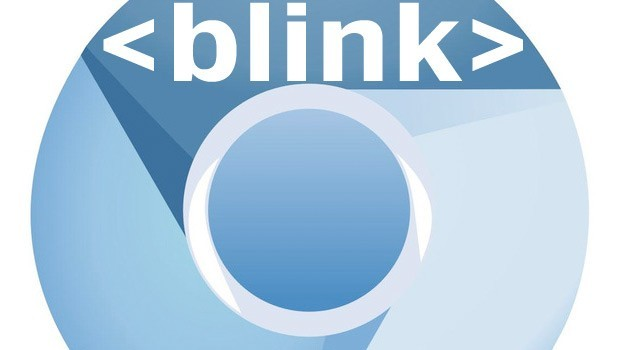

# 浏览器现状

## 浏览器市场份额

数据来源：[statCounter](https://gs.statcounter.com/browser-market-share#monthly-202103-202203-bar)

全球市场上看，基本上Chrome已经占领了整个浏览器市场，海外更甚，基本处于垄断地位。基本上各大厂放弃自研而以Chrome/Chromium为蓝本进行二次开发。后面内容会以Chrome/Chromium为蓝本。

主要是由于Google在Chrome/Chromium的巨大投入和Chromium开源模式运行的现状下，各大厂没必要继续投入研发渲染内核，而是参考谷歌开源的Chromium做二次开发迭代。

也是因为[Chrome在海外市场近乎垄断地位](https://www.zhihu.com/question/399939432)，再投入精力做竞争变成了ROI很低的一件事。

## 几个版本分不清
Chromium / Chrome Canary / Chrome 的区别是什么？

这几个都是独立的软件，Chromium是谷歌的开源项目，Chrome是商业项目，Chrome默认有自动更新和支持其他视频格式而Chromium没有，底层是一套架构。谷歌开源Chromium借助开源社区优化Chromium进而达到Chrome的目的。

> Chromium没有Google的账号体系，即无法登陆Google账号同步书签。也没有自动更新，浏览器崩溃也不会报告

Google Chrome Canary是Chrome的开发版，新特性还没会首先在Canary上稳定后再推到稳定版本

- Download Chromium: [https://www.chromium.org/getting-involved/download-chromium/](https://www.chromium.org/getting-involved/download-chromium/)
- Download Google Chrome Canary (金丝雀): [https://www.google.com/chrome/canary/thank-you.html?statcb=0&installdataindex=empty&defaultbrowser=0](https://www.google.com/chrome/canary/thank-you.html?statcb=0&installdataindex=empty&defaultbrowser=0)

> **Chromium/Chrome Canary/Chrome**以及各自的隐私模式环境都是互相隔离的，利用这个特性可以多开
> 隐私模式快捷键`⌘-Shift-N` (Mac)/`Ctrl+Shift+N`（Win)

## 浏览器分层架构

简单的说浏览器作为应用，底层分别有content，Blink，V8，Skia等等，像套娃一样一层引用一层。对比普通应用的项目来说就是不断用第三方库和组件来拼凑应用，Chrome也不例外

- content可以理解为就是除了浏览器主进程下的书签导航之外，网页内容这一部分，会随着网页不同而变化的部分，如下图红色部分
  .png)
- Blink渲染引擎，应该都听过就是网页的排版引擎，现存的Chrome/Edge都在用，作为开源项目维护，是在渲染进程里
- Blink又嵌套了V8 JavaScript engine来执行JS代码

## 开源源代码和部分目录
下图每部分对应源代码链接：[https://chromium.googlesource.com/chromium/src.git/+/refs/heads/main](https://chromium.googlesource.com/chromium/src.git/+/refs/heads/main)

## 浏览器渲染引擎
可以叫布局引擎，排版引擎，浏览器引擎等，是一个东西。

- [Layout Engine](https://en.wikipedia.org/wiki/Layout_engine)
- [Browser engine](https://en.wikipedia.org/wiki/Browser_engine)

## 为什么浏览器需要渲染引擎？
网页内容多为文本，没有排版引擎文字截断等需要自行实现，如一行文本边缘位置要超出自动换行，关于canvas换行实现可以看[这里](https://www.zhangxinxu.com/wordpress/2018/02/canvas-text-break-line-letter-spacing-vertical/)

.png)

## 有什么渲染引擎？

| 公司        | 渲染引擎   |    |
| --------   | ----- | :----:  |
| [Apple](https://en.wikipedia.org/wiki/Apple_Inc.)     | Apple为自身Safari浏览器开发的Webkit，从[KHTML](https://en.wikipedia.org/wiki/Browser_engine)fork过来开始修改的，现在应用在所有iOS生态产品上（iOS、iPadOS 和 Mac OS系统）, 所有平台的Safari都是Webkit。  因为Apple要求iOS 中不允许浏览器使用第三方浏览器引擎，所以就连 iOS 上的Chrome浏览器也要用Webkit（已测试），也就是说你在iOS上看到的浏览器或应用都是“换肤”的Safari 这也引起[讨论](https://9to5mac.com/2022/03/01/web-developers-challenge-apple-to-allow-other-browser-engines-on-ios/) |        |
| [Google](https://en.wikipedia.org/wiki/Google)        |   为了开发Chrome浏览器开始用**Webkit**，最后fork了一份开始修改变成[**Blink**](https://www.chromium.org/blink/)。现在应用在所有Chromium-based生态的产品，比如Chrome、Chromium和安卓手机，甚至Electron   |      |
| [Microsoft](https://en.wikipedia.org/wiki/Microsoft)        |   **Trident**用于IE浏览器，[EdgeHTML](https://en.wikipedia.org/wiki/EdgeHTML)用于早期Edge，后面Edge79（2021年4月）版本后改用[Blink](https://www.chromium.org/blink/)    |    |
| [Mozilla](https://en.wikipedia.org/wiki/Mozilla)        |  [Gecko](https://en.wikipedia.org/wiki/Gecko_(software))    |    |
| [Opera](https://www.opera.com/)        |  早期自研用[Presto](https://en.wikipedia.org/wiki/Presto_(layout_engine))，2013年放弃自家的，拥抱Chromium-based生态的[Blink](https://www.chromium.org/blink/) |
| 国产浏览器        |  Trident（兼容模式）+Webkit / Blink（高速模式），早期都是Webkit，后面都改成Blink    比如360的360安全浏览器/360极速浏览器， 早期用的Webkit，后面拥抱Chromium-based生态的[Blink](https://browser.360.cn/se/help/index.html),其次是网银自动切换[兼容模式](https://browser.360.cn/se/help/silver.html) [QQ浏览器](https://zh.wikipedia.org/wiki/QQ%E6%B5%8F%E8%A7%88%E5%99%A8)同上 |

国内遇到必须IE的就是银行PC端的网银系统了，只能Windows下IE浏览器还要配合安装一些安全软件，貌似无解🙈

> 特别说下 iOS 中不允许浏览器使用第三方浏览器引擎，所有的 webview 都是使用系统浏览器的内核，内核版本跟随 iOS 系统版本；
> - iOS 8之前，webview 默认调用的是 UIwebview，JS引擎使用的是 JavaScriptCore；
> - iOS 8开始，webview 默认调用的是 WKwebview，JS引擎调整为 SquirrelFish（Nitro），性能得到极大提高；

## 存活的渲染引擎

2022年，能活下来的渲染引擎只剩下Gecko/WebKit/Blink。from [there](https://en.wikipedia.org/wiki/Browser_engine)

### 对应JS引擎如下

- **[V8](https://link.juejin.cn/?target=https%3A%2F%2Fen.wikipedia.org%2Fwiki%2FV8_(JavaScript_engine))**——开源，由 Google 开发，使用 C++ 编写
- **[SpiderMonkey](https://link.juejin.cn/?target=https%3A%2F%2Fen.wikipedia.org%2Fwiki%2FSpiderMonkey_(JavaScript_engine))**——第一个 JavaScript 引擎，该引擎过去驱动 Netscape Navigator，如今驱动 Firefox 浏览器
- **[JavaScriptCore](https://link.juejin.cn/?target=https%3A%2F%2Fen.wikipedia.org%2Fwiki%2FJavaScriptCore)**——开源，苹果公司为 Safair 浏览器开发的
    - iOS 8后重命名为SquirrelFish，也有称为 [SquirrelFish（Nitro）](https://en.wikipedia.org/wiki/WebKit#JavaScriptCore)，性能得到极大提高；

## 移动端

基本是嵌入一个或者多个Webview组件，WebView可以理解为没有地址栏等控件的浏览器。iOS 和 Android 的 UI 框架都提供了内嵌的 WebView 控件(iOS基于WebKit 的 [WKWebView](https://developer.apple.com/documentation/webkit/wkwebview) 和 Android 基于Chromium的 [WebView](https://developer.android.com/reference/android/webkit/WebView))

Android 5.0 Lollipop 开始， Android 基于Chromium的WebView 会一直更新升级，所以[Can I use](https://caniuse.com/es6) 上 Android Browser 一栏有断层，后面都是基于Chromium的WebView

| 公司 | 引擎   |
| --- | ----- |
| 腾讯 |  iOS应Apple要求，iOS8后生态都是统一的WKWebView（Webkit）  安卓要分QQ系和微信系，QQ系都是[X5内核](https://x5.tencent.com/docs/index.html)，微信系早期是[X5内核](https://x5.tencent.com/docs/index.html)，后面基于Chromium-based生态自研[XWeb](https://developers.weixin.qq.com/miniprogram/dev/framework/runtime/env.html)，加入很多自定义功能，区别可以围观一下[腾讯毒瘤——X5/XWeb内核的坑记录](https://zhuanlan.zhihu.com/p/51160869) |
| 字节 |  iOS应Apple要求，iOS生产环境统一WKWebView（Webkit）  安卓自研TTWebview |

## 参考
- [你能分得清楚 Chromium, V8, Blink, Gecko, WebKit 之间的区别吗？](https://juejin.cn/post/6844904055236460558)