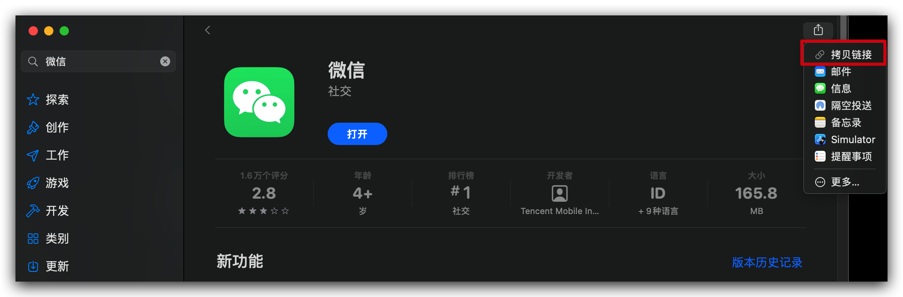
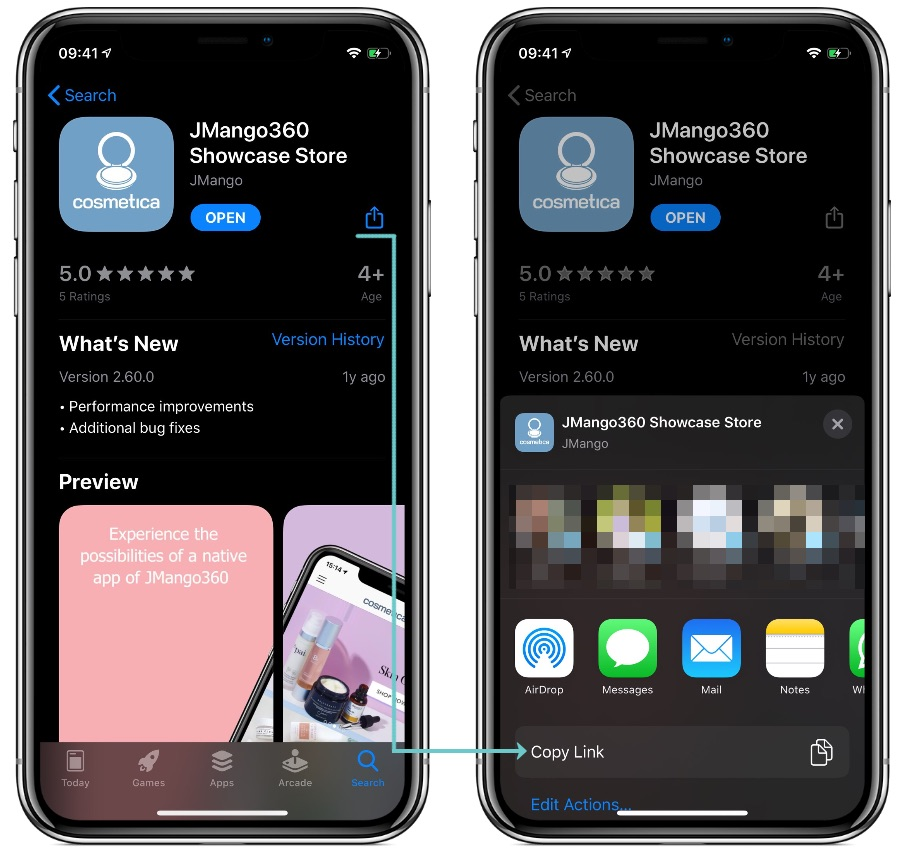
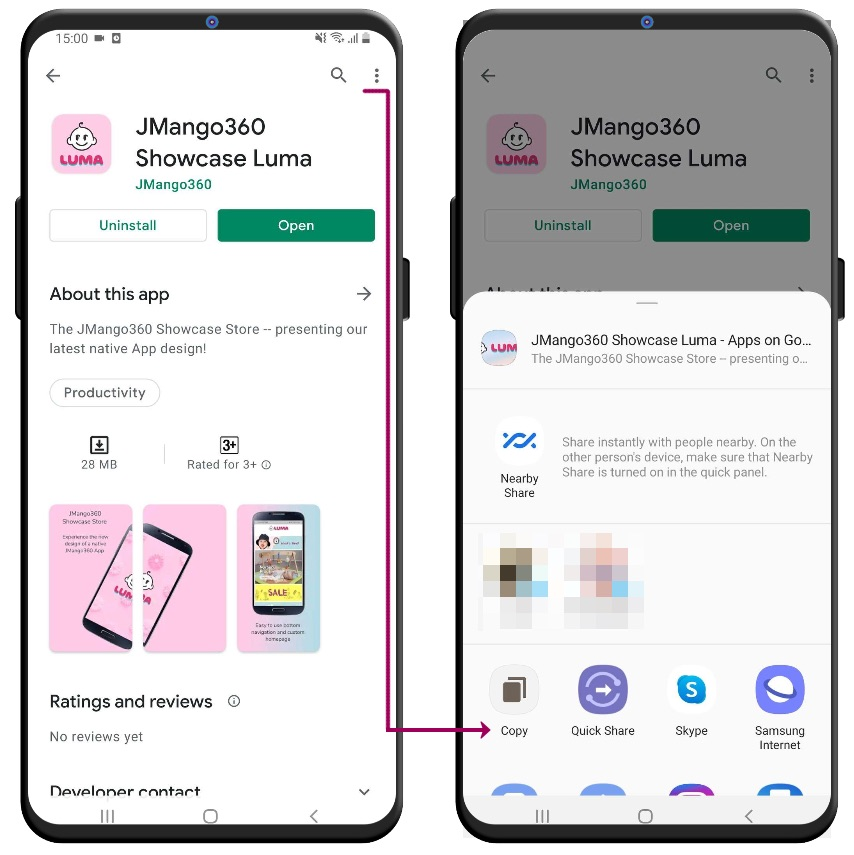

# 什么是APP Link？
对于一些游戏公司或者互联网行业的公司来说，开发迭代应用程序APP就是他们的工作内容，用APP去承载具体的服务。

## PC环境
电脑程序来说，Windows和Apple还有Linux基本垄断了市场，Windows的话大家习惯去360软件管家，腾讯电脑管家等的软件来下载软件，或者去百度搜索，当然会有一堆广告。

Apple的话基本软件都是收费的，一些免费的话自己有网站挂免费软件的下载链接这里不多说。Linux同理都是开发者，也不多说

## 移动端
对于手机，pad等来说就是移动端的设备，这里还要分全球市场和国内市场来说。国际市场上来说，一般Apple和Google两大公司垄断了，国内市场的话手机厂商基本都推出了自家的应用商店，比如小米，华为，OPPO，VIVO等等，甚至小米的手机即时是安卓系统还不能安装Google的应用商店，不懂什么神操作有知道的求告知

### Apple Store Link

对于苹果来说，其实对应的就是AppStore这个非常重要的下载渠道，可以通过链接访问到，链接格式如下

```bash
https://apps.apple.com/<country>/app/<app–name>/id<app-ID>
```

举个例子，中国微信的AppStore下载链接就是 `https://apps.apple.com/cn/app/%E5%BE%AE%E4%BF%A1/id414478124`，解码下 `https://apps.apple.com/cn/app/微信/id414478124`。所以很容易看出来，参数的具体信息

- country: 小写国家地区码，如中国就是cn，美国就是us
- app-name: 应用程序名称，比如微信
- app-ID: app的ID，唯一标识

再举个例子，us美国地区的Tiktok，`https://apps.apple.com/us/app/tiktok/id835599320`，因为都是英文都不用解码直接看。

但是其实us美国地区的Tiktok并不是Tiktok而是Musically，两者除了壳不一样其他都一致，所以Musically的老用户也很自然转移到Tiktok里去了，但是为了防止老用户找不到程序，所以发版还是得两个APP都发布一次，这就是APP工厂特殊的地方，微信不至于一套代码发布多个APP吧？

- https://apps.apple.com/us/app/musical-ly-make-music-videos/id835599320
- https://apps.apple.com/us/app/tiktok/id835599320

#### 如何获取AppStore里应用程序的链接？

打开AppStore，搜索应用后，分享复制链接即可



同理手机也可以操作


### Google Play Store Link

```bash
https://play.google.com/store/apps/details?id=<package_name>
```

格式如上，如果获取Link呢？

####  如何获取Google Play Store里应用程序的链接？

1. 进入[Google Play Store](https://play.google.com/store/games)
2. 搜索你需要的应用程序，比如Chrome，搜索页面的链接是 https://play.google.com/store/search?q=chrome&c=apps
3. 点击Chrome进入应用详情页，此时的链接就是 `https://play.google.com/store/apps/details?id=com.android.chrome`

可以看到此时的参数含义
- package_name: com.android.chrome

再看一个例子，QQ的，https://play.google.com/store/apps/details?id=com.tencent.mobileqq

可以看到都是类似Java的命名空间规范，`com.xxx.xxx`这种

同理手机操作，首先要下载Google Play Store，然后再打开



### 小米应用商店
举个例子，比如QQ

```
小米:    https://app.mi.com/details?id=com.tencent.mobileqq
Google: https://play.google.com/store/apps/details?id=com.tencent.mobileqq
```

可以看到跟Google Play Store的Link类似，说明这个id大家基本都是一样的，通过发布平台上传不同的应用商店罢了。肯定不会是特殊定制，代码都是一样的。
那各大分发平台其实都是类似的功能，特殊的如Google


## 为什么应用商店不统一？

根据不同的国家地区政策，有的APP在某些国家是无法下载的，比如滴滴被封了，那么CN地区的滴滴就下架了，通过这种方式可以很好避免地缘政治风险。但是很多人可能想不到为什么各大IT公司都抢占应用商店这个东西？
其实从硬件厂商开始就对这里的软件分发虎视眈眈，分发本质不赚钱，大家下载软件都是免费的。赚钱的是对应的支付，比如苹果税


