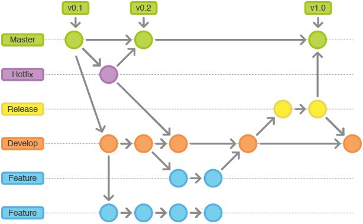

# Git Flow 在大型多人合作总的使用



# SVN 的痛

记得大学在工作室的时候起初用的版本管理工具是 SVN，多人开发以其中一个同学的机器创立本地版本库。之后其他同学局域网链接这个同学的机器提交代码做中心化的版本管理。然后有时候吧，合并的时候遇到各种坑爹问题合并不了或者相互覆盖，所以经常在合并之前会自己保留自己的代码一份再去合并。或者是出问题了，要重新拉一下 svn 的代码，本地合并完再提交。灰常蛋疼。还有更坑爹的是，有时候线上有一个 bug 要经济修复，然后本地还有在开发的代码，这个时候就不得不 checkout 多一份代码，做 hotfix，然后解决完再合并。项目小还好，但是如果项目一大，光 checkout 代码就耗时很久了。但是后面换到 git 之后，这种情况没怎么发生了，从一个侧面来说明，也是 git 优秀于 svn 的地方，是一个分布式的仓库，而不是集中式的代码版本管理。

# Git

Git 是个好东西大家都知道，但是经常会有童鞋对 git 的一些指令了解不是很深入，毕竟团队人员技术水平参差不齐，又不能一一要求。这个时候 git-flow 就登场了，通过寥寥几个命令你就可以快速掌握企业级的 git 研发流程。

# 关于 git-flow

当在团队开发中使用版本控制系统时，商定一个统一的工作流程是至关重要的。Git 的确可以在各个方面做很多事情，然而，如果在你的团队中还没有能形成一个特定有效的工作流程，那么混乱就将是不可避免的。

基本上你可以定义一个完全适合你自己项目的工作流程，或者使用一个别人定义好的。就是 git-flow 脚本，你不需要去记忆很多的 git 指令，比如 git fetch、git pull 和 git rebase 的区别之类的。

具体的可以点击[这里](https://github.com/petervanderdoes/gitflow-avh)

# 几个脚本命令

## 初始化

- git flow init [-d] -d 选项可选，如果有-d 则默认所有选项为默认（推荐）

## feature 特性分支

```
git flow feature start <name> [<base>] base 可选参数必须是分支，默认为 develop
git flow feature publish
git flow feature finish <name>
git flow feature delete <name>
```

## release 发布分支

```
git flow release start <release> [<base>]
git flow release publish
git flow release finish <release>
git flow release delete <release> base 可选参数必须是分支，默认为 develop˙
```

## hotfix 修复 bug 分支

```
git flow hotfix start <release> [<base>]
git flow hotfix publish
git flow hotfix finish <release>
git flow hotfix delete <release> base 可选参数必须是分支，默认为 develop
```
