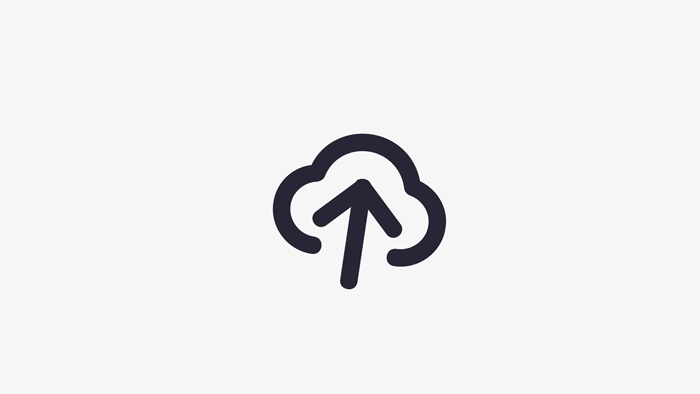

# 图片自适应大小、压缩 demo



# 图片上传 demo 原理

一个图片上传 demo，可以上传图片，然后按照最大宽度和最大高度，先触边的为目标，等比例缩放后绘制 canvas 显示。然后把 canvas 数据转化为 base64 位数据，这个时候就大家就可以自由传递数据到后台了。

拖拽裁剪之类的大家再去找下其他插件把，demo 只做演示用。

这里`canvas.toDataURL`这个接口，有两个可选参数

- 第一个参数是文件类型，默认为 `image/png`，图片的分辨率为 96dpi
- 第二个是编码选项，在指定图片格式为 image/jpeg 或 image/webp 的情况下，可以从 0 到 1 的区间内选择图片的质量。如果超出取值范围，将会使用默认值 0.92。其他参数会被忽略。

> 这里注意 png 图片的是没有压缩比例这个参数控制的，所以传了也没用。但是 png 图片我们可以通过等比缩放大小来控制

### 图片大小限制

手机拍照原图的大小一般是好几 M 以上，而很多时候这个大小实际用不到，几百 K 的图片用的居多。所以一般会做压缩处理，这个压缩如果放在后台的话，5M 的照片用户就需要上传 5M 的流量，100 张就是 500M。手机流量贵，所以这个压缩过程放在前端是大家喜闻乐见的！

图片压缩大小的限制，jpeg 等可以通过压缩比例控制。png 格式可以通过缩放图片大小控制。但是都离不开最后一步将 canvas 转化为数据的过程，base64 是用`toDataURL()`接口，然后如果需要的是二进制数据，可以用`toBlob()`接口。

通过改变 canvas 的大小，预算数据大小，活着预先调用 toDataURL 接口转化后计算图片大小。满足约束条件即可，如果不满足可能要多试几次。基本思路就这样。

### 示例源代码

也可以点击[这里](/code/pictureUpload/index.html)

```html
<!DOCTYPE html>
<html>
  <head>
    <meta charset="utf-8" />
    <meta http-equiv="X-UA-Compatible" content="IE=edge" />
    <title>图片上传压缩测试</title>
    <meta name="viewport" content="width=device-width, initial-scale=1" />
  </head>

  <body>
    <div>
      图片最大宽度（超出会自动裁剪）:<input
        class="imgMaxWidth"
        type="text"
        value="200"
        placeholder="正整数"
      />
    </div>
    <div>
      图片最大高度（超出会自动裁剪）:<input
        class="imgMaxHeight"
        type="text"
        value="200"
        placeholder="正整数"
      />
    </div>
    <div>
      图片压缩比例（jpeg可选压缩比例）:
      <input class="imgQulity" type="text" value="0.1" placeholder="0到1" />
    </div>
    <input id="file" type="file" accept="image/*" />
    <script>
      var eleFile = document.querySelector('#file')
      // 压缩图片需要的一些元素和对象
      var reader = new FileReader(),
        img = new Image()

      // 选择的文件对象
      var file = null

      // 缩放图片需要的canvas

      var canvas = createElement('canvas')
      var context = canvas.getContext('2d')

      // base64地址图片加载完毕后
      img.onload = function() {
        // 图片原始尺寸
        var originWidth = this.width
        var originHeight = this.height
        // 最大尺寸限制
        // var maxWidth = 400, maxHeight = 400;

        var maxWidth = document.querySelector('.imgMaxWidth').value,
          maxHeight = document.querySelector('.imgMaxHeight').value

        if (
          typeof parseInt(maxWidth) !== 'number' ||
          typeof parseInt(maxHeight) !== 'number'
        ) {
          alert('图片最大宽度与图片最大高度必须为正整数')
          return
        }

        // 目标尺寸
        var targetWidth = originWidth,
          targetHeight = originHeight
        // 图片尺寸超过400x400的限制
        if (originWidth > maxWidth || originHeight > maxHeight) {
          if (originWidth / originHeight > maxWidth / maxHeight) {
            // 更宽，按照宽度限定尺寸
            targetWidth = maxWidth
            targetHeight = Math.round(maxWidth * (originHeight / originWidth))
          } else {
            targetHeight = maxHeight
            targetWidth = Math.round(maxHeight * (originWidth / originHeight))
          }
        }

        // canvas对图片进行缩放
        canvas.width = targetWidth
        canvas.height = targetHeight
        // 清除画布
        context.clearRect(0, 0, targetWidth, targetHeight)
        // 图片压缩
        context.drawImage(img, 0, 0, targetWidth, targetHeight)

        // https://developer.mozilla.org/zh-CN/docs/Web/API/HTMLCanvasElement/toDataURL
        // canvas.toDataURL(type, encoderOptions);
        // 图片格式，默认为 image/png
        // 在指定图片格式为 image/jpeg 或 image/webp的情况下，可以从 0 到 1 的区间内选择图片的质量。如果超出取值范围，将会使用默认值 0.92。其他参数会被忽略。

        var imgData = canvas.toDataURL(
          file.type || 'image/png',
          document.querySelector('.imgQulity').value
        )
        log('压缩后的图片数据(base64)：')
        log(imgData)

        var image = createElement('img')
        image.src = imgData
        log('压缩后的图片大小：' + calcFileSize(imgData) + 'KB')
      }

      // 文件base64化，以便获知图片原始尺寸
      reader.onload = function(e) {
        img.src = e.target.result
      }

      eleFile.addEventListener('change', function(event) {
        file = event.target.files[0]

        log(
          '上传的图片大小：' +
            file.size +
            '字节（约' +
            (file.size / 1024).toFixed(2) +
            'kb)'
        )
        // 选择的文件是图片
        if (file.type.indexOf('image') == 0) {
          reader.readAsDataURL(file)
        }
      })

      function log(text) {
        var temp = document.createElement('p')
        temp.appendChild(document.createTextNode(text))
        document.body.appendChild(temp)
      }

      // 通过base64文件估算文件大小, 返回字节大小
      function calcFileSize(base64) {
        let blen = base64.length
        return (blen - (blen / 8) * 2) / 1024
      }

      function createElement(element) {
        var tempDiv = document.createElement('div')
        var tempElement = document.createElement(element)
        tempDiv.appendChild(tempElement)
        document.body.appendChild(tempDiv)
        return tempElement
      }
    </script>
  </body>
</html>
```
