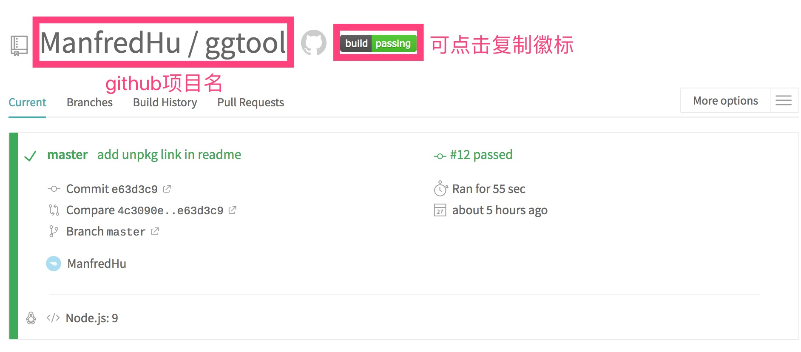
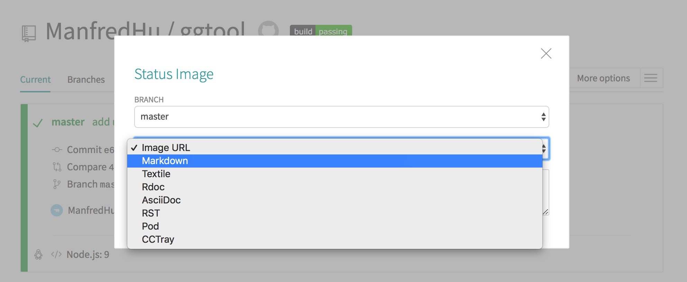
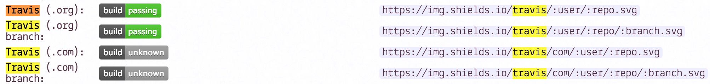

# 前端集成测试快速入门


最近在开发一个工具库 ggtool，可以点[这里](https://github.com/ManfredHu/ggtool)看下。
因为是开源的项目，所以要引入集成测试，记得早在 Angular 出来的时候就在吹嘘 TDD 开发了，但是在工作的时候看来基本是属于天方夜谭，方法论有了，但是研发人员时间精力和熟练度严重不够，基本没看到有部门在搞得。反倒是开源社区 gayhub 等等基本上开源项目会集成测试用例，CI 测试，代码覆盖率测试等等。一套下来其实内容跟编码一半一半吧。

> 我知道不写下来，1-2 年后我也会忘了这些东西，做此文以方便大家快速入门

第一步巴拉巴拉肯定是编码之类的，我写的是一个很简单的工具库，名字就叫[ggtool](<(https://github.com/ManfredHu/ggtool)>)。GG 的意思，相信玩过 MOBA 类游戏的大家，不陌生，一般被打得不行头像的一方最后会说一句 GG，意思是 Good Game。

夸对方打得好，很服气，下次再战。体育竞技精神体现的淋漓尽致。

但是我这里写这个库的起因是，之前做的很多项目一般工具库都是写在项目里面的，什么 util 目录下面一堆，widgets 下面又一堆，tools 目录又是一堆，很多内容其实是重复的，只是换了个人实现了一遍而已。实现内容大同小异。

求同存异，先剥离出来一个库，就是我以后不想再写同样的方法了，下次遇到新项目或者类似的项目，`tnpm install`一下就好了。

所以我这里有几个需求点先列下：

1. 这是一个工具库，集合很多基础方法，别人好的东西，我不写，别人不足的东西，聚合补充
2. 支持 tnpm install
3. 开源，代码高质量，大家可以提 pull request 参与进来
4. 完善的测试用例，CI 集成，代码覆盖率达标

巴拉巴拉撸了代码，基本雏形有了，四个模块。测试用例用[Jest](https://github.com/facebook/jest)写的，写法很简单，这里不细说。Jest 官网都有。本地代码基本跑起来了。

然后就是下一步，提交 github 和 CI 集成，github 提交很简单这里也不说了。
CI 集成，搜了一堆，用了比较普遍的[Travis-CI](https://travis-ci.org/ManfredHu/ggtool)，当然还有其他很多测试平台，你也可以试试。

## [Jest](https://github.com/facebook/jest)

```bash
npm install jest --save-dev
```

单元测试用例编写，安装后会自动在项目下寻找`xxx.spec.js`或者`xxx.test.js`后缀的文件。

推荐的目录结构：

```
test/
    unit/
        specs/
            axxx.test.js //a测试用例
            bxxx.test.js //b测试用例
        jest.conf.js //jest配置文件，命令行传入
        .eslintrc //可以定义环境env为jest
```

看下 jest.conf.js 的配置

```js
const path = require('path')

module.exports = {
  rootDir: path.resolve(__dirname, '../../'), //根目录
  moduleFileExtensions: ['js', 'json'],
  moduleNameMapper: {
    '^@/(.*)$': '<rootDir>/src/$1'
  },
  transform: {
    '^.+\\.js$': '<rootDir>/node_modules/babel-jest'
  },
  coverageDirectory: '<rootDir>/test/unit/coverage', //覆盖率报告生成目录
  collectCoverage: true,
  collectCoverageFrom: [
    //从如下文件收集覆盖率
    'src/**/*.{js}', //src下的文件
    '!src/main.js', //不包括src/main.js
    '!src/index.js',
    '!**/node_modules/**' //不包括node_modules下的文件
  ]
}
```

直接运行 jest 就会去跑 specs 下的测试用例了。

## [Travis-CI](https://travis-ci.org/ManfredHu/ggtool)

第一步是创建账号，这里 Github 通用登陆授权，然后你的项目就可以开始跑了。
当然代码是在人家的机器上跑的测试用例，所以你要告诉对方，怎么运行你的项目，你的项目依赖了什么。
是什么语言的巴拉巴拉之类的，你想人家给你跑代码，还不告诉人家怎么跑，不科学是吧？我们一步步来告诉 travis（没记错应该是钢铁侠里面的智能机器人的名字）怎么跑我们的代码。

首先是语言类型，我们选的是[node_js](https://docs.travis-ci.com/user/languages/javascript-with-nodejs)

因为是在人家的 Linux 环境跑的，所以没什么 javascript，环境选 Node!!跟你在命令行跑的差不多其实。
项目根目录新建一个`.travis.yml`的文件，然后配置下。这里舍弃了一些配置项，先集中精力看重要的部分先。

```yml
language: node_js
node_js:
  - '9'
script:
  - npm run lint
  - npm run test
```

这里告诉 travis 我们跑的是 node 项目，然后 node 版本是 9，其实无所谓，我的项目基本没啥依赖项，都是兼容高版本 node 的，但是为了稳妥这里还是写了我本地 Mac 的 node 版本。
然后是两个 script，travis 会依次执行 script 里面的命令。这两个命令在项目根目录下 package.json 里面的。

```json
"scripts": {
    "unit": "jest --config test/unit/jest.conf.js --coverage",
    "test": "npm run unit",
    "lint": "eslint --fix src test/unit/specs",
},
```

一个个来看，首先是是`npm run list`这个，对应的是`"lint": "eslint --fix src test/unit/specs",`这句，其实就是 eslint --fix 一下代码，这里用的是`eslint-config-standard`，标准的，用过 airbab，不过觉得这个太严格了，大大降低了代码编写效率。项目本地安装，不推荐全局安装。除非你电脑只有一个项目，以前经常全局安装 eslint，结果老是找到根目录的 eslint 而不是项目下的 eslint。

> 我们用 eslint 的目的是为了统一大家的编码标准，而不是为了降低大家的开发效率

第二个命令`npm run test`，其实跑了`npm run unit`，是一个 jest 命令。`--config`是传递配置文件，是在`test/unit/jest.conf.js`这个目录下，然后`--coverage`选项，生成覆盖率报告（后面 codecov 会上传 codecov 平台用到）。

然后你准备好了项目，就 OK 了，推送 github，在 Travis-ci 跑项目吧。




跑完了就如上图，成功执行 OK 了之后，我们来看看 log 的一些内容，首先是 woker 的信息，部署环境吧啦吧啦的。
忽略`npm install -g codecov`，因为跑了后面 codecov 的脚本。

环境部署 OK 之后执行了我们在`.travis.yml`定义的命令。

> `npm install`会自动执行，假如你没有在`.travis.yml`配置 install 选项的话。这里我们没有配置，所以是自动执行的。

之后`npm run lint`了下，之后`npm run test`。成功之后生成徽标，经常用于 github 开源项目标识。



复制之后可以写在 markdown 之类的。

## [Codecov](https://codecov.io/gh/ManfredHu/ggtool)

OK，你跑了 CI 测试了，也生成了覆盖率报告在`/test/unit/coverage`目录了（根据 jest.conf.js 的配置）。
Jest 生成了但是 Travis-CI 不负责解析你的覆盖率报告，这里用了[Codecov](https://codecov.io/gh/ManfredHu/ggtool)。

接下来你要做的就是提交覆盖率报告到 Codecov。这里我们不安装 Codecov 模块，而是在 travis 运行的时候，最后自动提交。
授权 Codecov 读取你的 github 项目之后，改变 travis 的配置如下：

```yml
language: node_js
node_js:
  - '9'
install:
  - npm install -g codecov
  - npm install
script:
  - npm run lint
  - npm run test
  - codecov
```

这里多了 install 的选项，告诉 travis 这里要全局安装 codecov，然后项目要跑`npm install`，因为这里你给了 install 选项，所以默认的`npm install`不会执行，这里要补上。

script 在`npm run lint`和`npm run test`最后跑了 codecov。大功告成，你的项目在提交 github 之后不久会自动执行 CI 测试，然后生成覆盖率报告提交 codecov。

## [NPM](https://www.npmjs.com/package/ggtool)

完美，发布 npm，去 npm 新建一个账号，然后`npm publish`发布上去。这样别人`npm install ggtool`就可以安装使用了。

## [ShieldsIO](https://shields.io/#/)

我们前面做了单元测试和覆盖率测试，但是我懒得每次都去看，其他人也没空去看你的项目。所以你最好给你的项目带上标示——徽标。类似

[](https://travis-ci.org/ManfredHu/ggtool)
[](https://github.com/ManfredHu/ggtool)
[](https://www.npmjs.com/package/ggtool)
[](https://github.com/ManfredHu/ggtool)

这样的东西，方便自己也方便其他人追踪项目当前情况。
ShieldsIO 可以根据 github，npm 包等生成徽标，然后写在项目的 readme 里面，大家都是这么干的。确实方便直观。

然后复制 github 项目目录地址进去生成就 OK 了。shieldIO 会自动去读取 travis 和 codecov 的徽标状态




当然还有其他的，感兴趣的童鞋自己研究下。

## [unpkg](https://unpkg.com/#/)

免费的 CDN 服务，根据 npm 文件生成。相当于你的文件还能 CDN 加速一把。
在你的 package.json 里面配置加上 files，声明有哪些文件是可以放到 unpkg 的，然后声明一个 unpkg 的入口。

```json
{
  "files": ["src", "lib/*.js"],
  "unpkg": "lib/ggtool.js"
}
```

这样访问[http://unpkg.com/ggtool](http://unpkg.com/ggtool)就会访问到我们 npm 的内容了。
当然这样会有一个 302 跳转到项目最新的版本，如果你要引用的话还是指定版本的好。

```html
<script src="https://unpkg.com/ggtool@1.0.9/lib/ggtool.js"></script>
```
