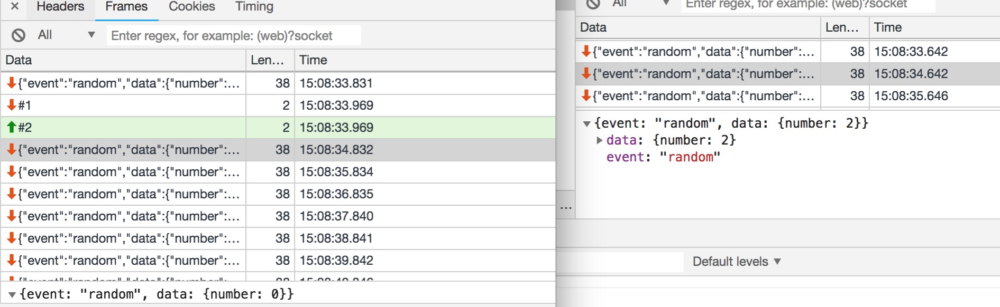
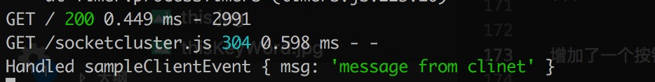

# websocket 原理和实践


## 基于现象探索原理

似懂非懂，还是不懂。项目里用到了 ws 的东西，之前写业务代码没觉得多难，突然想自己搭建同样的环境了发现一头雾水不知道从哪里开始。故作此文记录过程和增加理解。

我们来看一个 WebSocket 链接，是一个基于 layabox 的小游戏的，可以点[这里](http://h5store.layabox.com/layastore/gamecenter.html?gameid=197&spId=156&from=0)。

```
//General
Request URL: ws://139.224.68.169:8080/
Request Method: GET
Status Code: 101 Switching Protocols

//Request Header
Accept-Encoding: gzip, deflate
Accept-Language: zh-CN,zh;q=0.9,en;q=0.8,zh-TW;q=0.7
Cache-Control: no-cache
Connection: Upgrade
Host: 139.224.68.169:8080
Origin: http://laya.h5gamebar.com
Pragma: no-cache
Sec-WebSocket-Extensions: permessage-deflate; client_max_window_bits
Sec-WebSocket-Key: 8559tF5jtqqXWQnt3tA08g==
Sec-WebSocket-Version: 13
Upgrade: websocket
User-Agent: Mozilla/5.0 (iPhone; CPU iPhone OS 11_0 like Mac OS X) AppleWebKit/604.1.38 (KHTML, like Gecko) Version/11.0 Mobile/15A372 Safari/604.1

//Response Header
Connection: Upgrade
Sec-WebSocket-Accept: lsJN4kVMKgmL9vuwfjelSi2I2oU=
Upgrade: websocket
```

报文内容如上，WS 链接是以`ws:`或者`wss`开头的。

## 什么是Socket?
计算机网络基础都是socket，socket可以理解为插座或插孔。

Socket是应用层与TCP/IP协议簇通信的中间抽象层，是一组接口。在设计模式中其实就是门面模式。Socket将复杂的TCP/IP协议簇隐藏在接口后面，对于用户而言，一组接口即可让Socket去组织数据，以符合指定的协议。**可以理解，编程下的socket就是一个插座的抽象，让应用层更好调用底层接口**


操作系统的底层Socket接口, 有connect, bind, listen等等, 下图来自小林coding


## 什么是 WS/WSS？

WebSocket (WS)是 HTML5 一种新的协议。它实现了浏览器与服务器**全双工**通信，能更好地节省服务器资源和带宽并达到**实时通讯**。

> WebSocket 建立在 TCP 之上，同 HTTP 一样通过 TCP 来传输数据，但是它和 HTTP 最大不同是：
> WebSocket 是一种双向通信协议，在建立连接后，WebSocket 服务器和 Browser/Client Agent 都能主动的向对方发送或接收数据，就像> Socket 一样；WebSocket 需要类似 TCP 的客户端和服务器端通过握手连接，连接成功后才能相互通信。

WSS（Web Socket Secure）是 WebSocket 的加密版本。

一般的云服务器对 Websocket 都支持，可以看下[阿里云](https://www.alibabacloud.com/help/zh/doc-detail/63421.htm)的介绍。

- 建立在 TCP 协议之上，服务器端的实现比较容易
- WS 没有同源策略，可以跟任意服务器通信。
- 支持发送文本和二进制数据。
- 与 HTTP 协议有着良好的兼容性。默认端口也是 80 和 443，并且握手阶段采用 HTTP 协议，因此握手时不容易屏蔽，能通过各种 HTTP 代理服务器


这张图片很棒，很好的说明了协议间的关系。而且要记住，**ws 链接握手阶段是通过 HTTP 协议的**

## 端口

TCP/IP 网络协议分五层，从上往下分别为

- 应用层
- 传输层（端口）
- 网络层（IP）
- 数据链路层
- 物理层

端口是属于传输层部分的东西。众所周知，默认 http 端口是 80，https 是 443。而 WebSocket 设计之初就是为了更好的兼容 Http，所以 WebSocket 默认端口也是 80 和 443，并且**握手阶段基于 HTTP 协议**，因此握手时不容易屏蔽，能通过各种 HTTP 代理服务器。

浏览器WS默认支持跨域, 与HTTP区别对应Response的协议升级报头, 对应`HTTP/1.1 101 Switching Protocols`

## WebSocket握手原理


请求如 GET ws://192.168.31.165:8723/ 除了协议protocal与http不一样其他基本一致.

```
GET / HTTP/1.1
**Connection: Upgrade
Upgrade: websocket**
Sec-WebSocket-Version: 13
Sec-WebSocket-Key: Jyj8BMLkZNg1N3qA+lQy3Q==
Sec-WebSocket-Extensions: permessage-deflate; client_max_window_bits
```

- `Sec-WebSocket-Version`为版本，现在基本都是`13`
- `Sec-WebSocket-Key` 是随机生成的Base64编码字符串, 服务器接受到后与固定字符串相连再形成hash返回签名字段`sec-websocket-accept`
- `Sec-WebSocket-Extensions` 表示客户端和服务端支持的扩展协议。在握手阶段，客户端可以通过这个头部字段告知服务端它支持哪些扩展协议，服务端也可以通过这个头部字段告知客户端它支持哪些扩展协议. 取值如 `permessage-deflate`; `client_max_window_bits`, `x-webkit-deflate-frame` 等

而server回应如下报文: 

```
HTTP/1.1 **101 Switching Protocols**
**upgrade: websocket
connection: Upgrade**
sec-websocket-accept: nv78PSJiBOUQYeX+a5Ju/ZpZVH0=
```

其中`sec-websocket-accept`是对request header的`Sec-WebSocket-Key`的sha1,base64的结果，计算如下

```tsx
export const genWebSocketAccept = (content) => {
  let hash = createHash('sha1')
  hash.update(content + '**258EAFA5-E914-47DA-95CA-C5AB0DC85B11**') // 跟一个固定的字符串拼接后取得hash值
  return hash.digest('base64')
}
console.log(genWebSocketAccept('Jyj8BMLkZNg1N3qA+lQy3Q==')) // nv78PSJiBOUQYeX+a5Ju/ZpZVH0=
```

## 数据帧组成

```
0 1 2 3 4 5 6 7 8 9 0 1 2 3 4 5 6 7 8 9 0 1 2 3 4 5 6 7 8 9 0 1
+-+-+-+-+-------+-+-------------+-------------------------------+
|F|R|R|R| opcode|M| Payload len |    Extended payload length    |
|I|S|S|S|  (4)  |A|     (7)     |             (16/64)           |
|N|V|V|V|       |S|             |   (if payload len==126/127)   |
| |1|2|3|       |K|             |                               |
+-+-+-+-+-------+-+-------------+ - - - - - - - - - - - - - - - +
|     Extended payload length continued, if payload len == 127  |
+ - - - - - - - - - - - - - - - +-------------------------------+
|                               |Masking-key, if MASK set to 1  |
+-------------------------------+-------------------------------+
| Masking-key (continued)       |          Payload Data         |
+-------------------------------- - - - - - - - - - - - - - - - +
:                     Payload Data continued ...                :
+ - - - - - - - - - - - - - - - - - - - - - - - - - - - - - - - +
|                     Payload Data continued ...                |
+---------------------------------------------------------------+

FIN: 结束位标识, 默认0. 如果为1表示数据帧为最后一帧, 用来如果为0则是分片数据
RESV1-3: 三个表示都是1bit长(0或1),  必须设置为0，除非扩展了非0值含义的扩展。如果收到了一个非0值但是没有扩展任何非0值的含义，接收终端必须断开WebSocket连接
Opcode: 4 bit长,用于枚举操作
	- %x0 表示一个持续帧
	- %x1 表示一个文本帧
	- %x2 表示一个二进制帧
	- %x3-7 预留给以后的非控制帧
	- %x8 表示一个连接关闭包
	- %x9 表示一个ping包
	- %xA 表示一个pong包
	- %xB-F 预留给以后的控制帧
Mask: 1 bit, mask标志位，定义payload是否添加掩码。如果设置为1，那么掩码的键值存在于Masking-Key中. 客户端发送服务端时为1, 服务端发送客户端为0
Payload length: 7 bits, 7+16 bits, or 7+64 bits.
	- 如果值为0-125，那么就表示负载数据的长度
	- 如果是126，那么接下来的2个bytes解释为16bit的无符号整形作为负载数据的长度
	- 如果是127，那么接下来的8个bytes解释为一个64bit的无符号整形（最高位的bit必须为0）作为负载数据的长度
Masking-Key: 0 or 4 bytes. 对应上面Mask, 客户端发送为1, 是一个32bit长的Key, 用于解密数据
Payload Data: 传输的数据, 位数为8的倍数代码
```

## 数据传输

数据传输涉及数据帧的组成, 代码在[Github上](https://github.com/ManfredHu/manfredhu-some-exercise/tree/main/src/ws-handshake-and-parse)
```js
const http = require('http');
const net = require('net');
const crypto = require('crypto');

const server = http.createServer();

server.on('upgrade', (req, socket) => {
  const headers = req.headers;
  const key = headers['sec-websocket-key'];
  const hash = crypto.createHash('sha1').update(key + '258EAFA5-E914-47DA-95CA-C5AB0DC85B11').digest('base64');

  socket.write('HTTP/1.1 101 Switching Protocols\r\n');
  socket.write('Upgrade: websocket\r\n');
  socket.write('Connection: Upgrade\r\n');
  socket.write(`Sec-WebSocket-Accept: ${hash}\r\n`);
  socket.write('\r\n');

  // 0 1 2 3 4 5 6 7 8 9 0 1 2 3 4 5 6 7 8 9 0 1 2 3 4 5 6 7 8 9 0 1
  // +-+-+-+-+-------+-+-------------+-------------------------------+
  // |F|R|R|R| opcode|M| Payload len |    Extended payload length    |
  // |I|S|S|S|  (4)  |A|     (7)     |             (16/64)           |
  // |N|V|V|V|       |S|             |   (if payload len==126/127)   |
  // | |1|2|3|       |K|             |                               |
  // +-+-+-+-+-------+-+-------------+ - - - - - - - - - - - - - - - +
  // |     Extended payload length continued, if payload len == 127  |
  // + - - - - - - - - - - - - - - - +-------------------------------+
  // |                               |Masking-key, if MASK set to 1  |
  // +-------------------------------+-------------------------------+
  // | Masking-key (continued)       |          Payload Data         |
  // +-------------------------------- - - - - - - - - - - - - - - - +
  // :                     Payload Data continued ...                :
  // + - - - - - - - - - - - - - - - - - - - - - - - - - - - - - - - +
  // |                     Payload Data continued ...                |
  // +---------------------------------------------------------------+

  // FIN: 结束位标识, 默认0. 如果为1表示数据帧为最后一帧, 用来如果为0则是分片数据
  // RESV1-3: 三个表示都是1bit长(0或1),  必须设置为0，除非扩展了非0值含义的扩展。如果收到了一个非0值但是没有扩展任何非0值的含义，接收终端必须断开WebSocket连接
  // Opcode: 4 bit长,用于枚举操作
  //   - %x0 表示一个持续帧
  //   - %x1 表示一个文本帧
  //   - %x2 表示一个二进制帧
  //   - %x3-7 预留给以后的非控制帧
  //   - %x8 表示一个连接关闭包
  //   - %x9 表示一个ping包
  //   - %xA 表示一个pong包
  //   - %xB-F 预留给以后的控制帧
  // Mask: 1 bit, mask标志位，定义payload是否添加掩码。如果设置为1，那么掩码的键值存在于Masking-Key中. 客户端发送服务端时为1, 服务端发送客户端为0
  // Payload length: 7 bits, 7+16 bits, or 7+64 bits.
  //   - 如果值为0-125，那么就表示负载数据的长度
  //   - 如果是126，那么接下来的2个bytes解释为16bit的无符号整形作为负载数据的长度
  //   - 如果是127，那么接下来的8个bytes解释为一个64bit的无符号整形（最高位的bit必须为0）作为负载数据的长度
  // Masking-Key: 0 or 4 bytes. 对应上面Mask, 客户端发送为1, 是一个32bit长的Key, 用于解密数据
  // Payload Data: 传输的数据, 位数为8的倍数代码
  socket.on('data', (data) => {
    console.log('data', data, data.length);
    // data: <Buffer 81 8e 01 4f 34 33 49 2a 58 5f 6e 63 14 40 64 3d 42 56 73 61>
    // 每一个数字都是[0-9a-f]组成, 共0-255bit, 即32个字节.二进制如下
    // 81 8e: 10000001 10001110 表示FIN=1, opcode=1, mask=1, payload length=14, 因为发送的"Hello, server."是14个字符,每个字符对应1个字节存储
    // 01 4f 34 33 : 00000001 01001111 00110100 00110011, 因为前置设置了Mask=1说明有Masking-Key, 这里就是Masking-Key, 用于解密数据
    // 49 2a 58 5f 6e 63 14 40 64 3d 42 56 73 61: 01001001 00101010 01011000 01011111 01101110 01100011 00010100 01000000 01100100 00111101 01000010 01010110 01110011 01100001, 这段位payload

    // 精彩的来了, 这里js无法直接处理bit的数据, 通过将0b开头表示2进制, 通过 &1 和 >> 处理得到某个bit的值
    const fin = (data[0] & 0b10000000) >> 7; // 取first bit数据
    const opcode = data[0] & 0b00001111; // 取后4bit数据
    const mask = (data[1] & 0b10000000) >> 7; // mask标志位, 客户端过来为1

    let len = data[1] & 0b01111111;
    let index = 2;
    let maskKey = null;
    console.log('Payload len: ', len) // 第一句14
    if (len === 126) {
      len = data.readUInt16BE(index);
      index += 2;
    } else if (len === 127) {
      len = data.readUInt32BE(index) * 0x100000000 + data.readUInt32BE(index + 4);
      index += 8;
    }

    if (mask) {
      maskKey = data.slice(index, index + 4); // data.slice(2,6) 为 01 4f 34 33, 也就是Mask-key为 00000001 01001111 00110100 00110011
      index += 4;
    }
    console.log('Payload data from:', index) // 6, 也就是说payload从32bit*(2+4)开始
    const payload = data.slice(index);

    if (mask) {
      console.log('Masking-key: ', maskKey, maskKey.toString('hex'));
      for (let i = 0; i < payload.length; i++) {
        // 异或XOR运算, 0⊕0=0，1⊕0=1，0⊕1=1，1⊕1=0（同为0，异为1）
        // Mask-key有4个字节32位, 每个字节依次跟payload进行异或运算, 直到最后
        payload[i] ^= maskKey[i % 4];
      }
    }

    if (opcode === 0x8) { // opcode为8表示关闭连接
      // 关闭连接
      const closeCode = payload.readUInt16BE(0);
      const closeReason = payload.slice(2).toString();
      console.log(`Client closed connection with code ${closeCode} and reason '${closeReason}'.`);
      socket.end();
    } else {
      // 处理数据帧
      console.log(`Received payload: ${payload.toString()}`);

      // 发送数据帧, 特别注意的是没有 mask, 自然也就没有Mask-key
      const response = Buffer.alloc(payload.length + 2); // payload是按照数据帧解开的,这里需要把前面的数据帧头部加上
      response[0] = 0b10000001; // FIN=1, opcode=1
      response[1] = payload.length; // payload length
      payload.copy(response, 2); // copy payload to response, 从第2字节开始
      socket.write(response);
    }
  });
});

server.listen(8080, () => {
  console.log('WebSocket server started on port 8080.');
});
```

## WS 框架
这部分是实践部分了, 从头写一个不太科学. 考虑直接拿现成的框架来用.
- [socketcluster](https://socketcluster.io/#!/)
- [ws](https://www.npmjs.com/package/ws)

### 操作步骤

安装也很简单：

1. 全局安装 socketcluster

```bash
npm i -g socketcluster
```

2. 创建简单应用

```bash
socketcluster create myApp
```

3. 运行应用

```bash
cd myApp
node server.js 或者 npm run start
```

4. 访问
   打开[localhost:8000](localhost:8000)，你会发现一个简单的页面，对应源码的`public/index.html`的例子。


其实 demo 已经是前端页面跟 ws 服务器建立了链接了。socketcluster 的 demo 是结合的 express 的。

我们可以在`myApp/worker.js`下看到一句代码

```js
app.use(serveStatic(path.resolve(__dirname, 'public')))
```

其中对`public`做了静态代理的意思，就是 public 下的所有静态内容都可以链接访问。属于静态资源。那么我们看下`index.html`的内容。

前端跟 ws 服务建立链接的过程，前提是要引入一个`socketcluster.js`的文件，封装好了方法了。引入后全局就有一个`window.socketCluster`的变量。


```js
// Initiate the connection to the server
var socket = socketCluster.connect()

socket.on('error', function(err) {
  console.error(err)
})

socket.on('connect', function() {
  console.log('Socket is connected')
})

socket.on('random', function(data) {
  console.log('Received "random" event with data: ' + data.number)
})

var sampleChannel = socket.subscribe('sample')
sampleChannel.on('subscribeFail', function(err) {
  console.error(
    'Failed to subscribe to the sample channel due to error: ' + err
  )
})

sampleChannel.watch(function(num) {
  console.log('Sample channel message:', num)
})
```

其实前端建立链接后就是监听方法就好了，这里是监听了`random`方法。而例子里面后端 worker 是每 1S 更改一次 count 的值,并且推送数据。因为这里前端监听了`random`方法，所以会收到推送。可以理解建立链接后就是`发布/订阅`模式的应用，互相监听消息，然后消息触发。用起来是不是很简单呢？

```js
var interval = setInterval(function() {
  socket.emit('random', {
    number: Math.floor(Math.random() * 5)
  })
}, 1000)
```

## SC 基本原理

1. 主进程（Server.js）一切开始的地方，可以设置参数，并会调用 Workers 和 Brokers
2. Workers：在 workerController 可以设置 HTTP 服务器逻辑，还有管理 SocketCluster 实时连接及事件（发送的广播等）
3. Brokers：主要应用在 SocketCluster 内部，允许高效的在不同的 Workers 间分享通道数据，也可使用它会话数据及在多服务器间水平扩展节点

### 广播和单发

sc 有 publish 广播和 emit 单发两种模式，publish 即广播所有 ws 用户。而 emit 只会发送给一个用户。


我们开了另外一个 tab，可以看到不同的 client 收到的 websocket 服务推送的数据 number 是不同的，这就是 emit 的效果。

我们来给 demo 加点料，我们想要一个全局的数据（现在的服务器时间），同步给所有的 client。

```html
<button id="btn">send data to server</button>
```

```js
// bind event for button
document.getElementById('btn').addEventListener('click', btnClick, false)
function btnClick() {
  socket.emit('sampleClientEvent', {
    msg: 'message from clinet'
  })
}
```

点击按钮，服务器日志如图。



同时所有客户端会收到服务器广播的消息。如下图。


这里感觉是个彩蛋，前端代码我找不到`sampleClientEvent`方法的调用，但是服务器端是有的，所以自己补充了。
源代码

增加了一个按钮，注册了点击事件，是发送给服务端一个信息.

项目地址，[传送门](https://github.com/ManfredHu/someExercise/tree/master/socketCluster)

## 参考文献

- [阮一峰-WebSocket 教程](http://www.ruanyifeng.com/blog/2017/05/websocket.html)
- [博客园-SocketCluster](https://www.cnblogs.com/weschen/p/9110605.html)
