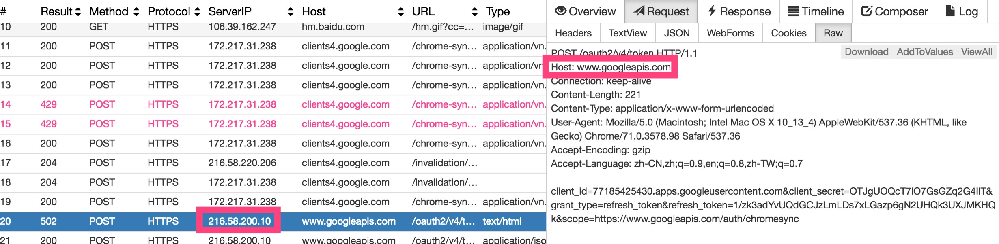

# 如何获取请求方的 ip

我们知道网页请求里面，请求是带 ip 的。比如下图这样的，但是其实 HTTP 协议报文是没有涉及到 IP 的，网络传输到网络层就加入了 ip，传输层加入了端口。



whistle 可以看到请求的信息，和目的地址。

那服务器接收到请求，如何处理呢？特别还是经过 nginx 转发的过程的请求，代理了好几层呢！

# X-Forwarded-For

> X-Forwarded-For（XFF）是用来识别通过 HTTP 代理或负载均衡方式连接到 Web 服务器的客户端最原始的 IP 地址的 HTTP 请求头字段。
> X-Forwarded-For 请求头格式非常简单，就这样：
> X-Forwarded-For: client, proxy1, proxy2

如果一个 HTTP 请求到达服务器之前，经过了三个代理 Proxy1、Proxy2、Proxy3，IP 分别为 IP1、IP2、IP3，用户真实 IP 为 IP0，那么按照 XFF 标准，服务端最终会收到以下信息：

```
X-Forwarded-For: IP0, IP1, IP2
```

Proxy3 直连服务器，它会给 XFF 追加 IP2，表示它是在帮 Proxy2 转发请求。列表中并没有 IP3，IP3 可以在服务端通过 Remote Address 字段获得。我们知道 HTTP 连接基于 TCP 连接，HTTP 协议中没有 IP 的概念，Remote Address 来自 TCP 连接，表示与服务端建立 TCP 连接的设备 IP，在这个例子里就是 IP3。

Remote Address 无法伪造，因为建立 TCP 连接需要三次握手，如果伪造了源 IP，无法建立 TCP 连接，更不会有后面的 HTTP 请求。不同语言获取 Remote Address 的方式不一样，例如 php 是 \$\_SERVER["REMOTE_ADDR"]，Node.js 是 req.connection.remoteAddress，但原理都一样。

虽然 Remote Address 无法伪造, 但是因为 X-Forwarded-For 这个信息来自于 HTTP 报文头，所以其实是可以伪造的。

首先我们要看一下自己公网的真实的 ip 地址，注意这里不是局域网地址，例如`ifconfig`查看的地址是经过转化的，不是公网的地址。例如我输入`ifconfig`显示的是 10.40.95.101，这不是公网的 ip。要查看公网的 ip 可以通过访问[http://www.ip138.com/](http://www.ip138.com/)获取，比如我真实的公网地址显示的是

```
您的IP是：[59.47.125.11] 来自：广东省深圳市 电信
```

好的，我已经确认了我的公网地址，接下来会在服务器验证一下。收到一段类似这样的消息。

```json
{
  "remoteIp": "59.47.125.11",
  "header": {
    "x-real-ip": "9.56.10.106",
    "x-forwarded-for": "59.47.125.11, 9.56.10.106"
  },
  "conRemoteAddress": "10.50.168.215",
  "socketRemoteAddress": "10.50.168.215"
}
```

其中，我们可以看到`59.47.125.11`就是我们的公网 ip 了。获取方式类似下面这样

```js
function getRemoteIp(req) {
  let ip = req.headers['x-forwarded-for']
  let m = ip.match(/\d{1,3}\.\d{1,3}\.\d{1,3}\.\d{1,3}/) //注意这里忽略了后面的代理ip，只取第一个
  return m && m[0]
}
```

但是除了这个`x-forwarded-for`报头，其实还有几个方式。就是`req.connection.remoteAddress`和`req.socket.remoteAddress`

# req.connection.remoteAddress 和 req.socket.remoteAddress

因为建立了 TCP 连接，所以我们的服务器是可以拿到真实的跟服务器通信的 ip 的，就是这里的 req.connection.remoteAddress 和 req.socket.remoteAddress.

可以看到他们都是显示的`10.50.168.215`这个 ip，那么这个其实就是服务器最后收到请求的 ip 了。

# 通讯链路

把整个链路串起来说的话是下面这样的：

```
客户端(59.47.125.11)-> 代理1(9.56.10.106) -> 代理2(10.50.168.215) -> 服务器
```

这里客户端 ip 我们通过网站获取到了，代理 1 和代理 2 的信息是携带在几个报文里面的。

# 参考

- [HTTP 请求头中的 X-Forwarded-For](https://imququ.com/post/x-forwarded-for-header-in-http.html)
