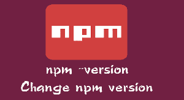

# npm version 升级版本号



## 版本号的定义

一般项目里面，`npm run xxx`可以执行`package.json`里面 script 的指令。
对于库的维护者来说，其实每次发布 npm 包要手动去更改 package.json 里面的版本号是很烦的。

npm 是有命令可以帮助我们升级 package.json 里面的版本号的。就是我们标题说的`npm version`命令。

一般我们的版本号会用类似`1.2.3`这样三位数来表示一个版本，就是`[major, minor, patch]`

- 第一个数字 1 表示主版本，major
- 第二个数字 2 表示小版本，minor
- 第三个数字 3 表示修订版本，一般用于修补 bug，patch

当然除了这些还有`prepatch`, `preminor`, `premajor`, `prerelease`这几个，需要的同学自行 google。

升级修订版本，版本号的命令，一般也是用的最多的。别人反馈一个 bug，修订后需要升级版本号并发布 npm。
`npm publish`之前需要执行 CI 过程，CI 成功则升级版本号，然后再执行发布。

## 升级版本号命令

```bash
npm version patch -f
```

单独执行`npm version patch`这个命令升级 patch 的版本，但是一般是不成功的，因为仓库不干净，但是可以加`-f`参数强制提交。
但是这个命令只是升级版本号而已，并不会提交代码。

> 除了 patch 修补版本还有 major 和 minor
>
> - 升级major版本号`npm version major`
> - 升级minor版本号`npm version minor`
> - 升级patch版本号`npm version patch`

所以我们还要加入一点黑科技，就是 npm 定义的几个 npm script 的钩子。

- preversion
- version
- postversion

如果你在`package.json`配置下面的命令。

```json
{
  "scripts": {
    "version": "echo 1",
    "postversion": "echo 2",
    "preversion": "echo 3"
  }
}
```

然后执行`npm version patch -f`，会依次输出`3,1,2`。所以这三个定义的顺序依次是`preversion`,`version`,`postversion`。
我们可以在`version`和`postversion`提交代码。

## 升级版本号并自动提交代码

如下面这样的配置

```json
{
  "scripts": {
    "version": "git add .",
    "postversion": "git push"
  }
}
```

会在执行`npm version patch -f`后自动提交当前分支的代码。注意就可以达到我们想要的效果。当然如果你加上各种 CI/CD 指令，就可以实现一个命令发布了。

这里`git push`如果不跟参数的话，在 git 版本不一样的情况下行为是不同的。推荐大家用新版本的`matching`，即 push 所有本地和远程两端都存在的同名分支。

## 参考

- [Git push 与 pull 的默认行为](http://blog.angular.in/git-pushmo-ren-fen-zhi/)
