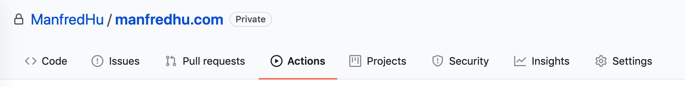
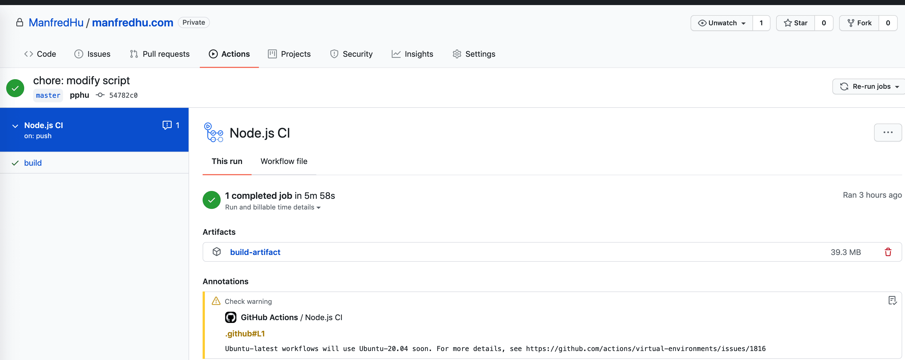
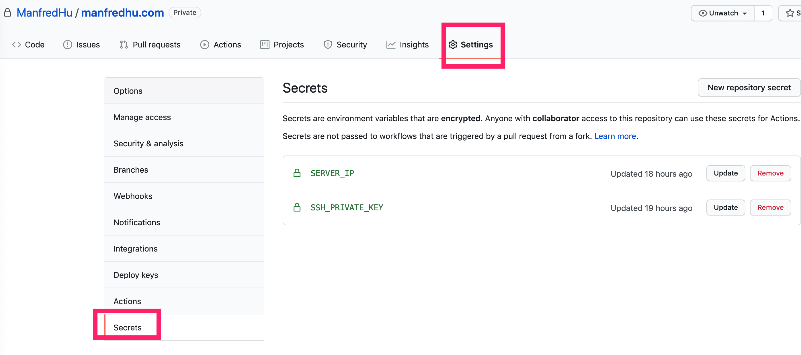

# 使用github actions完成CI/CD自动化部署
以前的Travis CI，跟现在的github ci，其实都是差不多的东西。不过可以肯定Github CI出来了后，其他的CI工具要靠边站了。新项目强烈推荐接入Github CI,这是非常简单的步骤，点击顶部的Tab里的Action，自动创建`.github/workflows`和对应的脚本文件，之后就可以自动运行了



入门的东西不多说，看[ 阮一峰的GitHub Actions 入门教程](http://www.ruanyifeng.com/blog/2019/09/getting-started-with-github-actions.html)
配置语法不建议过深研究，个人经验工作时候遇到很多CI平台，这个东西很多测试开发、内部系统开发的同学喜欢拿来做KPI，做的又难用又low。无力吐槽，遇到了再去看文档就好。

## 配置文件

```yaml
name: Node.js CI
on: [push]
jobs:
  build:
    runs-on: ubuntu-latest
    steps:
    - name: Checkout
      uses: actions/checkout@master
      
    - name: Use Node.js ${{ matrix.node-version }}
      uses: actions/setup-node@v1
      with:
        node-version: '12.x'
    - run: npm run init
    - run: npm run build --if-present
      
    - uses: actions/upload-artifact@v2 # 上传产物
      with:
        name: build-artifact
        path: client/docs/.vuepress/dist/

    # https://zhuanlan.zhihu.com/p/107545396
    - name: deploy file to server
      uses: wlixcc/SFTP-Deploy-Action@v1.0 
      with:  
        username: 'root'   #ssh user name
        server: '${{ secrets.SERVER_IP }}' #引用之前创建好的secret
        ssh_private_key: ${{ secrets.SSH_PRIVATE_KEY }} #引用之前创建好的secret
        local_path: './client/docs/.vuepress/dist/*'  # 对应我们项目build的文件夹路径
        remote_path: '/data/blog/manfredhu.com/client/docs/.vuepress/dist'

    # https://github.com/marketplace/actions/http-request-action
    - name: refresh cdn
      uses: fjogeleit/http-request-action@master
      with:
          url: 'someurl'
          method: 'GET'
```

简单解释下这里脚本的含义

### 监听操作on
首先`on: [push]`是表示在这个仓库有push操作的时候执行下面的jobs。jobs是一个线性的流程，当然也可以并发多个jobs。根据配置文件而定，想详细了解概念的可以看[官方文档](https://docs.github.com/cn/free-pro-team@latest/actions/learn-github-actions/introduction-to-github-actions)

`build:`声明了一个名为build的job，之后将按步骤顺序运行下面的steps。

### 指定运行环境runs-on
之后是`runs-on: ubuntu-latest`，这里runs-on的含义是配置在最新版ubuntu系统运行，当然这里还有mac，别问我windows……没看过CI跑在windows环境的。
**友情提示：推荐ubuntu系统，除非你需要其他系统。因为很多依赖的插件是只支持linux环境的**

### 步骤命名name
`- name: Checkout`是说这个步骤的名字，可以理解为注释用。方便看和日志打log区分

### 使用插件uses
`uses: actions/checkout@master`指的是用`actions/checkout`这个插件，拉取master代码。

### 指定node版本
```yaml
uses: actions/setup-node@v1
  with:
    node-version: '12.x'
```

这里是使用`actions/setup-node`插件的v1版本，传入参数`node-version`为`12.x`，则运行node版本为`12.x`。建议指定，因为有一些npm包是依赖node版本的，特别是c++编译的addons。

### 运行run

```yaml
- run: npm run init
- run: npm run build --if-present
```

之后只两个npm命令，大家应该很熟悉了。特别说下这里`--if-present`参数的含义，一般我们跑`npm run xxx`的时候，如果xxx这个命令不存在，是会报错的，也就是返回的错误码是非0的。

```bash
➜  manfredhu.com git:(master) ✗ npm run xxx
npm ERR! missing script: xxx

npm ERR! A complete log of this run can be found in:
npm ERR!     /Users/manfredhu/.npm/_logs/2020-12-04T08_27_44_488Z-debug.log
```

但是加了这个参数，就算xxx 这个命令不存在，也不会报错，而是静默失败，也就是返回了0

### 归档编译产物

```yaml
- uses: actions/upload-artifact@v2 # 上传产物
  with:
    name: build-artifact
    path: client/docs/.vuepress/dist/
```

这里用`actions/upload-artifact`的v2版本归档产物，传入参数`name`为最后压缩包的名字，path为编译后压缩到压缩包的目录。如上配置最后生成的产物是下图这样的 


### 发布部署

```yaml
# https://zhuanlan.zhihu.com/p/107545396
- name: deploy file to server
  uses: wlixcc/SFTP-Deploy-Action@v1.0 
  with:  
    username: 'root'   #ssh user name
    server: '${{ secrets.SERVER_IP }}' #引用之前创建好的secret
    ssh_private_key: ${{ secrets.SSH_PRIVATE_KEY }} #引用之前创建好的secret
    local_path: 'xxx/dist/*'  # 对应我们项目build的文件夹路径
    remote_path: '/xxx/.vuepress/dist'
```


编译产物都归档了，那么再次同步到机器也不是难事，这里用的是`wlixcc/SFTP-Deploy-Action`插件的v1版本，传入参数root，机器IP，本地和远端路径就好。

```yaml
${{ secrets.SERVER_IP }}
```
的写法，指的是`Settings下的Secrets`，如下图




secrets是一个key:value的格式，如上图我声明了`SERVER_IP`和`SSH_PRIVATE_KEY`，则可以通过下面的方式获取。

```yaml
${{ secrets.SERVER_IP }}
${{ secrets.SSH_PRIVATE_KEY }}`
```


SERVER_IP就是我腾讯云机器的公网IP，也就是我ssh登录的机器IP。而SSH_PRIVATE_KEY是私钥的字符串。这里生成公钥和私钥后把私钥贴这里，公钥贴在服务器`/root/.ssh/authorized_keys`里，则sftp传输采用ssh协议，不用输入密码。


```yaml
remote_path: '/data/blog/manfredhu.com/client/docs/.vuepress/dist'
```
是我腾讯云机器放置vuepress静态内容的地方

### CDN刷新
```yaml
# https://github.com/marketplace/actions/http-request-action
- name: refresh cdn
  uses: fjogeleit/http-request-action@master
  with:
    url: 'http://google/refreshCdn'
    method: 'GET'
```

最后一步，因为同步构件产物后，CDN还没刷新过来。需要手动强制刷新，这里我封装了腾讯云的CDN刷新API，调用服务接口就可以刷新CDN，当然也可以做通知等。大家自己想了

## github actions可以做什么？
简单说，可以用github actions做CI/CD的很多东西，提交代码即部署，解放程序员的一堆繁琐操作。很多东西都可以自动化完成了。而不是自己去机器一步步执行命令。当前前提是你有运维的知识，可以先把CI/CD的流程先搞好