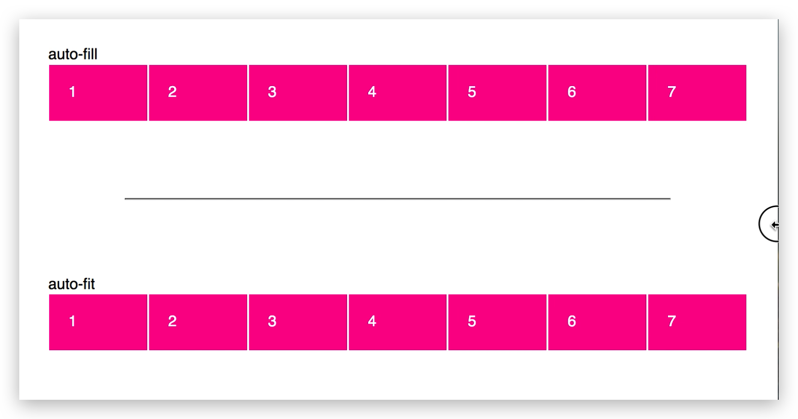
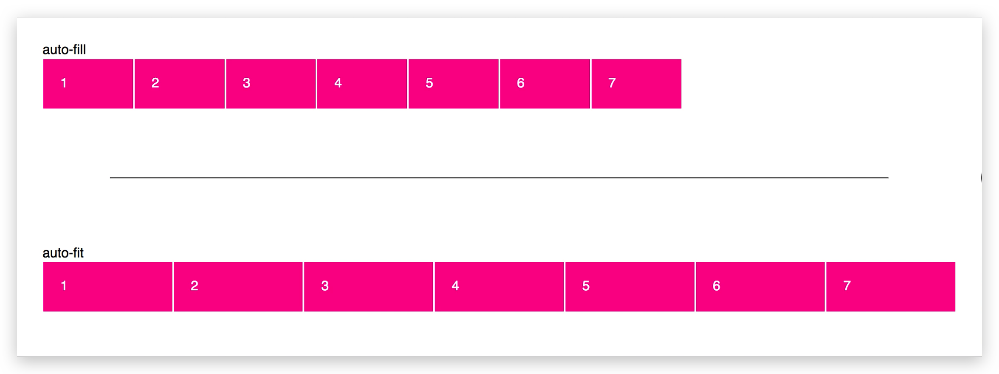

# grid布局
这是一个非常强大的功能，flex布局可能很多行代码，用grid的话最少代码减半。但是更要去了解的是grid的思路和思想
与以前的table布局类似，grid更像是flex+table的方式

## display: inline-grid vs display: grid
跟块级元素和内联元素类似, `display: grid`对应下图1, `display: inline-grid` 对应下图2


## grid-template-columns 和 grid-template-rows
以grid-template-columns举例，有下面N种写法

- `grid-template-columns: 100px 100px 100px;`
- `grid-template-columns: 33.33% 33.33% 33.33%;`
- `grid-template-columns: repeat(3, 33.33%);`
- `grid-template-columns: repeat(auto-fill, 100px);`
- `grid-template-columns: 1fr 1fr;`
- `grid-template-columns: 1fr 1fr minmax(100px, 1fr);`
- `grid-template-columns: 100px auto 100px;`
- …

其中既有固定宽度的、也有百分比、等比分配fr，自动计算等等, 非常灵活多变. 常见的三列等分，可以用下面的布局方式，其中column-gap还可以支持按照间距分配。

### 多等分布局
```css
/* box空间三等分,列间距为20px */
.boxs {
  width: 100%;
  display: grid;
  grid-template-columns: repeat(3, 1fr);
  column-gap: 20px;
}
```
其中repeat的3可以换成n(n>0)，就是多等分布局了. 你可以点击 [multi-col](https://codesandbox.io/s/multi-col-lkdtx5) 体验

### 圣杯布局
类似左右边栏为200px,中间部分满屏，间距为10px，代码如下

```css
.box{
  grid-template-columns: 200px auto 200px;
  column-gap: 10px;
}
```

```BASH
---------------------------------------------------
|                 |               |               |
|   Left Sidebar  |   Main Content|  Right Sidebar|
|                 |               |               |
|                 |               |               |
|                 |               |               |
---------------------------------------------------
```


### 实战
一个表格的例子，这里需求是三分表格，之后最后一列文字右对齐。还有row对应的`border-bottom`。本来想用flex或者是table，转念一想还是上`grid`,毕竟多用才能熟，遇到了不少问题。

你可以[戳这里](https://codesandbox.io/s/grid-table-k27dcd?file=/index.css)
```html
<div class="score-detail">
  <div class="score-detail__title">
    当前周期数据
  </div>
  <div class="score-detail__main">
    <div class="bold">
      指标名称
    </div>
    <div class="bold">
      得分
    </div>
    <div class="bold">
      较上一周期
    </div>
    <div>1</div>
    <div>3</div>
    <div>3</div>
    <div>4</div>
    <div>5</div>
    <div>6</div>
    <div>7</div>
    <div>8</div>
    <div>9</div>
  </div>
</div>
```

```css
.score-detail{
  padding: 32px 48px;
  border-radius: 8px;
  background: rgba(0, 0, 0, 0.01);
  &:last-child{
    margin-top: 16px;
  }
}
.score-detail__title{
  font-weight: bold;
  margin-bottom: 24px;
}
.bold{
  font-weight: bold;
}
.score-detail__main{
  display: grid;
  grid-template-columns: 50% 1fr 1fr;
  div {
    height: 52px;
    line-height: 52px;
    border-bottom: 1px solid pink;
    &:nth-child(3n+3) {
      text-align: right;
    }
  }
}
```

### 三等分并不能完全满足我的需求

```less
grid-template-columns: 1fr 1fr 1fr;
```

中间得分一列太靠左，所以这里改成了，尽量接近设计稿的3等分

```less
grid-template-columns: 50% 1fr 1fr;
```

### grid布局里row border的问题
其次是这里的`border-bottom`，因为grid布局就没有对这里的行border做约束，翻了下[stackoverflow](https://stackoverflow.com/questions/51085555/horizontal-border-across-entire-row-of-css-grid)，一个是用背景渐变`repeating-linear-gradient`+`row-gap`。还有一个方法是用伪类在每行最后一个元素后面加一个大横条。

感觉都属于hack的手段，果断子元素`border-bottom`走起，不过发现

```less
&:nth-child(3n+3) {
  justify-self: right;
}
```

这里右对齐的效果会打断


所以修改了属性

```less
&:nth-child(3n+3) {
  text-align: right;
}
```

### grid布局row height的问题
如果设置
```less
grid-template-rows: 52px;
```
只会对第一个元素生效，所以这里对子元素设置`height`+`line-height`实现文字垂直居中对齐和撑大容器高度使其满足间距

## `auto-fill` vs `auto-fit`
考虑如下的case
```css
.grid {
   display: grid;

  /* define the number of grid columns */
  grid-template-columns: repeat(12, 1fr);
}
```

这种方式的写法不管元素大小, 总会均分为12份. 在小屏幕手机上宽度会被压缩到很小, 不适合实际场景. 为了解决最小宽度问题会改用`minmax`

```css
grid-template-columns: repeat( 12, minmax(250px, 1fr) );
```

这又会导致超出的问题, 如果屏幕宽度小于12*250px, 则水平方向行内将溢出.

为了让其换行, 我们会添加`auto-fill` 或者`auto-fit`属性, 但是你知道两个属性对最后布局有什么影响吗? 
```css
grid-template-columns: repeat(auto-fill, minmax(250px, 1fr));
grid-template-columns: repeat(auto-fit, minmax(250px, 1fr));
```

**结论: **
在小屏幕上面两者表现一致, 但是如果容器超出限定的范围了. 两者对余量空间处理不一致



1. `auto-fill`倾向于补充更多的列数量, 而原列宽度保持不变
2. `auto-fit`倾向于扩展原列宽度适应余量空间



你可以[点击查看这个例子](https://codepen.io/SaraSoueidan/pen/JrLdBQ)

## 兼容性
- IE10+基本PC主流浏览器都支持
- 微信生态基本支持（包括移动端页面和小程序），偏门的属性等有待支持，具体的可以再去查

## 参考
[阮一峰-CSS Grid 网格布局教程](https://www.ruanyifeng.com/blog/2019/03/grid-layout-tutorial.html)