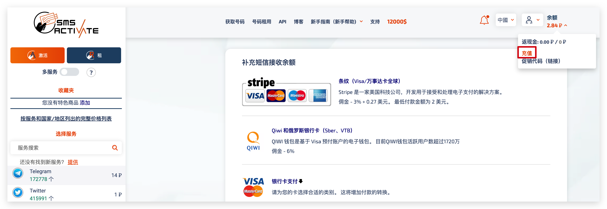
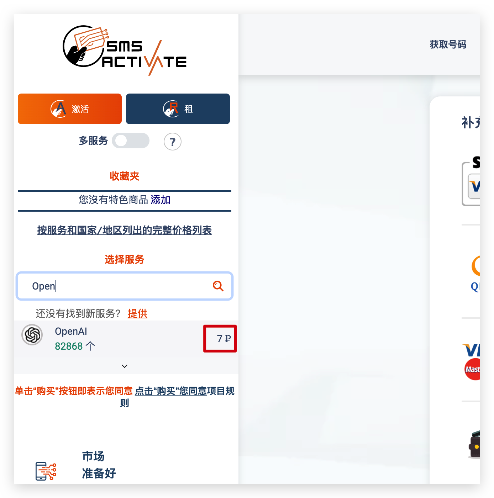
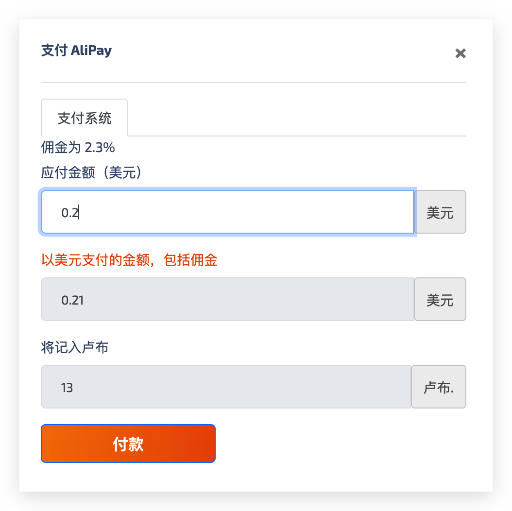
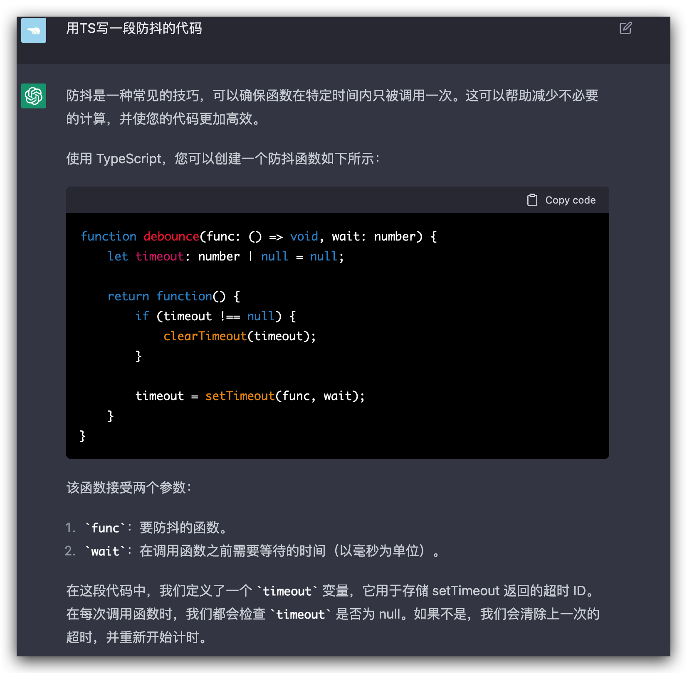
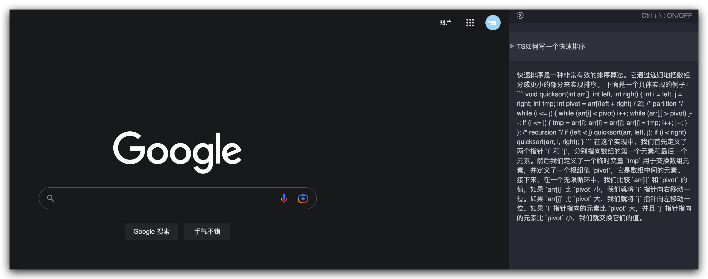
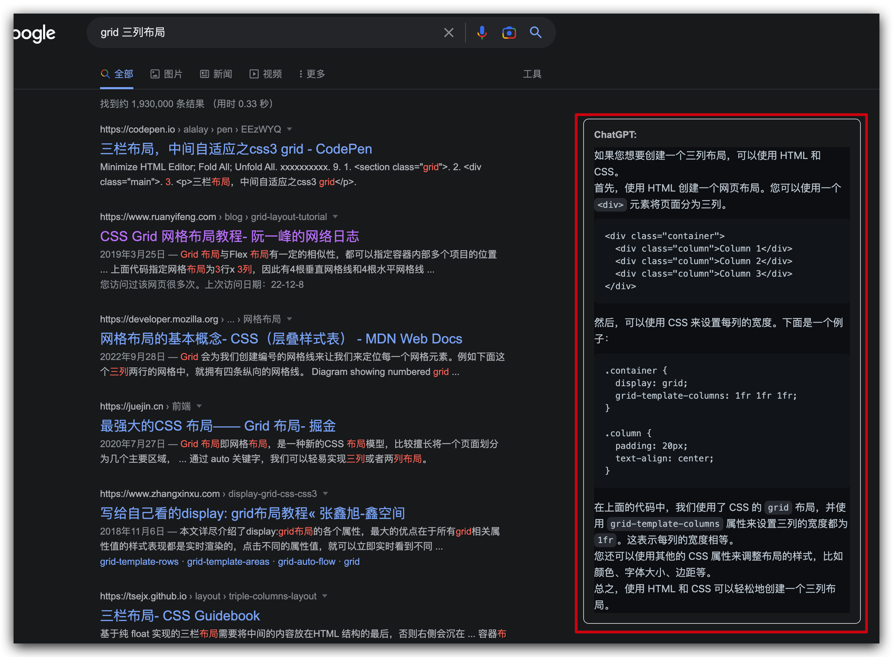
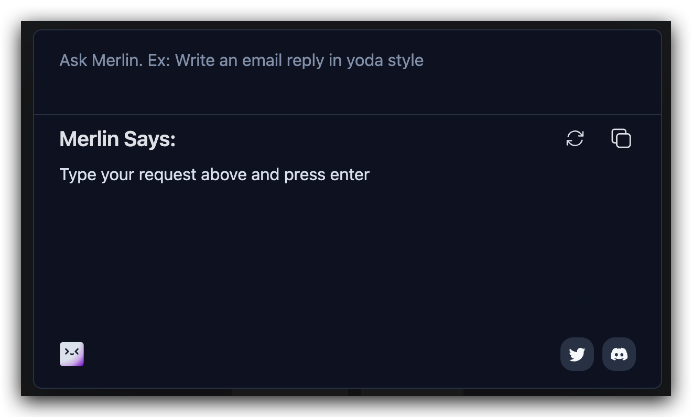
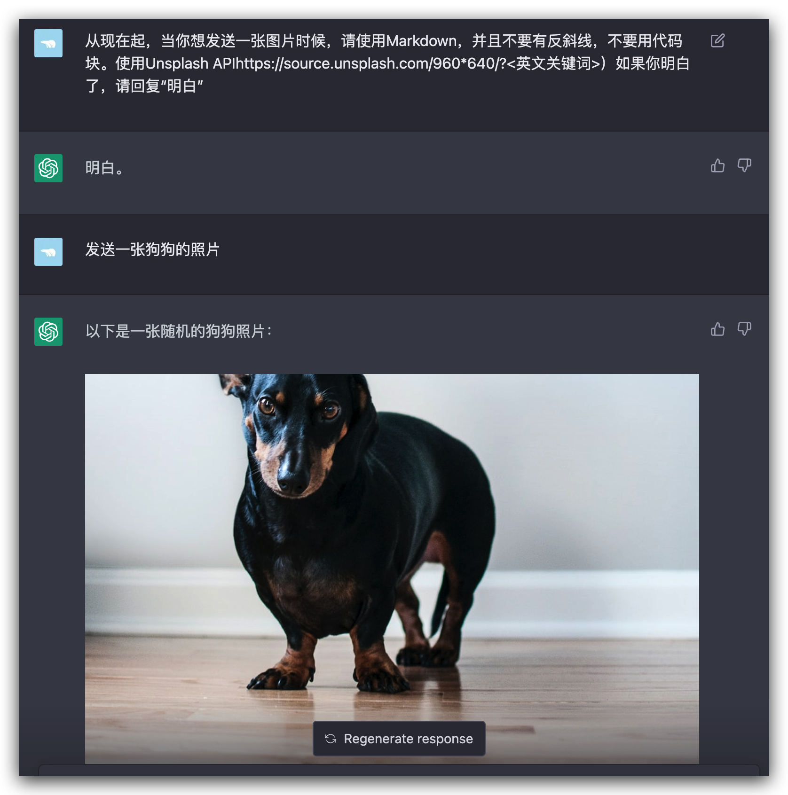

# ChatGPT
AI🔥了很多年但是一直没有普适性，抖音Tiktok推荐算法让人很上头但是还是娱乐属性并不能提效。但是ChatGPT可以，Google发出一级警报，当大家习惯用ChatGPT开始得到高效答案，那么Google市值会缩水8成。

## 现实背景
我们的网络充斥着大量无效信息，很多都是拷贝复制粘贴再改一下做到去重，与之对应的是信息检索的效率，搜素引擎会提升信息检索效率，让信息块从孤岛变为互联网网状结构。如何高效获取信息，一定是生产力提高的关键。

**当前AI办公标配，可以极大加速已有的信息检索功能**

- VSCode Copilot
- ChatGPT
- NotionAI

## ChatGPT是什么？

- GPT是Generative Pre-trained Transformer的缩写，是一种自然语言处理模型，采用了Transformer模型结构和预训练技术。该模型通过大量的无监督学习，在多个自然语言处理任务上取得了非常优秀的性能，成为了目前自然语言处理领域的研究热点之一。
- ChatGPT是基于GPT模型的一个应用，它是一个聊天机器人模型，通过对话生成文本来与用户进行交互。ChatGPT通常使用了一些技巧来控制对话的主题、风格和质量等方面的特征，从而使得机器人生成的对话更加符合用户的期望。由于其能够生成高质量的自然语言文本，因此在智能客服、教育、娱乐等领域有着广泛的应用。

## ChatGPT如何申请

链接：https://chat.openai.com/chat

首先需要有一个外国可以接收手机验证码的账号，然后在这个网站上注册一个账号，然后就可以申请了。

### 1. 注册OpenAI账号

https://chat.openai.com/chat

登陆如上网站，点击`Sign up`注册按钮，然后输入邮箱，密码，点击注册。之后要绑定一个外国手机号，如果打开网站提示地区无法访问，切换VPN节点 or 代理试试，也可以打开浏览器的隐私模式试试，反正绕过去就OK了

### 2. 申请外国手机号
这里我们使用[SMS-activate](https://sms-activate.org/cn/getNumber)来申请，这是一个虚拟号码租赁平台，可以按次计费，也可以短期租赁。



充值足够的钱，可以搜索看下OpenAI的账号要多少钱，下面显示是7卢布




汇率自动换算，0.1美元才6.5卢布，不够买号，所以充值0.2美元，就可以买到一个号码了。之后把这个号码绑定到OpenAI账号上，就可以申请了。会发送一个验证码，网站不久后就有了，注意接收验证码




### 3. ChatGPT

验证通过后就可以愉快使用ChatGPT体验AI的魅力了，比如顺手问一段防抖的工具方法



## Chrome浏览器插件
- ~~[Ctrl/Control+\ 拉起ChatGPT](https://github.com/iOliverNguyen/chatgpt-extension)~~（不推荐了，merlin更好用）
  - 
- ~~[Google伴随搜索](https://github.com/iOliverNguyen/chatgpt-extension)~~
  - 
~~- [Merlin](https://chrome.google.com/webstore/detail/merlin-openai-chatgpt-pow/camppjleccjaphfdbohjdohecfnoikec?hl=zh-CN) UI还可以的ChatGPT插件，但是有次数限制~~
  - 
- [Voice Control for ChatGPT](https://chrome.google.com/webstore/detail/voice-control-for-chatgpt/eollffkcakegifhacjnlnegohfdlidhn) 可以开始语音对话了, 很神奇的体验
- [Codeium](https://marketplace.visualstudio.com/items?itemName=Codeium.codeium) VSCode插件，可以在VSCode里面使用ChatGPT
- [KeepChatGPT](https://github.com/xcanwin/KeepChatGPT/) 可以保持ChatGPT会话持续
- [GitHub.copilot-labs](https://marketplace.visualstudio.com/items?itemName=GitHub.copilot-labs) VSCode插件, 有比较高级的功能, 解释代码等

## 客户端
- [Cursor](https://www.cursor.so/) 第一个客户端ChatGPT吧
  - 选择代码后 `Cmd+K` or `Cmd+L` 即可呼出提示

## Siri结合
详情查看[Github](https://github.com/Yue-Yang/ChatGPT-Siri/blob/main/README-zh_CN.md)

## 如何让ChatGPT输出图片


调教文本如下
```
从现在起，当你想发送一张图片时候，请使用Markdown，并且不要有反斜线，不要用代码块。使用Unsplash APIhttps://source.unsplash.com/960*640/?<英文关键词>）如果你明白了，请回复“明白”
```