# zen·工作环境搭建(长期更新)

> 俗话说：“工欲善其事必先利其器”，高效的工作环境可以提升开发效率

下面介绍的都是实际工作用到的，自己折腾出来的最佳选择，可能不适合所有人，可以按需取用，各取所需。

## 硬件和操作系统

能上Mac就上Mac，windows并不适合开发，遇到的坑已经够多了。Mac的话推荐笔记本，主要是移动办公方便，电脑24小时不离身，出问题也方便解决。而且iMac外接屏幕基本就是蛋疼-_-!。mbp照着最新的买就好，m1能上也行。前端环境现在基本MacOS是标配
键盘可以看我推荐的Keychron或者HHKB。主要是用的爽，苹果自带的键盘撸了两年最后觉得实在不好用，代码写起来完全没激情。还是机械键盘好。鼠标可能是因为我手大，妙控鼠标觉得太小了，支撑不行。

* 笔记本电脑 最新mbp
* 键盘 keychron2或者HHKB
* 触摸板 苹果

我还加了一块触摸板，主要是方便左右手鼠标+触摸板可以高效切换桌面浏览器/开发工具和编辑器等等。个人习惯，用起来确实爽，而且触摸板基本一个月才冲一次电，平时基本可以忽略用电

### 系统配置

#### 将功能键(F1-F12)设置为标准的功能键

主要是程序员用不到一些功能，F1-F12会多出来12个自定义功能键等

系统偏好设置 -> 键盘
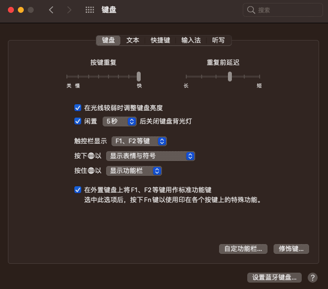

#### 触摸板

系统偏好设置 -> 触摸板
全开就好了，跟踪速度最大


#### Dock居左

系统偏好设置 -> 程序坞与菜单栏
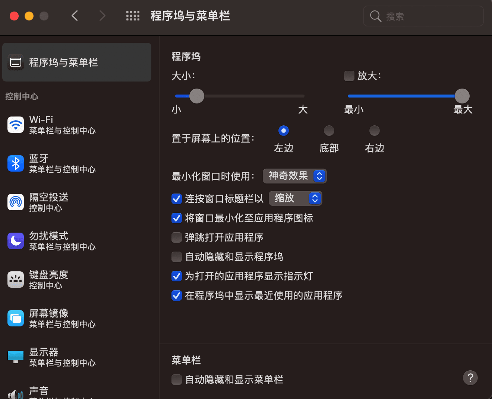

#### Tab切换选项

系统偏好设置 -> 键盘
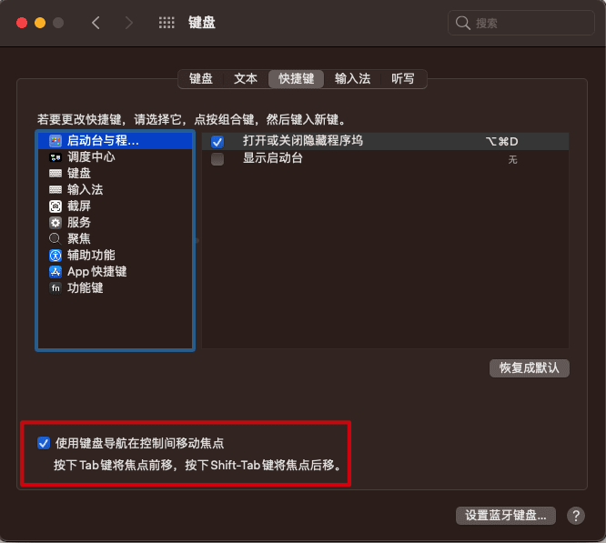

这样设置后可以用Tab在选项间做切换，如保存文件的时候


#### 右下角触发屏幕保护

系统偏好设置 -> 桌面与屏幕保护程序，切换到屏幕保护程序，右下角触发角设置
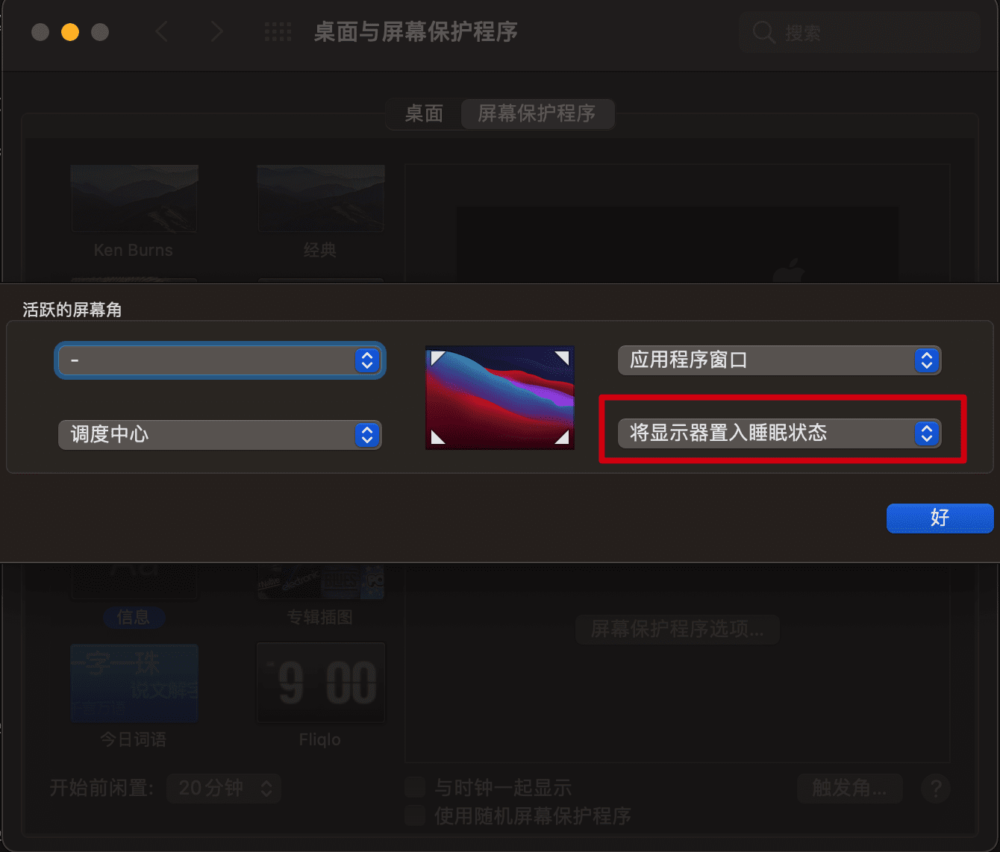

再设置进入屏保后需要密码才能进入，在系统偏好设置 -> 安全性与隐私


好了现在你有事可以直接鼠标移到右下角进入屏保然后走人，别人再来需要密码才能进入你的电脑

[Mac快捷键使用](https://support.apple.com/zh-cn/HT201236)，基本是所有软件都支持的，下面列几个常见的，有一些可能用的不多，但是如果HHKB下没有方向键则会体会都优势

* 光标方向
  + `ctrl`+`a/e`可以实行移动到行首/行尾
  + `ctrl`+`f/b`实现单字符的左右移动(forward/back)
  + `ctrl`+`p/n`实现移动至上一行/下一行(previous/next)
* 删除
  + `ctrl`+`U`清理之前的输入
  + `ctrl`+`h/d`实现向前删除/向后删除
  + `ctrl`+`w`可以实现向前删除一个单词

#### 始终显示滚动条
系统偏好设置->通用，如下设置，底部“接力”也可以一起开了，如果你用的苹果手机的话复制电脑可以粘贴，前提是wifi蓝牙一起打开

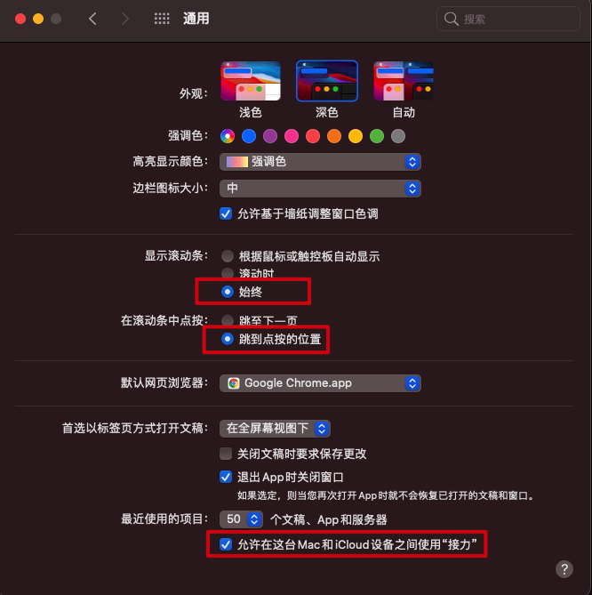

#### 自定义工具栏


#### 配置启动台显示行数和列数

启动台，即触摸板开启后四指收合的手势会出现启动台，这里有电脑所有的应用程序集合，默认的行列太少了，可以终端输入如下命令修改

```bash
defaults write com.apple.dock springboard-columns -int 9
defaults write com.apple.dock springboard-rows -int 6
defaults write com.apple.dock ResetLaunchPad -bool TRUE
killall Dock
```

以上命令的含义如下

1. 调整每一列显示图标数量，9表示每一列显示9个，数字部分可根据个人喜好进行设置。
2. 调整多少行显示图标数量，这里我用的是6，数字部分你也可以改成8或其他
3. 重置Launchpad
4. 重启Dock

#### 去除拼写检查

主要是偶尔每一次敲击如果设置了文本检查则都会比较慢，特别是中文输入的时候

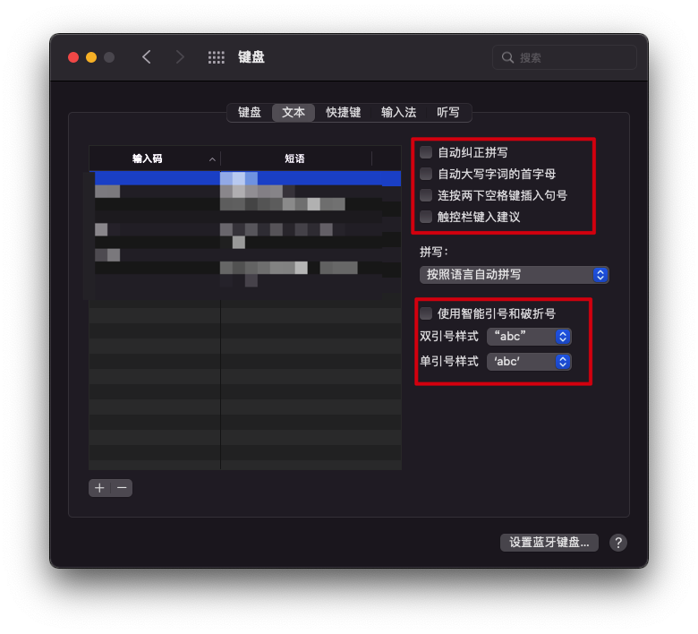
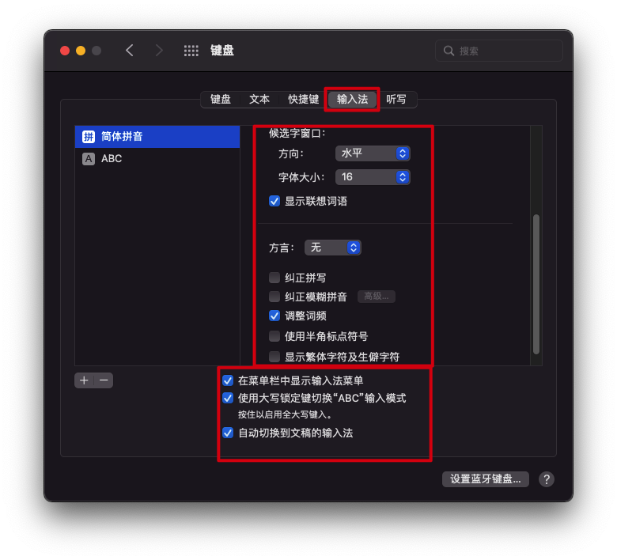

可以换搜狗输入法，但是我发现杀一下输入法进程重启就好了

```BASH
pkill -f SCIM.app
```


参考：https://www.zhihu.com/question/21205282

## 软件

软件也是跟开发效率息息相关的，只推荐好用的。Mac的软件基本都收费的，可以去买个软件分享会员，基本就可以畅行无阻了。

其次，Mac也会对软件来源限制，可以按照[这里](https://xclient.info/a/74559ea2-7870-b992-ed53-52a9d988e382.html)的来解开限制

### XCode
- 除非是做 iOS 开发，否则没有必要安装几个 G 的 Xcode，直接安装 `Xcode Command Line Tools` 即可；
- 安装步骤：打开终端 -> `xcode-select --install` 回车 -> 按照提示完成操作即可。
- 为什么要安装这个东西呢，解释一下：它提供了一系列编译工具集(git, make, clang, gcc, etc)，安装 homebrew 也需要用到。

### Chrome

谷歌浏览器，时下最流行的浏览器。[快捷键](https://support.google.com/chrome/answer/157179?hl=zh-Hans&co=GENIE.Platform%3DDesktop#zippy=%2Cgoogle-chrome-%E5%8A%9F%E8%83%BD%E5%BF%AB%E6%8D%B7%E9%94%AE)值得去深入研究一波，这里不细说。记多少看自己了

#### 插件

推荐一些日常用的插件

- **常用**
  * [Github Toc](https://chrome.google.com/webstore/detail/github-toc/nalkpgbfaadkpckoadhlkihofnbhfhek/related?hl=zh-CN) github的readme没有目录，这个插件可以生成目录
  * [Octotree](https://chrome.google.com/webstore/detail/octotree-github-code-tree/bkhaagjahfmjljalopjnoealnfndnagc) 可以侧边栏看Github项目的全局文件，当然你也可以直接按`.`快捷键进入Github的网页编辑器
  * [octolinker](https://chrome.google.com/webstore/detail/octolinker/jlmafbaeoofdegohdhinkhilhclaklkp) 查看github代码的时候可以点击依赖跳转过去
  * [Tampermonkey](https://chrome.google.com/webstore/detail/tampermonkey/dhdgffkkebhmkfjojejmpbldmpobfkfo?hl=zh-CN) 油猴，很多脚本，只有你想不到
  * [YouTube™ 双字幕](https://chrome.google.com/webstore/detail/youtube-dual-subtitles/hkbdddpiemdeibjoknnofflfgbgnebcm?hl=zh-CN) 推荐，非常好用
  * [NIM(Node.js 调试管理工具)](https://chrome.google.com/webstore/detail/nodejs-v8-inspector-manag/gnhhdgbaldcilmgcpfddgdbkhjohddkj?hl=zh-CN) 很厉害的调试工具，可以自动打开监听
  到的页面
  * [Proxy SwitchyOmega](https://chrome.google.com/webstore/detail/proxy-switchyomega/padekgcemlokbadohgkifijomclgjgif?hl=zh-CN) 很强的代理管理工具，配合Whistle两道转发随时切换
  * [JSONView](https://chrome.google.com/webstore/detail/jsonview/chklaanhfefbnpoihckbnefhakgolnmc?hl=zh-CN) 一个JSON工具，比如打开JSON文件自动检查是否有错误，或者打开一个JSON返回的时候自动格式化为JSON树状格式，不用自己复制再去格式化，全自动
  * [Set Character Encoding](https://chrome.google.com/webstore/detail/set-character-encoding/bpojelgakakmcfmjfilgdlmhefphglae?hl=zh-CN) 遇到某些乱码，如编码错误的返回，可以右键改编码
  * [捕捉网页截图](https://chrome.google.com/webstore/detail/take-webpage-screenshots/mcbpblocgmgfnpjjppndjkmgjaogfceg?hl=zh-CN) 可以截图整个网页为图片，跟屏幕截图还不太一样，有需求的同学可以装
  * [Momentum](https://chrome.google.com/webstore/detail/momentum/laookkfknpbbblfpciffpaejjkokdgca) Chrome打开新的tab的时候，会有高清大图，而且有todolist之类的应用
  * [Vimium C](https://github.com/gdh1995/vimium-c) 一个很厉害的Chrome插件，主要是熟悉Vim的话会觉得非常的方便
    * [使用教程](https://www.jianshu.com/p/98c95055d5fa)
  * [omni](https://github.com/alyssaxuu/omni) 很强大的Chrome tab/书签 管理工具，通过 [chrome://extensions/shortcuts](chrome://extensions/shortcuts) 设置快捷键，可以搜索书签或者打开的tab等
  * [Tango](https://chrome.google.com/webstore/detail/tango-screenshots-trainin/lggdbpblkekjjbobadliahffoaobaknh) 录制网页操作教程，比如第一步第二步第三步做什么等等
- 框架相关
  * [Vue Devtools](https://chrome.google.com/webstore/detail/vuejs-devtools/ljjemllljcmogpfapbkkighbhhppjdbg?hl=zh-CN) 记住Vue3要用最新版本，体验比以前好太多，而且兼容Vue2
  * [React Developer Tools](https://chrome.google.com/webstore/detail/react-developer-tools/fmkadmapgofadopljbjfkapdkoienihi?hl=zh-CN) React调试工具
  * [Redux DevTools](https://chrome.google.com/webstore/detail/redux-devtools/lmhkpmbekcpmknklioeibfkpmmfibljd?hl=zh-CN) Redux调试工具

### 终端

iterm2+zsh基本没争议

* [iterm2](https://github.com/gnachman/iTerm2)
* [zsh](https://ohmyz.sh/#install)

#### iterm2配置

主要是一些快捷键配置，个人习惯可以改，但是大体差不多

zsh的插件可以去看[最好用的shell-ohmyzsh](./oh-my-zsh)

一些简单的快捷键，其实 `ctrl` + `a/e` 这种是系统自带的，很多地方都能用

* `cmd`+`T`新建
* `cmd`+`D`垂直分屏
* `cmd`+`shift`+`D`水平分屏
* `cmd`+`U`透明度切换，一般截图的时候不想让人家看到后面用
* `cmd`+`K`清屏
* `cmd`+`number`，比如cmd+1为第一个tab等
* `cmd`+`上下左右`，切换tab


iterm2一般会跟服务器进行上传下载操作，此时需要更好的插件，比如有显示进度条的
[trzsz](https://trzsz.github.io/)

#### [tig](https://devhints.io/tig)

一个git图形化命令行工具，主要是因为git的命令行工具比较薄弱，交互太烂。而VSCode的git管理工具遇到过失灵的情况，且只能看到最后的总文件变更，如果你要去找到某一行代码是谁改的，会非常难用。
主要是几个命令， `Ctrl+C` 可以退出交互

```bash
tig status # 进入status视图，会注明 Untracked files/Changes not staged for commit/Changes to be committed 的文件
tig blame <file> # 查询文件的每一行最后修改信息
tig <branchname> # 查看某个分支的提交信息
tig <oldBranch>..<newBranch> # 查看两个分支的diff
tig <filename> # 查看某个文件的提交历史
```

需要结合常见的vim光标移动和翻页操作
```
hjkl 左下上右
ctrl+d down下翻半页
ctrl+u up上翻半页
空格 下翻一页
- 上翻一页
```
很强大，感觉可以单独开篇写了。写完了，点击[这里](./tig)查看

### 窗口管理软件

[Moom](https://manytricks.com/moom/)，可以快捷键编排窗口大小和位置，附上个人快捷键设置，在VSCode需要多项目分屏的时候特好用

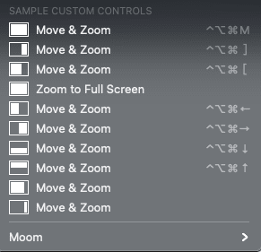

也有推荐[Rectangle](https://github.com/rxhanson/Rectangle)的感兴趣的可以试试

### Alfred

[Alfred](https://www.alfredapp.com/)，超越系统搜索，功能太多自行挖掘，可以参考[这里](https://www.jianshu.com/p/e9f3352c785f).

先关闭系统的搜索再用Alfred的快捷键替换系统的搜索，这样相当于升级系统的搜索

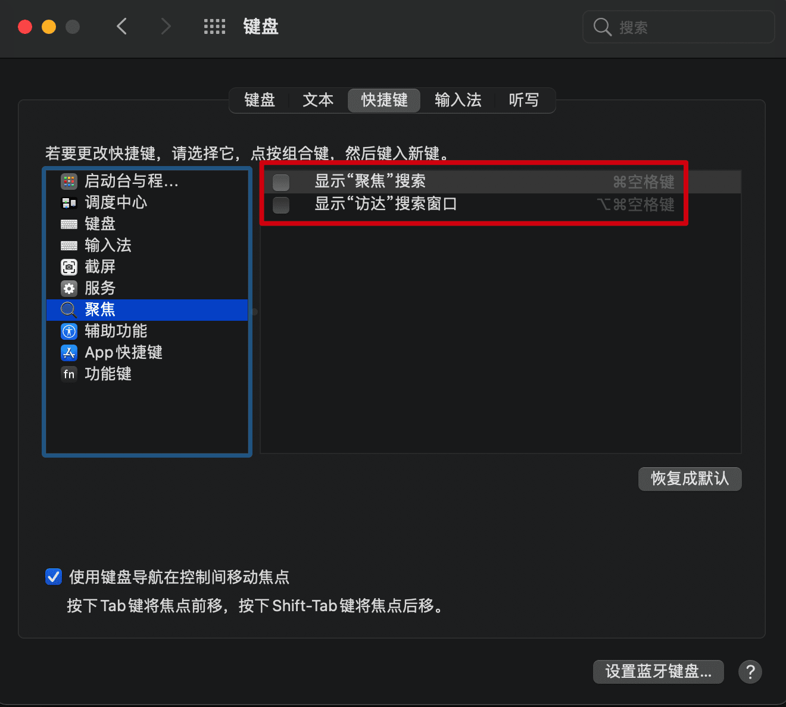
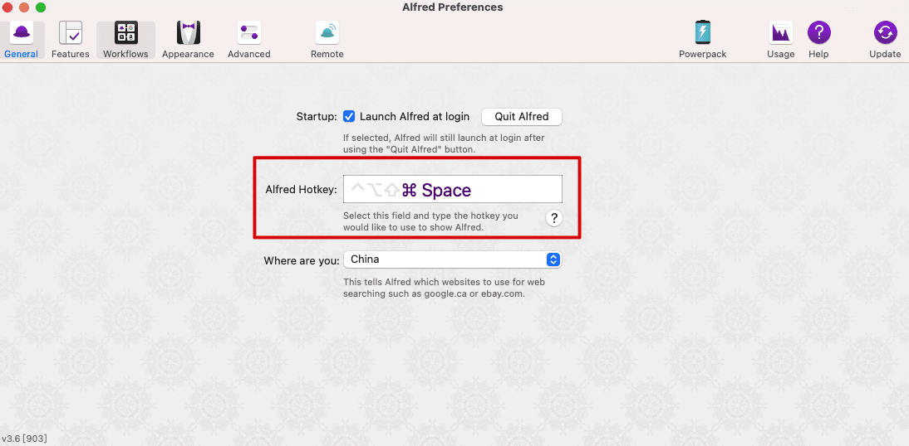

可以配置如下功能
* 应用搜索
* 文件搜索
* `bm` 搜索浏览器书签，甚至区别多个账户
* Snippets，短语编辑，比如常用的姓名地址电话号码都可以设置短语编辑
* 一键打开 google/gmail 等，比如配置 `g manfredhu`可以google搜索我
* 计算器，不需要打开直接输入就可以得到结果
* 搜索打开代码项目
* `> code ./` 类似的命令执行，而且是在itemr2运行命令

几个场景举例

1. 移动场景下很多时候要连接代理，这个时候要获取电脑IP，常规的控制打个`ipconfig/ifconfig`。这里直接[一个插件实现GetIp功能](https://github.com/ManfredHu/alfred-workflow-getip)
2. 发布的时候要写哪天的发布方便后面回归特性等需求，可以用到Snippets功能，如下图，比如正常发布用 `🚀🚀🚀【2022年11月3日 23:00:38】常规发布` 作为标题，与众不同
  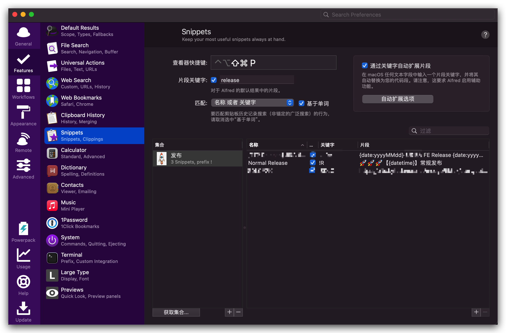
3. 对浏览器书签分类，取个简单名字记忆，然后`bm <bookmark name>`
4. 配置iTerm2终端执行命令
  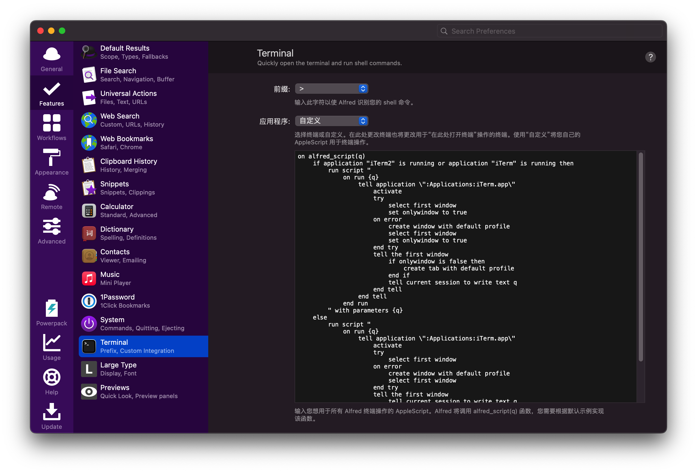

#### workflow

* [Github](https://github.com/gharlan/alfred-github-workflow)，授权登陆后，github所有项目可以直接跳转，真的是N倍的快乐。搜索命令`gh`
* [StackOverflow](https://github.com/deanishe/alfred-stackexchange)，搜索命令`.so`
* [CodeVar](https://github.com/xudaolong/CodeVar)，就是你不知道要起什么变量名的时候，搜索命令`xt`小驼峰

### Git
安装可以自行搜索，这里说下如何配置个人与公司双重账号。一般个人账号全局配置，然后可以在全局`~/.gitconfig`文件配置，设置同时创建
`~/work`为工作目录并在访达添加

```bash
[user]
    name = 你的名字
    email = 你的邮箱@gmail.com
[includeIf "gitdir:~/work/"] # 注意这里要放在最后，因为工作的邮箱要覆盖全局的
    path = .gitconfig-work
```

`~/.gitconfig-work`按照如下配置

```bash
[user]
    name = xxx
    email = xxx@xxx.com
```

这样`~/work/`目录用来放工作项目，以`xxx@xxx.com`提交代码，与个人项目隔离。同时可以配置`~/.bashrc`如下增加全局指令跳转方便来回切换

```bash
alias doc="cd /Users/xxx/Documents"
alias work="cd /Users/xxx/work"
```

### [Paste](https://pasteapp.io/)

自动记录下前N个剪辑板的东西，后面可以用到可以返回去找。快捷键 `Shift+Command+V`

### [Xnip](http://zh.xnipapp.com/)

截图用，系统自带的截图有点不灵活片，不能标注。之前用的腾讯的[截图](https://jietu.qq.com/)也很好用，不过新的mac用不了

### [翻译Bob](https://ripperhe.gitee.io/bob/#/)

一个好用的翻译软件，全局可以翻译一些东西，高效。结合各大xx云的翻译接口，可以畅游所有英文文档

特别推荐绑定自己的云服务接口，不会收到频率限制，非常稳定。其次是OCR识图，基本可以解决国内各大canvas实现的文档关闭复制的能力，是的说的就是飞书。

### CleanMyMac

主要是配置不高的时候定期清理可以提高系统速度，收费。免费的可以用腾讯的[柠檬](https://lemon.qq.com/)

### 图片处理

* `HEIC Converter`，主要是iphone高版本手机图片格式是HEIC，隔空投送到电脑格式不变，需要批量转化。App Store搜下就有了

### [Thor](https://github.com/gbammc/Thor)
雷神索尔，快捷键控制窗口切换，真的是像闪电⚡️一样快的切换，跟`cmd+tab`不一样，Thor是支持DIY快捷键的，你可以给每一个应用程序定义自己的快捷键。

cmd+1~9让你有一种打dota改键操作的快感

### 常用cli 
- [npkill](https://www.npmjs.com/package/npkill) 用于管理整个电脑的node_modules
- [nvm](https://github.com/nvm-sh/nvm) 用于切换不同的node版本

### 屏保
[fliqlo](https://fliqlo.com/) 很经典的锁屏时钟


## 开发

### 代码格式化prettier

推荐prettier，规范都是虚的，每个人见仁见智，很多人封装了自己的ESlint规则库，开发的时候运行报错还要手动修改。私认为能提供工具就提供工具，而不是写个规范要开发者遵守。
这里prettier能帮助开发者直接修改代码为格式化后的代码，多人开发的话基本业内已经认同了。

1. 项目安装prettier

<CodeGroup>
  <CodeGroupItem title="NPM" active>

```bash:no-line-numbers
npm i -D prettier

```

  </CodeGroupItem>
  <CodeGroupItem title="YARN">

```bash:no-line-numbers
yarn add --dev --exact prettier
```

  </CodeGroupItem>
</CodeGroup>

2. 项目根目录创建`.prettierrc`和`.prettierignore`文件

```json
semi: false // 不需要;
singleQuote: true // 单引号
printWidth: 80
trailingComma: 'none' // 行尾,号
arrowParens: 'avoid' // 单参数可以不用括号，如 x => x，如果是always则会变成 (x) => x
```

::: details .prettierignore 内容 

```
# Ignore artifacts
build
dist
coverage

# Ignore all HTML files:
*.html

node_modules/*
```

:::

3. 加个script测试一下

```json
{
  "scripts": {
    ...
    "format": "prettier --config .prettierrc 'src/**/*.ts' --write"
  }
}
```

跑 `npm run format` 试试

4. VSCode结合
安装prettier扩展[Prettier - Code formatter](https://marketplace.visualstudio.com/items?itemName=esbenp.prettier-vscode)

添加 `.vscode/setting.json` 文件
内容为

```json
{
  // Default (format when you paste)
  // 这里不一定开开启，有时候被格式化后反而乱了
  "editor.formatOnPaste": true,
  // Default (format when you save)
  "editor.formatOnSave": true,
  "editor.codeActionsOnSave": {
    "source.fixAll.eslint": true, // 在保存时使用 eslint 格式化
    "source.organizeImports": true // 保存时整理 import 排序，去掉没用的导入包
  },
}
```

如果只希望对某一类文件进行格式化，可以这么设置

```json
{
  "[typescript]": {
    "editor.formatOnPaste": false,
    "editor.formatOnSave": false,
  },
  "editor.formatOnPaste": true,
  "editor.formatOnSave": true,
}
```

5. ESlint结合
ESlint跟Prettier规则有冲突的，需要安装插件解决一下冲突

首先安装几个插件

```bash
npm install --save-dev eslint eslint-config-prettier eslint-plugin-prettier
```

* eslint-config-prettier: 关闭所有可能干扰Prettier规则的ESLint规则
* eslint-plugin-prettier: 转化Prettier规则为ESLint规则

.eslintrc文件配置如下

```json
{
  "root": true,
  "parser": "@typescript-eslint/parser",
  "plugins": [
    "@typescript-eslint",
    "prettier"
  ],
  "extends": [
    "eslint:recommended",
    "plugin:@typescript-eslint/eslint-recommended",
    "plugin:@typescript-eslint/recommended",
    "prettier"
  ],
  "rules": {
    "prettier/prettier": 2 // Means error
  }
}
```

### 编辑器VSCode+相关插件

编辑器无争议的VSCode, SublimeText和WS也用过，基本淘汰了。不强求，只推荐最好的

> Tips: VSCode可以安装 `code xxx` 的命令，这样在终端输入 `code <path>` 就可以用VSCode打开某个目录作为项目了。具体是 `Command+Shift+P` 输入 `Shell` ，选择 `在Path中安装Code命令` 选项，安装就好了

#### VSCode的一些配置

* TypeScript
  + TS报错如果是中文的，理解起来会很别捏，可以设置搜索typescript local, 选择为英文报错。解决起来容易点

### VSCode侧边栏快捷键

- `Cmd+B`显示/隐藏侧边栏
- `Cmd+Shift+x`侧边栏显示扩展

- `Cmd+Shift+e`侧边栏显示资源管理器
- `Cmd+Shift+F`全局搜索
- `Ctrl+Shift+G`git状态
- `Cmd+Shift+D`debug面板

#### VSCode 配置

```json
{
  // 工作区文件icon主题
  "workbench.iconTheme": "vscode-icons",
  "vsicons.dontShowNewVersionMessage": true,

  // 标题栏显示文件全路径名
  "window.title": "${activeEditorLong}",

  // 删除文件不确认
  "explorer.confirmDelete": false, 

  "files.associations": {
    "*.vue": "vue",
    "*.wpy": "vue",
    "*.cjson": "jsonc",
    "*.wxss": "css",
    "*.wxs": "javascript",
    "*.json": "jsonc",
    ".eslintrc": "yml",
    ".prettierrc": "yml"
  },
  "emmet.includeLanguages": { // emmet是默认插件，html与wxml关联
    "wxml": "html"
  },

  // 启用文件路径面包屑显示
  "breadcrumbs.enabled": true,

  // 关闭单击预览模式
  "workbench.editor.enablePreview": false,

  // 直接打开文件忽略信任，https://code.visualstudio.com/docs/editor/workspace-trust
  "security.workspace.trust.untrustedFiles": "open",

  // tabSize
  "editor.tabSize": 2,
  // 控制是否在打开文件时，基于文件内容自动检测 `editor.tabSize#` 和 `#editor.insertSpaces`。
  // "editor.detectIndentation": true,

  // git配置，取消同步确认（一键push)
  "git.confirmSync": false,
  // git diff是否忽略空格
  "diffEditor.ignoreTrimWhitespace": false,

  // 控制编辑器是否自动格式化粘贴的内容。格式化程序必须可用，并且能针对文档中的某一范围进行格式化
  // https://juejin.cn/post/6844903747458465805
  "editor.formatOnPaste": true,

  // -------------------------------------------------------------------------------
  // sync plugin start -------------------------------------------------------------
  // 同步vscode 配置by Sync插件
  "sync.gist": "c55dd2850c93a448aa9ad5ac1187947c",
  "sync.quietSync": false,
  "sync.removeExtensions": true,
  "sync.syncExtensions": true,
  "sync.autoDownload": false,
  "sync.autoUpload": true,
  "sync.forceDownload": false,
  // -------------------------------------------------------------------------------
  
  // -------------------------------------------------------------------------------
  // WXML - Language Service
  // https://marketplace.visualstudio.com/items?itemName=qiu8310.minapp-vscode
  "minapp-vscode.disableAutoConfig": true,
  // -------------------------------------------------------------------------------

  // ---------------------------prettier start--------------------------------------
  // Prettier
  // https://marketplace.visualstudio.com/items?itemName=esbenp.prettier-vscode
  "[html]": {
    "editor.defaultFormatter": "esbenp.prettier-vscode"
  },
  "[css]": {
    "editor.defaultFormatter": "esbenp.prettier-vscode"
  },
  "[less]": {
    "editor.defaultFormatter": "esbenp.prettier-vscode"
  },
  "[javascript]": {
    "editor.defaultFormatter": "esbenp.prettier-vscode"
  },
  "[typescript]": {
    "editor.defaultFormatter": "esbenp.prettier-vscode"
  },
  // ---------------------------prettier end-----------------------------------------

  // ---------------------------vetur start--------------------------------------
  // vetur
  // https://marketplace.visualstudio.com/items?itemName=octref.vetur
  "[vue]": {
    "editor.defaultFormatter": "octref.vetur"
  },
  "vetur.format.defaultFormatter.html": "prettier",
  "vetur.format.defaultFormatter.js": "prettier",
  "vetur.format.defaultFormatter.less": "prettier",
  "vetur.format.defaultFormatterOptions": {
    "prettier": {
      "printWidth": 160,
      "singleQuote": true, // 使用单引号
      "semi": true, // 末尾使用分号
      "tabWidth": 2,
      "arrowParens": "avoid",
      "bracketSpacing": true,
      "proseWrap": "preserve" // 代码超出是否要换行 preserve保留
    }
  },

  // ---------------------------vetur end-----------------------------------------

  // ---------------------------Beautify start--------------------------------------
  // Beautify
  // https://marketplace.visualstudio.com/items?itemName=HookyQR.beautify
  // ---------------------------Beautify end-----------------------------------------

  // JSON和JSONC使用vscode默认工具格式化
  "[json]": {
    "editor.defaultFormatter": "vscode.json-language-features"
  },
  "[jsonc]": {
    "editor.defaultFormatter": "vscode.json-language-features"
  },
  

  // 关闭默认js和ts默认格式化程序，用prettier或者eslint做格式化
  "javascript.format.enable": false,
  "typescript.format.enable": false,

  // 保存时用eslint格式化
  "editor.codeActionsOnSave": {
    "source.fixAll.eslint": true
  },

  // ----------------------------------------------------------------------
  // markdown
  // https://github.com/sumnow/markdown-formatter/blob/HEAD/README_CN.md
  "[markdown]": {
    // 快速补全
    "editor.quickSuggestions": {
      "other": true,
      "comments": true,
      "strings": true
    },
    "editor.defaultFormatter": "mervin.markdown-formatter",
  },

  // ----------------------------------------------------------------------
  // liveServer plugin 
  // https://marketplace.visualstudio.com/items?itemName=ritwickdey.LiveServer
  "liveServer.settings.donotShowInfoMsg": true,
}
```

#### VsCode的替换
VsCode的替换很高级的，比如下面这样的数据要去除下划线，变`bookkeeping_time`为`bookkeepingTime`连代码都不用写

```json
{
  "id": "2220111",
  "bookkeeping_time": "2022-01-11 21:23:49",
  "transaction_id": "50302000412022011116333576526",
  "funds_flow_id": "4200001393202201111256288731",
  "busi_name": "退款",
  "type": "退款",
  "flow_type": "支出",
  "amount": "0.01",
  "balance": "0.48",
  "commit_owner": "1800009625API",
  "remark": "退款总金额0.01元;含手续费0.00元",
  "out_request_no": "test11117",
  "sub_mch_id": "1618672245",
  "account_type": "基本账户",
  "flowTime": "1641907429",
  "createTime": "1642418022",
  "update_time": "1642418022",
  "busi_type": 0,
  "busi_no": "st11117"
}
```

直接`cmd+f`调出查找替换窗口

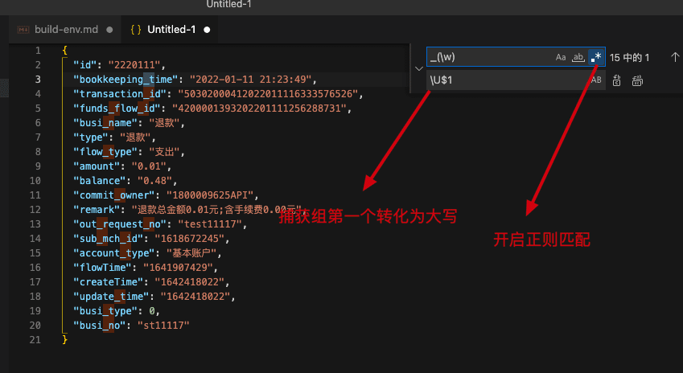

#### VSCode 扩展插件

* HTML
  + [Auto Rename Tag](https://marketplace.visualstudio.com/items?itemName=formulahendry.auto-rename-tag)
* 样式
  + [PostCSS Language Support](https://marketplace.visualstudio.com/items?itemName=csstools.postcss)
  + [Tailwind CSS IntelliSense](https://marketplace.visualstudio.com/items?itemName=bradlc.vscode-tailwindcss)
  + `#fff`颜色标识显示出来 [Color Highlight](https://marketplace.visualstudio.com/items?itemName=naumovs.color-highlight)
  + [stylelint](https://marketplace.visualstudio.com/items?itemName=stylelint.vscode-stylelint)
* TS
  + [json2ts](https://marketplace.visualstudio.com/items?itemName=GregorBiswanger.json2ts) 格式转化，写TS应该都懂
* Node&NPM
  + [node-snippets](https://marketplace.visualstudio.com/items?itemName=chris-noring.node-snippets)
  + [npm-intellisense](https://marketplace.visualstudio.com/items?itemName=christian-kohler.npm-intellisense)
* React
  + [vscode-styled-components](https://marketplace.visualstudio.com/items?itemName=styled-components.vscode-styled-components) 给Styled-Components提供Highlight
  + [ES7+ React/Redux/React-Native snippets](https://marketplace.visualstudio.com/items?itemName=dsznajder.es7-react-js-snippets)
* Vue
  + 2.x [Vetur](https://marketplace.visualstudio.com/items?itemName=octref.vetur)
  + 3.x 
    - [Vue Volar extension Pack](https://marketplace.visualstudio.com/items?itemName=MisterJ.vue-volar-extention-pack)
    - [Volar](https://marketplace.visualstudio.com/items?itemName=johnsoncodehk.volar)
* Git & 文件比对
  + [GitLens](https://marketplace.visualstudio.com/items?itemName=eamodio.gitlens) 能看到某行代码最后是谁提交的
  + [Partial Diff](https://marketplace.visualstudio.com/items?itemName=ryu1kn.partial-diff) 文件比对，类似 Beyond Compare
* proto
  + proto文件代码高亮 [vscode-proto3](https://marketplace.visualstudio.com/items?itemName=zxh404.vscode-proto3)
  + JSON转Type，支持多编程语言 [Paste JSON as Code](https://marketplace.visualstudio.com/items?itemName=quicktype.quicktype)
* Code format
  + 格式化HTML/CSS/SASS/JS等文件，很好用 [Beautify](https://marketplace.visualstudio.com/items?itemName=HookyQR.beautify)
  + [prettier](https://marketplace.visualstudio.com/items?itemName=esbenp.prettier-vscode)
* quick console [Turbo Console Log](https://marketplace.visualstudio.com/items?itemName=ChakrounAnas.turbo-console-log)
  + 选择变量后 `cmd+shift+l` 在下方快速输出
  + `alt+shift+c` 注释当前文档中由扩展插入的所有日志消息
* 开发效率
  + [change-case](https://marketplace.visualstudio.com/items?itemName=wmaurer.change-case) 将内容case转化
  + [Dot log](https://marketplace.visualstudio.com/items?itemName=jaluik.dot-log)
    - 输入如`person.log`会自动变成`console.log('person', person)`这样的代码
* 小程序
  + [WXML - Language Services](https://marketplace.visualstudio.com/items?itemName=qiu8310.minapp-vscode)
* Node
  + [eggjs](https://github.com/eggjs/vscode-eggjs)
* Markdown & Excalidraw
  + [Markdown Emoji](https://marketplace.visualstudio.com/items?itemName=bierner.markdown-emoji)
  + [Auto Markdown TOC](https://marketplace.visualstudio.com/items?itemName=huntertran.auto-markdown-toc)
  + [markdown-formatter](https://github.com/sumnow/markdown-formatter/blob/HEAD/README_CN.md) 格式化markdown用，还有输入tab等有快捷提示，很实用
  + [Excalidraw](https://marketplace.visualstudio.com/items?itemName=pomdtr.excalidraw-editor) Excalidraw是一个开源的手绘流程图工具, 好处是可以私有化部署(使用官网存储服务需要按月付费), 安装VSCode插件可以直接本地编辑&存储文件
* other
  + VSCode翻译为中文 [vscode-language-pack-zh-hans](https://marketplace.visualstudio.com/items?itemName=MS-CEINTL.vscode-language-pack-zh-hans)
  + VSCode官方icon图标样式 [vscode-icons](https://marketplace.visualstudio.com/items?itemName=vscode-icons-team.vscode-icons)
  + 路径提示 [Path Intellisense](https://marketplace.visualstudio.com/items?itemName=christian-kohler.path-intellisense)
    - 
  + 左下角显示文件大小, Gzip后的大小等 [filesize](https://marketplace.visualstudio.com/items?itemName=mkxml.vscode-filesize)
    - 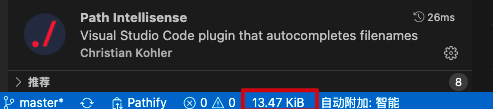
  + 空格、括号等对齐匹配插件 [bracket-pair-colorizer-2](https://marketplace.visualstudio.com/items?itemName=CoenraadS.bracket-pair-colorizer-2)
    - 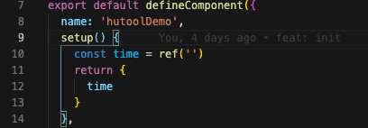
  + 显示导入的模块大小 [Import Cost](https://marketplace.visualstudio.com/items?itemName=wix.vscode-import-cost)
    - 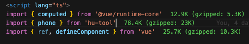
  + VSCode默认禁止搜素 node_modules下，会影响效率 [Search node_modules](https://marketplace.visualstudio.com/items?itemName=jasonnutter.search-node-modules) 插件可以搜索node_moduels, from [zhihu](https://www.zhihu.com/question/309220217/answer/586510407)
  + [Live Server](https://marketplace.visualstudio.com/items?itemName=ritwickdey.LiveServer) 类似http-server的本地服务器
  + [Quokka](https://marketplace.visualstudio.com/items?itemName=WallabyJs.quokka-vscode) 网站是https://quokkajs.com/，写代码过程可以直接运行各类文件得到结果，方便做一些简单测试
  + [Vim](https://marketplace.visualstudio.com/items?itemName=vscodevim.vim) 慎用，遇到过好几次开发的时候程序太多，16G内存扛不住。觉得用的话要等硬件上去了
  + [Project Manager](https://marketplace.visualstudio.com/items?itemName=alefragnani.project-manager) 多项目管理，在一个IDE里切换，有点鸡肋
  + [DotENV](https://marketplace.visualstudio.com/items?itemName=mikestead.dotenv) 给.env类文件高亮用
  + [i18n Ally](https://marketplace.visualstudio.com/items?itemName=Lokalise.i18n-ally) 国际化用
  + [Template String Converter](https://marketplace.visualstudio.com/items?itemName=meganrogge.template-string-converter) 加速模版字符串编写
  + [更好的curl](https://httpie.io/cli)
* 智能补全
  + ~~[tabnine](https://marketplace.visualstudio.com/items?itemName=TabNine.tabnine-vscode) AI提示插件，比微软的Visual Studio IntelliCode好用~~
  + ~~[Visual Studio IntelliCode](https://marketplace.visualstudio.com/items?itemName=VisualStudioExptTeam.vscodeintellicode)~~
  + [GitHub Copilot](https://marketplace.visualstudio.com/items?itemName=GitHub.copilot) Github推出的自动补全，主要是训练集来自开源社区。

## 调试

### 开发调试

开发调试的技巧内容太多，浏览器大家基本都会。node调试和VSCode的可以看看[真·工作环境搭建-调试篇](/others/build-env-debug)

### [whistle](https://github.com/avwo/whistle)代理

基本上whistle搞定网页+小程序

whistle是基于node的代理，有node的地方就可以运行，所以Linux/MacOS/Windows都是OK的，可以转发http/https请求。千万不要再用fiddle了-_-!!

一般搭配[Chrome插件SwitchyOmega](https://chrome.google.com/webstore/detail/proxy-switchyomega/padekgcemlokbadohgkifijomclgjgif?hl=zh-CN), 方便各个环境的切换

* [whistle安装](https://wproxy.org/whistle/install.html), 这里推荐修改`~/.bashrc`实现开机启动，基本是长驻应用了
* SwitchyOmega就是Chrome的浏览器插件，新建一个情景模式指向whistle就可以了，同时可以把不需要代理的域名过滤掉

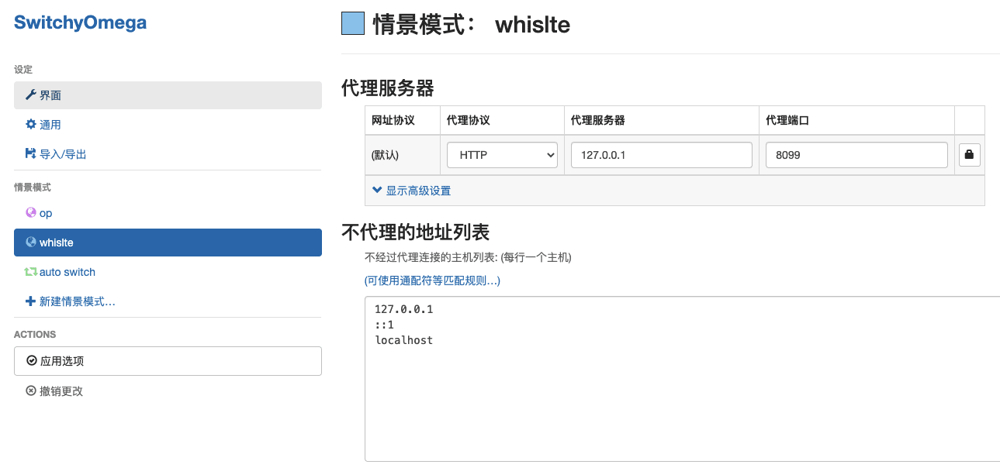

最后设置完后请求流走向

```
Chrome发起请求 -> SwitchyOmega匹配转发到whistle -> whislte根据规则转发到本地端口
```

#### whistle Mock请求

比如 `/cgi/a/b/c` 的请求可以这么配置

```
/a/b/c/ tpl://{c.json}
```

command+鼠标左键点击 `{c.json}` 位置可以自动创建对应的json文件，再把内容贴上去就好


#### whistle的手机代理和捕获

一些效果只有真机能模拟，经常是小程序方面的，此时用手机配置IP+端口将请求打到电脑的whistle，更加方便查看请求和做mock定位问题。
通常都是https请求，需要安装证书。可以看[这里](https://wproxy.org/whistle/webui/https.html)。
安装证书后，电脑可以输入ifconfig(mac)或者ipconfig(windows)查看IP，之后手机配置对应IP和我们上面设置的8099端口，就可以实现将请求打到电脑了

### [SwitchHost](https://github.com/oldj/SwitchHosts)代理

其实就是修改的 `/etc/hosts` 文件，不过好在暗黑模式颜值还可以
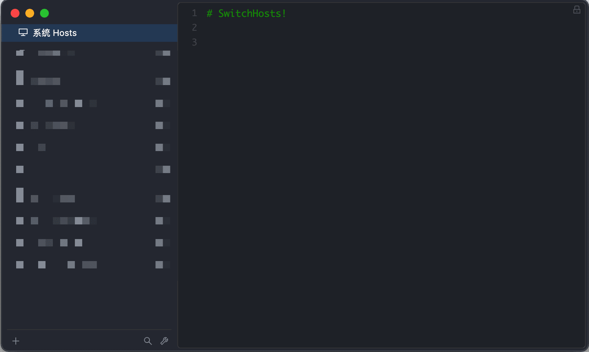

### [Proxyman](https://proxyman.io/)
也是挺好用的代理工具，可以自己写脚本定义转发等。

默认开启在9090端口，可以用Chrome浏览器插件SwitchyOmega转发过去，与whistle等价

## CI/CD

一般都有流水线配置了，这里阿里云对外的云效或者是Github的Github Action，原理基本差不多，安装+构建。主要是写bash，当然也有pipeline as code的概念在这里，其实Github Action是很不错的，开源项目推荐用起来。逐渐可以称为行业规范了。不过各大IT公司都有自己的类似产品，重复造轮子罢了。本质还是shell

博客流水线部署部分Github Action， `.github/workflows/node.yml`

```yml
# vuepress静态资源文件部署
name: Node.js CI
on:
  push:
    branches:    
      - master # 指定master的push才触发
      
jobs:
  build:
    runs-on: ubuntu-latest
    steps:
    - name: Checkout
      uses: actions/checkout@master
      
    - name: Use Node.js ${{ matrix.node-version }}
      uses: actions/setup-node@v1
      with:
        node-version: '12.x'
    - run: npm run init
    - run: npm run build --if-present # 如果有build script就执行
      
    - uses: actions/upload-artifact@v2 # 上传产物
      with:
        name: build-artifact
        path: xxx
        retention-days: 1
```

## 监控

现代的工程基本都上云了，这里说下云上的监控，如果是公司内的可以找对标产品或者自行搭建

### 前端监控

一般是引入SDK，然后上报数据到平台里

* [阿里云 ARMS](https://www.aliyun.com/product/arms)
* [腾讯云 RUM](https://cloud.tencent.com/product/rum)

### Node监控

都可以了解一下，pm2的话是应用本来就基于pm2多进程部署，那么简单搞的话可以直接用pm2的。Easy-Monitor的话是阿里开源的，自己去上报也能用

* [pm2](https://github.com/Unitech/pm2)
* [Easy-Monitor](https://github.com/hyj1991/easy-monitor)

### badjs

一般badjs需要结合sourcemap才能定位到源代码，所以一般是发布的时候把sourcemap上传到对应的服务器，然后服务器catch到错误之后根据错误去映射到源代码，此时可以定位到报错的大致位置，有效提升解决js错误的效率

* [Sentry](https://sentry.io/for/javascript/)
* [badjs](https://github.com/BetterJS/badjs-installer) 其实有点不推荐用了，不过胜在跨平台，简单够用的话可以上