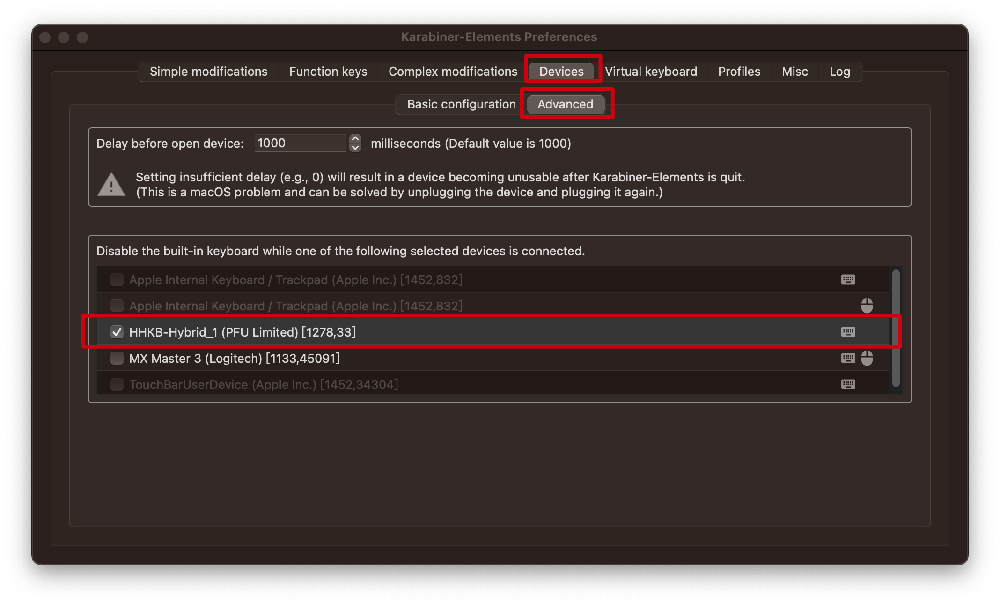

# HHKB快乐键盘

HHKB（Happy Hacking Keyboard）是一款专为程序员和设计师打造的高端键盘，起源于90年代末期。其最大特点是采用60%的精简布局，去掉了数字键盘、功能键行和导航键区，便于携带。HHKB移动了Control键至Caps Lock键位置，使程序员更便捷地操作。

HHKB的优点包括：一流的敲击手感，使用Topre静电容量无触点开关，触感优越且稳定；可定制性，用户可自定义部分键位功能；耐用性强，采用高质量PBT键帽，抗磨损。生产工艺方面，HHKB注重细节，采用日本精密制造技术，确保每个键盘质量上乘。

HHKB品牌拥有多个型号，其中包括：
- HHKB Pro Classic（基础款）,最低1599-1699
- HHKB Pro Hybrid（蓝牙功能款）,最低2188
- HHKB Pro Hybrid Type-S（静音功能款）, 最低2499

不同型号满足不同用户需求，为专业人士提供极致的使用体验。个人推荐后面两款, 无线的感觉还是非常的爽的.

## Mac方向键

因为HHKB跟Mac兼容性非常好, 可以说是笔记本外置键盘第一梯队的存在了. 

```
						                         上一行 Control+p
						
						                               :
						
						                               :

行头Control+a     向左移 Control+b .... 目前光标位置 .... 向右移 Control+f  行尾Control+e

						                               :
						
						                               :
						
						                          下一行 Control+n
```

## 匹配

1. **Fn+Q** 为匹配模式，蓝灯闪烁
    
    **Fn+X** 为取消匹配，灯熄灭
    
2. **Fn+Control+1~4** 是连接不同的设备，最多可以存储4个设备，按照蓝牙编号如 `HHKB-Hybrid_1`,    `HHKB-Hybrid_2`这样排列下去

偶尔黄灯闪烁是电池没电了


## 功能键与快捷键

`fn + A/S/D` 分别是音量—、音量+、静音

`fn + O/P` 分别是屏幕亮度—、屏幕亮度+

每15秒闪烁两下就是需要更换电池，每30秒闪一下是提示电量过低了

## 快捷键

ctrl + h 删除游标所在的前一个字符/ctrl + d 删除游标所在的后一个字符

ctrl + k 删除游标之后改行的所有字符

ctrl + p 移到游标上一行 / ctrl + n 移到游标下一行

ctrl + a 移到游标行头 / ctrl + e 移到游标行尾

ctrl + b 将游标向左移动一位 / ctrl + f 将游标向右移动一位

ctrl + t 将游标左右单个字符交换位置

ctrl + o 将游标后的字符放置下一行

ctrl + v 将游标移动到最末尾一个字符

## 改键

主要是配合软件Karabiner改建让HHKB的 `Home/End` 用起来，而且可以设置连接HHKB后Mac默认内置键盘失效，这样HHKB放电脑键盘上也不会压到键

脚本可以用[我的](https://github.com/ManfredHu/Karabiner-Elements)

## 当有外置键盘接入时关闭内置键盘



## 携带

不需要频繁开关，短时间可以直接不关闭直接塞包里. 使用2年下来简直不要太爽.


