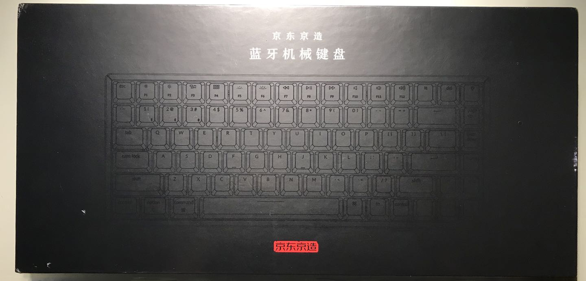
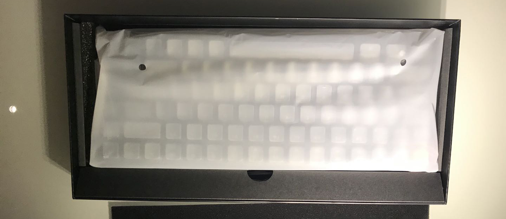
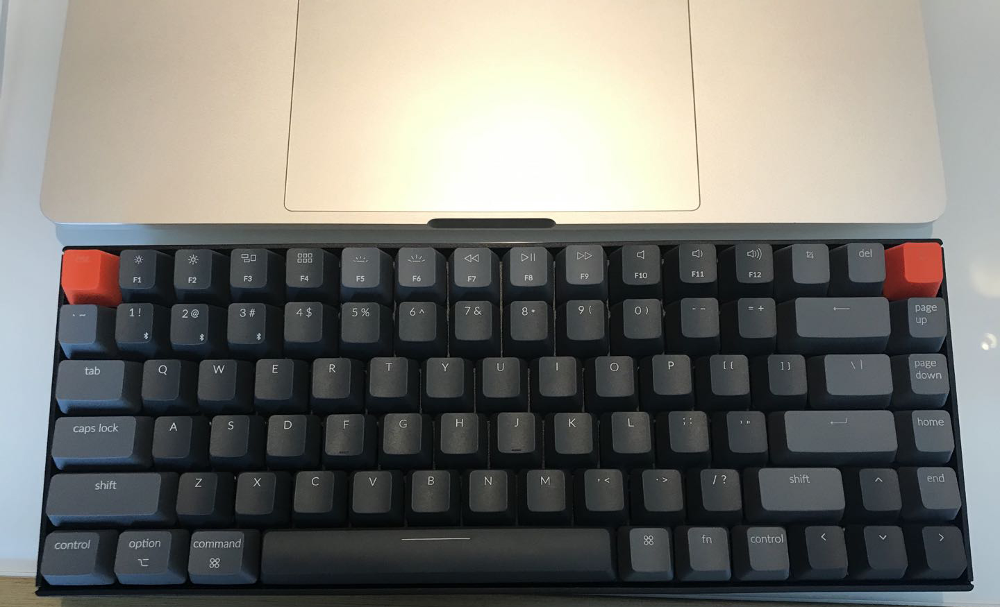

# 外设进化之路

看到这个标题，可能大家会认为机械键盘，不是都是通用的吗？我改下键不就好了？但是我却不这么认为，一般的机械键盘，对于MacOS来说，其实是很难匹配的。你会发现Windows的键位和Mac还是有很大出入的。

不适应大概有这么几个原因：

1. 键位不一致
2. 需要花费时间和精力去设置自定义按键
3. 自己的肌肉对于键盘需要有特殊记忆，而且是长期形成的，最早可以追溯到读书时代打机时候
4. 酷炫一点，提升自己的打码激情，但是又不能花里胡哨。同时要低调奢华有内涵😅

## mac演化之路
所以，作为一个以前的Win党，现在的Mac党来说，市面上很多键盘都是渣渣。敢这么说是因为在互联网公司呆着周围基本人手机械键盘，也体验过很多。但是都不符合预期，一个是键位不行，第二个是不符合自己的设定，导致我拿苹果的[妙控键盘](https://www.apple.com.cn/shop/product/MLA22CB/A?fnode=ef95fecb4eb3661dacf6d981f0434caf94c4427c7e321f150b3ed82dae925bedc42a0720c31efee4e208c54cc16f369c55c389e947847d5f30dadc6dfb26df386159344e1b4d19335b456535545ba1550521021016d4b2e63bdb204a1b50ebbff4eb013ce125f6b0d7a6f9fba6b5e236)狠狠撸了两年代码。

第一台mac电脑是老款的mbp，128G渣渣版，那个时候还在读大学是拿实习工资买的。后面2018年2月开始腾讯里面开始有mac电脑申请了，借着需求申请了一台顶配的iMac，作为第一次使用27寸iMac电脑的渣渣，觉得还是爽。显示器也是很细腻，没有外置主机的感觉也是超棒的。当然我也尝试往电脑装dota2🤣，后面因为公司网络原因放弃了。代理能绕晕，而且mac打游戏确实也不爽。

再后来，原来的Thinkpad笔记本退役了，换了一台新的MBP，以为带bar的键盘会很辣鸡，上手后发现还不错。这个时候还是使用的笔记本自带的键盘，还有iMac也是用的自带的苹果的[妙控键盘](https://www.apple.com.cn/shop/product/MLA22CB/A?fnode=ef95fecb4eb3661dacf6d981f0434caf94c4427c7e321f150b3ed82dae925bedc42a0720c31efee4e208c54cc16f369c55c389e947847d5f30dadc6dfb26df386159344e1b4d19335b456535545ba1550521021016d4b2e63bdb204a1b50ebbff4eb013ce125f6b0d7a6f9fba6b5e236)。但是觉得苹果的妙控鼠标不好用，自己的手太大了，苹果的鼠标太小了，握不住。**大手还是需要大鼠标才能掌握呀，嗯我喜欢大的🤓。**

所以自己就有了两台mac的电脑了，台式笔记本都有。新入职的同学应该是没有iMac的了，属于历史遗留，据说是部门预算，IT部门不包。

- 苹果 IMAC（27 英寸／4.2GHz 四核 Intel Core i7 处理器／16GB／512GB 固态硬盘／Radeon Pro 580 图形处理器，配备 8GB 显存）
- 苹果 MacBook Pro (15寸 / 2.6GHz 六核九代 Intel Core i7 / Radeon Pro 555X，4GB GDDR5 显存 / 16GB／256GB 固态硬盘) 

## 2020-9 笔记本当家

最近的变动是换了工作环境，需要**经常出差**。考虑到今年疫情开始就没怎么用过iMac了，基本属于吃灰状态，毕竟需要经常移动，而且两台电脑的话，iMac又不能给MBP投屏或者作为外置显示器用（这个真的研究了很久，最后找客服问过，这个型号的iMac不支持投屏）。所以就只剩下一种出路，就是MBP+外置显示器了，这也是现在普通开发的标配模式，使用体验感觉蛮不错。

不推荐mbp/iMac两台电脑一起用，你会崩溃的，而且数据同步容易丢，例如某个commit忘了同步，可能就是一次事故。

性价比最高的Mac机械键盘，说是**keychron K2**应该是没错的，这个价位蓝牙5.0的配置挺高，主要是蓝牙5.0连接速度很快，基本没什么感觉到切换设备的延迟，在Mac机械键盘还是很能扛打的

## 键盘
说回键盘，之前用的苹果的秒控键盘还是不爽，笔记太薄了，没有**敲击的体验**，很怀念以前青轴那种清脆的段落音。反正不爽了两年了，直到最近油管看到一款**keychron**键盘，看了下评测觉得真的还不错。准备打造自己的移动办公设备体系了

1. mbp作为主力机器
2. 搭配无线机械键盘和苹果触摸板（放弃鼠标了，毕竟2年了自己习惯了苹果的触摸板了）
3. 机械键盘键位需要跟苹果高度一致，不想要学习和去适应键盘，不然就不想买了

说到这里其实还有一个选择，就是HHKB。但是对自己来说，还是接受不了没有上下左右四个键的布局，毕竟写代码或者DEBUG的时候，基本就是在去找代码的路上，如果要结合Fn键盘，就相当于手要停下来。还有是觉得HHKB性价比并不高。
我觉得一个后台开发或者运维会更加适合HHKB，因为HHKB感觉就是为了vim而生的。后面实在太喜欢HHKB的轴体了，适应了几个月就完全转变过来了

- mac系统，mac键盘或者布局类似的键盘
- linux系统，HHKB
- windows系统，大部分市面的机械键盘

作为一个还有点挑剔的人，遇到了keychron，也是觉得非常适合打代码，推荐青轴而不是茶轴，毕竟代码跟打字很像其实。最后，JD还是很厉害的，这个键盘可以作为国货之光了。

附上开箱图

[购买链接](https://item.jd.com/100013389478.html)，我真的没有收钱2333

## 2022-1 HHKB

闲下来有时间折腾一下外设，传说中的程序猿的终极键盘，我也了解一些历史，比如HHKB跟苹果早起键盘布局其实是很像的。如下图

熟悉了两天后发现其实HHKB的键盘布局一个是学习适应新键盘的成本比较大，其次是如果适应了HHKB那么重新用回传统的键盘估计还是不适用，也就是说会很容易陷入“围城”的境地。但是熟悉了键位之后其实觉得更少的键位会让我更加“专注”在手头上，手腕更少的移动。

毕竟键盘布局是欧美开始出现的，我们现在用的基本也是US美式键盘布局。然后慢慢过渡到Vim的键位，VSCode有一个Vim的插件可以用，习惯之后觉得编码确实很高效，快捷键用的飞起，但是多程序一起开发现会出现“卡机”的情况，特别是在做小程序开发，本地3个VSCode窗口，小程序开发工具，Chrome，微信/企微等等软件一起跑的时候16G内存经常爆满，然后Vim插件没响应，多次这种情况后就放弃了Vim插件，改为Mac原生支持的Emacs的一些快捷键的键位做光标移动。现在感觉还不错。

现在的外设，包括无线黑色HHKB（新款支持蓝牙4.2连接更稳定省电，不要买3.0的版本据说有坑），还有万年雷蛇有限鼠标和一个用剩的MagicTrackpad，暂时够用了。触摸板是公司福利属于白嫖，用于窗口和程序切换之类的习惯后还挺爽，当然键盘挂笔记本上其实笔记本自带的触摸板也够用。我是因为在家的时候显示器被柜子顶部挡住了升不上去，把笔记本放显示器下会挡住所以疫情开始居家办公后搞了一个MagicTrackpad触摸板，不然这个触摸板确实可以吃土了。

> 现在的心态就是追求外设越少越好，有那么点退烧的感觉，这一点跟HHKB的设计想法相符，**越简单稳定越好**。电脑软件每年更新，不变的是外设跟你的匹配程度，基于这一套也打算不再更换了，3年内可以说基本够用了

还有HHKB被诟病最多的方向键，因为没有方向键的存在所以需要用`Ctrl+f/b`做光标的前后移动，`Ctrl+n/p`做光标的上下切换，这个只能在输入的时候才有用，如果是VSCode或者其他的上下左右选择其实是无效的。

综上：HHKB适合一开始就用上的同学，而且后面大概率跟其他键盘切换使用其实是冲突的。HHKB最好我认为是它的轴体，确实比一般的机械键盘柔和很多。

如果你习惯把键盘架在笔记本上，可以用Karabiner，有个选项当你笔记本连上了配置的键盘，笔记本内置的键盘会失效，这样键盘架笔记本上不会误触。

最后附上HHKB外壳，手感摸起来真的是享受，包装外壳都值99分

## 罗技Master3
据说是最高的办公鼠标，手感也很不错，试了一下同事的发现还不错。主要是无线+辅助键，感觉比雷蛇的好用点，推荐。最终成型装备如下，触摸板可看情况移除，罗技Master3自带屏幕移动等操作，而且`Control+1~7`也足够切换窗口了。

