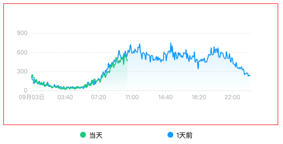
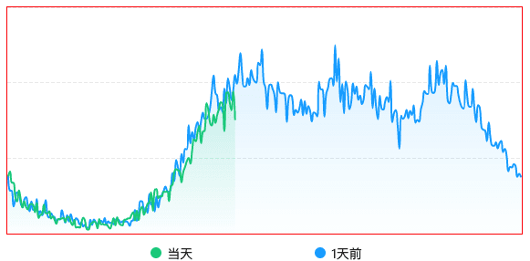
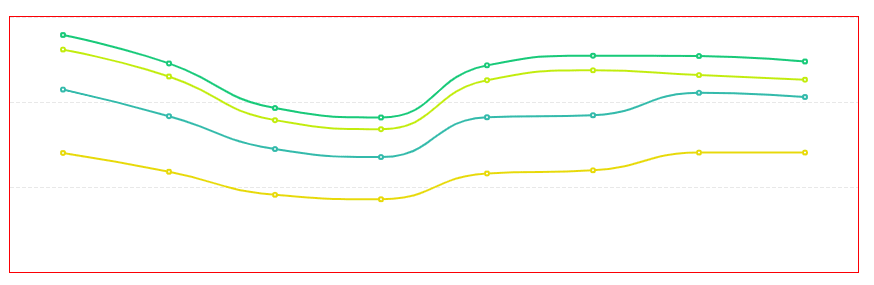
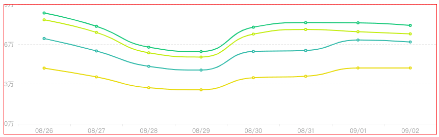
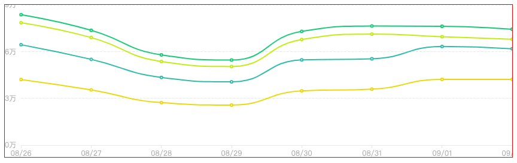
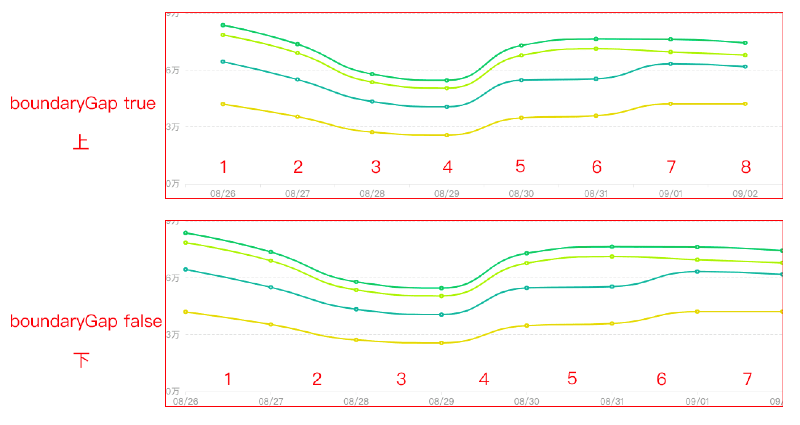
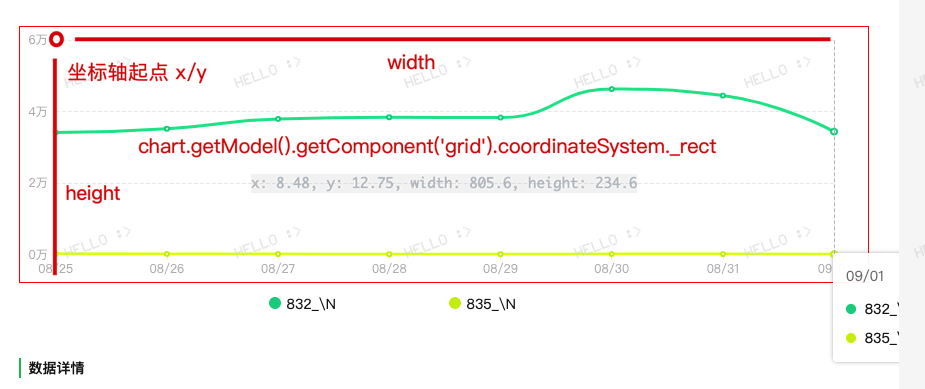

# echart
最近又用起了echart发现自己还是不太了解原理，作此文备忘。N年迭代基本echart是图表库里用的比较多的，百度开发好后捐献给apache基金会，现在迭代到`v5版本`。[echarts](https://github.com/apache/echarts)

[基本概念看这里](https://echarts.apache.org/zh/tutorial.html#ECharts%20%E5%9F%BA%E7%A1%80%E6%A6%82%E5%BF%B5%E6%A6%82%E8%A7%88)，主要是整体的结构构成。可以理解就是组件构成的echart。


## 坐标系
数学常识告诉你我，只要确定了坐标系，那么图表其实就不难。在echart里原理是一样的

我们知道echart最后就是一个canvas绘制图表，而实例就存有各个组件绘制的信息。

一个默认配置的图表大概如下所示，会发现其实不是我们的期望，这里坐标轴已经按照需要展示的位置计算过了。即xy坐标轴的文本要露出来不能遮挡等等逻辑




因为默认坐标轴上下左右都有默认值，按照类似css定位往内缩小


其中
- left/right默认'10%'
- top/bottom默认60
这里按照如下配置后取消了这部分往里的缩进，则canvas的左下角就是坐标原点

```json
{
  grid: {
    top: 0,
    left: 0,
    right: 0,
    bottom: 0
  }
}
```



大数据量的情况下如上图所示，小数据量的时候如下图所示，会发现图表被居中了。


这里的原因是`xAxis.boundaryGap`和`yAxis.boundaryGap`，即留白部分。类目轴中 boundaryGap 可以配置为 `true` 和 `false`。默认为 true，即左右留白居中

## grid.containLabel
默认containLabel为false，即不包含坐标轴的标签等，但是为了解释boundaryGap这里先把`grid.containLabel`设置为true，如下图可以看到左下角的原点往右上方向偏移，因为要展示坐标轴标签，所以这里动态计算了。



## boundaryGap的改动
此时我们再把`boundaryGap`配置为false，则可以看到留白不见了。


细心的会发现，其实是通过修改刻度实现的，如下图。



这里上图为`boundaryGap: true`，下图为`boundaryGap: false`

- 上面的图可以发现数据长度是8，即8个点，8段线段，点在刻度中间展示。这是默认留白的表现
- 下面的图可以发现数据长度还是8，即8个点，7段线段，这里点不再居中了，变成跟刻度一样的表现

这里坐标轴起点可以通过如下方式获取

```js
// x: 8.48, y: 12.75, width: 805.6, height: 234.6
const {x, y, height, width} = chart.getModel().getComponent('grid').coordinateSystem._rect
```



## 修改tooltip默认行为
tooltip默认跟随鼠标移动，这种交互其实并不好，业务想要的是鼠标移动到坐标上，出现辅助线，tooltip固定在辅助线附近，而不是跟随鼠标移动。

结合默认的`boundaryGap: true`，其实可以发现，留白的部分就是数据段长度的一半，也就是刻度间距的一半


```js
const option = {
  tooltip: {
    show: true,
    trigger: "axis",
    position: smartTooltipPos(this.chart, targetOption)
  }
}

export const smartTooltipPos = (chart, targetOption) => {
  // 数据长度
  const dataLen = targetOption.xAxis.data.length

  // size {contentSize: [width, height], viewSize: [width, height]} contentSize是dom的尺寸，viewSize是echarts容器尺寸
  return (point, params, dom, rect, size) => {
    try {
      // 多少段数据，点要+1
      const dataIndex = params[0].dataIndex
      
      // tooltip宽度一半
      const toolTipsWidth = size.contentSize[0]

      // 鼠标在左还是右
      const dir = ['left', 'right'][+(point[0] > size.viewSize[0] / 2)]

      // 坐标轴位置
      // x: 8.48, y: 12.75, width: 805.6, height: 234.6
      const {x, y, height, width} = chart.getModel().getComponent('grid').coordinateSystem._rect
      // 每一段的长度
      const itemLen = width / dataLen
      // 留白1/2段长度
      const boundaryGap = itemLen / 2
      // 留点空间呼吸，整体的1%宽度
      const gapDiy = size.viewSize[0] * 0.01
      // 坐标轴左上角原点
      // return [x, y] // chart.getModel().getComponent('grid').coordinateSystem._rect
      // 坐标轴右下角原点
      // return [x+width, y+height]
      const guideLineX = x + boundaryGap + dataIndex * itemLen

      return [dir === 'left' ? guideLineX + gapDiy : guideLineX - gapDiy - toolTipsWidth, 0]
    } catch(err) {
      // 静默失败，恢复默认的跟鼠标走
      console.error(err)
    }
  }
}
```
