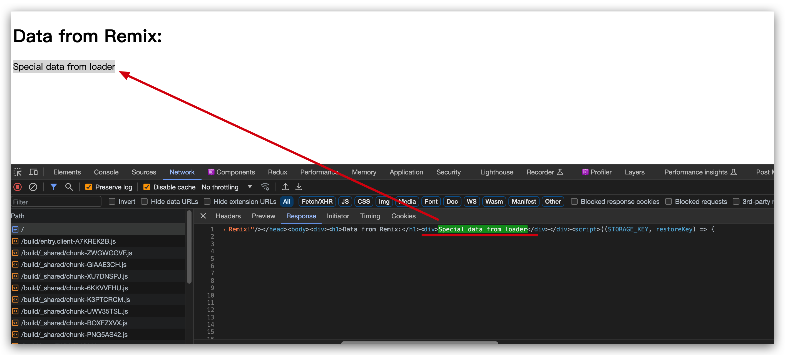

# Remix
Tiktok里大量使用Remix作为基础开发模式, 偏全栈. 这里做简单用法记录

## 与传统的React开发对比
1. 全栈框架一体化开发(包含服务端): React是前端框架, 而不提供服务端能力. 对于一些Demo等不够Solid. 比如一个翻页组件, 要测试要单测要E2E. 没有服务器能力简直难受, 比如要模拟接口返回错误数据或者请求等, 单纯mock数据不够灵活. 而如果能通过编程方式实现简单接口返回则一切都变得简单.
2. SSR: 其二是SSR的存在, 对于简单前端页面来说, 一体化开发是最简单方便的模式. 如果这个时候还要配一个服务器开发, 人力成本沟通成本上去了. 对于初创企业来说压力山大, 所以北美一直都是全栈开发工程师的乐园. 这也解释了为什么北美程序员很多都会有系统设计这一轮面试
3. 约定式路由提升效率: 路由这个最常见的东西, 为什么前端定义一份后端定义一份? 我记得2016年面试腾讯实习生的时候Kp就问过“你觉得什么是全栈开发?”这个问题. 我就说前端路由对后端路由, 当时有想过为什么一个路由要写两份? 不能一份吗? Remix解决了这个问题
4. 与django(Python)、rails(Ruby)、laravel(PHP)等对比, JS缺少一个能够平替这几个的JS一把梭的解决方案

## 目录结构
安装命令如下
```
npx create-remix@latest
```

```
$ tree -I 'node_modules|build'
.
├── README.md
├── app
│   ├── entry.client.tsx
│   ├── entry.server.tsx
│   ├── root.tsx
│   ├── routes
│   │   └── _index.tsx
│   └── style
│       └── index.css
├── package-lock.json
├── package.json
├── public
│   └── favicon.ico
├── remix.config.js
├── remix.env.d.ts
├── tsconfig.json
└── yarn.lock
```

- app 是应用开发的主要目录，entry.client 和 entry.server 是应用的入口文件，一般不用动
- root 是页面的入口文件, 里边有一些默认的配置。其中 LiveReload 组件可以在开发的时候自动重启服务
- routes 文件夹是 Remix 页面组件存放的地方，remix 的路由是按文件名和目录约定的
- public 文件夹下就是存放静态的资源文件，例如图片、视频等
- 外面的 remix.config.js 是 remix 的配置文件

## 简单例子
在同一个文件把服务端逻辑和前端逻辑收归, 可以看到loader是一个默认的获取数据的方法钩子. 而返回JSON格式化后的数据最后会直接SSR方式注入HTML

```ts
// app/routes/_index.tsx
import type { MetaFunction, LoaderFunction } from "@remix-run/node";
import { json } from "@remix-run/node";
import { useLoaderData } from "@remix-run/react";
export const meta: MetaFunction = () => {
  return [
    { title: "simple demo" },
    { name: "description", content: "Welcome to Remix!" },
  ];
};

type Data = {
  message: string
}
export let loader: LoaderFunction = async () => {
  const data: Data = { message: 'Special data from loader' };
  return json(data);
};


export default function Demo() {
  const data: Data = useLoaderData();
  return (
    <div>
      <h1>Data from Remix:</h1>
      <div>{data.message}</div>
    </div>
  );
}
```



## 约定式路由

- 如目录 app/routes/notes.tsx 则对应 http://localhost:3000/notes 的访问, 其中app/routers/notes.tsx里export default暴露出来的需要是一个React组件. 
- app/routes/notes.tsx 与 app/routes/notes/index.tsx 是等价的
- `_index.tsx`是特殊的约定的起始路由, 感觉是为了跟index.tsx区别, 可以看[这里](https://remix.run/docs/en/main/file-conventions/routes#basic-routes)

## 数据获取
数据可以通过 `useLoaderData` hooks获取, 水合部分Remix会统一处理

```tsx
import { useLoaderData } from "@remix-run/react";
export default function Demo() {
  const data: Data = useLoaderData();
  // todo: 获取到了数据
}
```

### loader处理Get数据
- router里export loader就是处理get请求, 包含请求页面或者处理普通Get请求. 
- GET请求的参数可以通过 `new URL(request.url).searchParams` 解析出来

```tsx
import { LoaderFunction, json } from "@remix-run/node";
import { respWithPagination } from "~/server/pagination";

export const loader: LoaderFunction = async ({ request }) => {
  const searchParams = new URL(request.url).searchParams;
  const page = Number(searchParams.get("page")) || 0;
  const pageSize = Number(searchParams.get("pageSize")) || 20;
  console.log('page', page, pageSize)
  return json(respWithPagination(page, pageSize), {
    status: 200,
  });
};
```


### action处理非Get请求
- router里export action就是处理非get请求
- 如果是 `Content-Type: application/x-www-form-urlencoded`的类型, 请求的参数可以通过 `request.formData` 解析出来
- 如果是 `Content-Type: aplication/json` 的类型, 请求参数可以通过 `request.json` 解析出来

```tsx
import { ActionFunction, LoaderFunction, json } from "@remix-run/node";

// 非 get
export const action: ActionFunction = async ({ request }) => {
  // Content-Type: application/x-www-form-urlencoded
  const formData = await request.formData();
  const myField = formData.get('myField'); // 使用表单中对应字段的名称
 
  // Content-Type: aplication/json
  const formData = await request.json()
  const myField = formData.myFiled

  return {
    myField
  }
};
```

