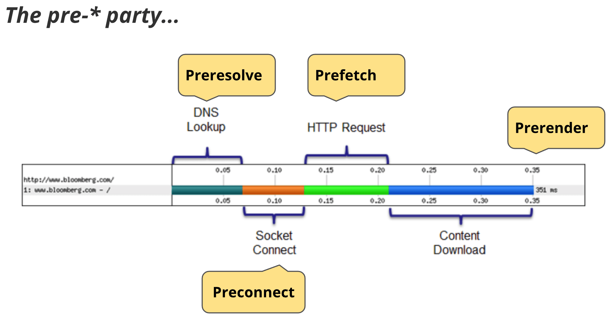

# 资源预加载preload和数据预取prefetch
这不是新的概念，在2016年就有了，不过看现在行业内用到的并不多。工作两三年只有在优化的时候会去特意深入，平时可能大家都忽略了。特意整理下方便大家阅读



## prefetch数据预取是什么？
prefetch一般翻译为数据预取，数据预取是一种推断浏览器未来可能使用某些资源的方式，比如页面后面可能用到某些静态资源(css,图片,js文件等)，这些资源在当前页面提前下载，再跳转到其他页面的时候这部分资源不需要下载，页面可以直接使用。
加速了下个页面的loading速度，所以这是一个有效的提升用户体验的方式。作为开发者，其实我们可以来觉得某些资源是提前需要加载的，这比浏览器更加贴近我们的应用。

如头条APP，微信公众号类的体验，一定是用到了prefetch的，因为你在断网的时候也可以打开一些文本和图片内容的页面。当然不一定是网页技术，可能是APP的prefetch。

## dns-prefetch
第一次看到这个属性，是在重构同学的重构稿上。当时还特意查了一下，后面发现其实人家对HTML/CSS前沿属性的了解比一般写JS的工程师了解更加深入、更早。当然得看人，不过普遍来说重构对新属性会更加重视。说回属性本身

```html
<link rel="dns-prefetch" href="//example.com">
```
众所周知，从客户端发起请求到服务器收到这个请求之前，客户端需要首先确定服务器的IP，此时需要查询DNS服务去获取服务器地址（没有缓存的时候）。获取了服务器地址之后本地会存储一份，相关的DNS查询服务器也会缓存一份。
这个属性告诉浏览器提前预取某域名的IP地址，方便后面使用。一般这里我们会prefetch业务相关的域名。

看起来是很小的提升，但是有时候提升是巨大的。如Chrome浏览器，当我们在浏览器地址栏中只键入一小部分域名，它将自动预解析DNS(有时甚至预渲染页面)，从而将每个请求缩短到几毫秒。

[CANIUSE](https://caniuse.com/?search=dns-prefetch)兼容性还是特意说一下，已经可以投入使用了，而且不影响优雅降级。

### linux下查询域名IP地址

```bash
nslookup baidu.com
```

```
Server:		10.11.56.23
Address:	10.11.56.23#53

Non-authoritative answer:
Name:	baidu.com
Address: 39.156.69.79
Name:	baidu.com
Address: 220.181.38.148
```

### chrome清除dns缓存
[chrome://net-internals/#dns](chrome://net-internals/#dns)

## preconnect预连接
与DNS预取方法非常类似，预连接将解析DNS（**包括dns-prefetch**)，它还将进行TCP三次握手和可选的TLS协商。比如我们preconnect了一个其他域名，则浏览器会解析DNS并建立连接。它的使用方法如下：

```html
<link rel="preconnect" href="https://css-tricks.com">
```

在发出实际请求之前，现代浏览器会尽力预测站点需要哪些连接。通过启动`preconnect`，浏览器可以提前设置必要的套接字，并从实际请求的关键路径消除昂贵的DNS、TCP和TLS往返。也就是说，尽管现代浏览器很智能，但它们不能可靠地预测每个网站的所有预连接目标。
作为开发者，我们终于可以帮助浏览器理解应用。我们可以通过Firefox39和Chrome46中附带的新的Preconnect提示，在发起实际请求之前告诉浏览器我们需要哪些套接字


我们查询[CANIUSE](https://caniuse.com/?search=Preconnect)的兼容性发现，这个属性的支持度更好，2020年QQ浏览器（微信等）v10.4这个属性已经得到主流浏览区的支持了。你还不用起来吗？

## prefetch
这是更近一步的属性，直接获取某些一定会用到的资源。比如某些图片或者样式、脚本等。

```html
<link rel="prefetch" href="image.png">
```

与DNS预取不同，我们实际上请求下载资源并将其存储在缓存中。但是，这取决于许多条件，因为**浏览器可以忽略预取**。例如，客户端可能会放弃对网速慢的大字体文件的请求。Firefox只会在“浏览器空闲”时预取资源。

特别一提的是这个属性在字体获取方面提升是非常大的，一般我们字体文件有几M大。目前，字体文件会在DOM和CSSOM构造后再开始下载，比如样式文件声明的字体获取。需要等待样式下载、解析之后才能获得字体文件的URL。当时如果我们prefetch了字体文件，则字体就可以提前下载，在样式表解析后马上在本机缓存拿到。

**Chrome的网络面板可以看到prefetch的资源，而且prefetch没有同源策略限制**

当然http报文也可以指定prefetch,会比写在html更快，因为http头返回的时候html还没解析。
```
<!-- HTTP 响应头模式 -->
Link: <https://example.com/other/styles.css>; rel=prefetch; as=style
```

## subresource
另一种预取技术帮助标识具有最高优先级并且应该在预取项目之前请求的资源。例如，在Chrome和Opera中，我们可以将以下内容添加到文档头：
```html
<link rel="subresource" href="styles.css">
```

与`link rel=prefetch`不同。`rel=prefetch`提供后续页面上使用的资源的低优先级下载，而`rel=subresource`允许提前加载当前页面内的资源。
因此：如果资源是当前页面所需的，或者如果尽快需要，那么最好使用`subresource`，否则就只能使用预取prefetch。


## preload
兼容性在这里[preload](https://caniuse.com/?search=preload)，可以看到QQ/微信生态是不支持的。但是谷歌是OK的。
浏览器在解析的时候会去下载这个资源，但是不解析资源，只是下载而已。毕竟网络里最贵的就是网络请求耗时。

```html
<!-- 使用 link 标签静态标记需要预加载的资源 -->
<link rel="preload" href="/path/to/style.css" as="style">

<!-- 或使用脚本动态创建一个 link 标签后插入到 head 头部 -->
<script>
const link = document.createElement('link');
link.rel = 'preload';
link.as = 'style';
link.href = '/path/to/style.css';
document.head.appendChild(link);
</script>
```

当然http报文也可以指定preload,会比写在html更快，因为http头返回的时候html还没解析。
```
Link: <https://example.com/other/styles.css>; rel=preload; as=style
```

## preload和prefetch区别，preload优先级高
preload与prefetch看起来很相似，区别在于**preload优先级是高于prefetch的**

对于 preload 来说，一旦页面关闭了，它就会立即停止 preload 获取资源，而对于 prefetch 资源，即使页面关闭，prefetch 发起的请求仍会进行不会中断。
preload 是告诉浏览器页面必定需要的资源，浏览器一定会加载这些资源，而 prefetch 是告诉浏览器页面可能需要的资源，浏览器不一定会加载这些资源。

所以建议：**对于当前页面很有必要的资源使用 preload，对于可能在将来的页面中使用的资源使用 prefetch**。

### 优先级区别


1. HTML(Main Resource)/CSS 资源/脚本，其优先级是最高的
  - 注意脚本这里比较特殊，如果脚本指定了preload则为High，异步/延迟/插入的脚本（无论在什么位置）网络优先级中是Low
  - 如果没有as的属性会被作为异步请求
2. font 字体资源，优先级分别为 Highest/High
3. 图片资源，如果出现在视口中，则优先级为 High，否则为 Low
  - svg等优先级为lowest
4. 同步请求优先级为Highest，异步请求优先级为High
5. favicon优先级为low
6. prefetch的所有资源为lowest

#### script的async和defer

使用 async/defer 属性在加载脚本的时候不阻塞 HTML 的解析，defer 加载脚本执行会在所有元素解析完成，DOMContentLoaded 事件触发之前完成执行。它的用途其实跟 preload 十分相似。你可以使用 defer 加载脚本在 head 末尾，这比将脚本放在 body 底部效果来的更好。

1. 它相比于 preload 加载的优势在于浏览器兼容性好，从 caniuse 上看基本上所有浏览器都支持，
2. 不足之处在于：defer 只作用于脚本文件，对于样式、图片等资源就无能为力了，并且 defer 加载的资源是要执行的，而 preload 只下载资源并不执行，待真正使用到才会执行文件。
3. 对于页面上主/首屏脚本，可以直接使用 defer 加载，而对于非首屏脚本/其它资源，可以采用 preload/prefeth 来进行加载

## prerendering
[CANIUSE](https://caniuse.com/?search=prerender)
这个有点变变态，是提前渲染整个页面，点击后这个已经渲染完毕的页面切换到前台直接展示，目前只有Chrome生态的支持，比如安卓和Chrome浏览器。

这就像在隐藏选项卡中打开URL-下载所有资源、创建DOM、布局页面、应用CSS、执行JavaScript等。如果用户导航到指定的href，则隐藏页面将切换到视图中，使其看起来像是立即加载。谷歌搜索多年来一直以Instant Pages（即时页面)的名字拥有这一功能。微软最近宣布，他们将在IE11上类似地在必应中使用prerender。

代价也是有的，提前渲染必定会有不准确的情况，你预测了用户会打开结果用户走了，提前下载和渲染浪费了。

## 参考
- [Prefetching, preloading, prebrowsing](https://css-tricks.com/prefetching-preloading-prebrowsing/)
- [PPT](https://docs.google.com/presentation/d/18zlAdKAxnc51y_kj-6sWLmnjl6TLnaru_WH0LJTjP-o/present?slide=id.gc03305a_0106)
- [使用 Preload/Prefetch 优化你的应用](https://zhuanlan.zhihu.com/p/48521680)