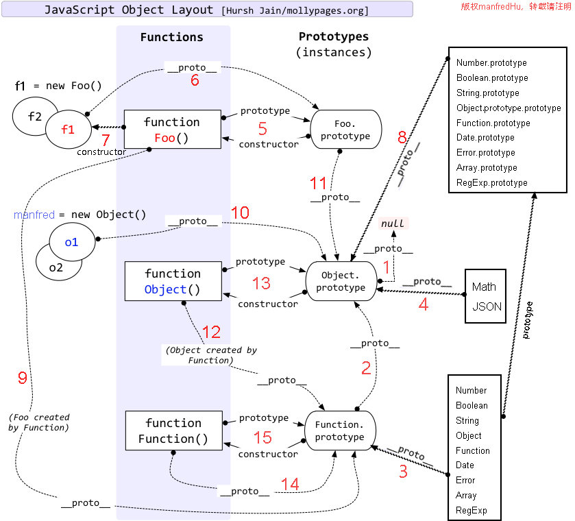

# Interesting JavaScript


## 声明提升

写出下面代码的运行结果

```javascript
var a, b
;(function() {
  console.log(a)
  console.log(b)
  var a = (b = 3)
  console.log(a)
  console.log(b)
})()
console.log(a)
console.log(b)
```

A. undefined,undefined,3,3,undefined,3
B. undefined,undefined,3,3,undefined,undefined
C. 0,0,3,3,undefined,undefined
D. undefined,undefined,3,3,0,0

正确答案：A
解释：代码相当于下面这样的过程

```javascript
var a, b
;(function() {
  var a
  console.log(a) //undefined
  console.log(b) //undefined
  a = 3
  b = 3
  console.log(a) //3
  console.log(b) //3
})()
console.log(a) //undefined
console.log(b) //3
```

## 变量定义规则

下面符合一个有效的 javascript 变量定义规则的是？

A. \_$te$t2
B. with
C. a bc
D. 2a

正确答案： A
考点：ECMAScript 语法
解析：with 为关键字，空格不行，数字开头的不行

## document.getElementById 和 document.getElementsByTagName

JavaScript 中`document.getElementById`的返回值的类型和`document.getElementsByTagName`的返回值类型分别是？

A. Array,NodeList
B. Object, HTMLCollection
C. String,NodeList
D. Function,NodeList

正确答案： B
解析：这题可能有争议，浏览器测试代码如下

```html
<!DOCTYPE html>
<html lang="en">
  <head>
    <meta charset="UTF-8" />
    <title>Id与TagName类型检测</title>
  </head>
  <body>
    <div id="test"></div>
    <script type="text/javascript">
      function checkType(element) {
        console.log(Object.prototype.toString.call(element))
      }
      checkType(document.getElementById('test')) //[object HTMLDivElement]
      checkType(document.getElementsByTagName('div')) //[object HTMLCollection]
    </script>
  </body>
</html>
```

## if/var

下面关于块内函数的做法哪些是正确的？
A. if(x){ function foo(){}}
B. if(x){ var function foo(){}}
C. if(x){ foo = function(){}}
D. ECMAScript 明确的规范了块级函数，JavaScript 实现了这个规范

正确答案：B
解析：测试报错

## hasOwnProperty

下列代码

```javascript
    var obj={}
    ……
    obj.hasOwnProperty("val");
```

中 hasOwnProperty 的作用是？
A. 判断 obj 对象是否具有 val 的属性
B. 判断 obj 对象是否具有 val 的值
C. 判断 obj 的原型对象是否具有 val 的属性
D. 判断 obj 的原型对象是否具有 val 的值

正确答案：A
解析：`hasOwnProperty()`函数用于指示一个对象自身(不包括原型链)是否具有指定名称的属性。如果有，返回`true`，否则返回`false`

## call 和 apply

下面有关 JavaScript 中 call 和 apply 的描述，错误的是？

A. call 和 apply 都属于 Function.prototype 的方法，所以每个 function 实例都有 call，apply 属性
B. 两者传递的参数不一样，call 函数第一个参数都是传入给当前对象的对象，apply 不是
C. apply 传入的是一个参数数组，也就是将多个参数组合成为一个数组传入
D. call 传入的则是直接的参数列表。call 方法可将一个函数的对象上下问从出事的上下文改变为 thisObj 指定的新对象。

正确答案：B
解析:`apply`和`call`都是改变函数内部`this`指向的方法，挂载在`Function.prototype`下

## script 标签

（不定项选择题）给网页添加 javascript 的方式有

```
A. 使用script标签，将JavaScript代码写到<script></script>之间
B. 添加外部javascript文件
C. 使用行内javascript
D. 使用@import引入javascript文件
```

正确答案：A，B，C
解析：只有 CSS 可以用`@import`方法，题目其实可以换成 CSS，则全部正确

```
给网页添加css的方式有
A. 使用style标签，将JavaScript代码写到<style></style>之间
B. 添加外部css文件
C. 使用行内css
D. 使用@import引入css文件
```

## parseInt 与 map

["1", "2", "3"].map(parseInt)的输出结果是
A. [1,NaN,NaN]
B. [1,2,3]
C. [NaN,NaN,NaN]
D. 发生错误

正确答案： A. [1,NaN,NaN]
解析：

- `Array.prototype.map(func(currentValue, index, arrary),thisObj)`
  map 接受两个参数, 一个回调函数 callback, 一个回调函数的 this 值。其中回调函数接受三个参数 `currentValue, index, arrary`
- parseInt 只接受两个两个参数 string, radix(基数).基数。该值介于 2 ~ 36 之间,如果该参数小于 2 或者大于 36，则 parseInt() 将返回 NaN。**如果为 0，则直接输出字符串**

如下的例子来看`this`的运用和基数的例子：

```javascript
var obj = {
  value: 1
}
;['1', '2', '3'].map(function(currentValue, index, arrary) {
  console.log(this) //输出3次obj
}, obj)

console.log(parseInt('1', 0)) //1
console.log(parseInt('123', 0)) //123
console.log(parseInt('2', 1)) //NaN
console.log(parseInt('3', 2)) //NaN
```

当`["1", "2", "3"].map(parseInt)`的时候，传入`parseInt`的参数为`currentValue`,`index`


## Function.prototype.name

```
function foo() { }
var oldName = foo.name;
foo.name = "bar";
console.log([oldName, foo.name]);
```

A. ['foo','bar']
B. ['foo','foo']
C. ['bar','bar']
D. ['bar','foo']

答案：B.['foo','foo'];

函数的`name`属性指向函数名，挂载在`Function.prototype`下，所以不要给函数赋值属性`name`哈。并且这个属性是**不可改变的**.

所以下面这样的例子就不要出现了

```javascript
function foo() {}
foo.name = 'bar' //bad,你居然真忘了Function.prototype.name是一个不可修改的属性！！
```

测试代码：

```javascript
console.log(Function.prototype.hasOwnProperty('name')) //true
```

## 正则 test 方法的参数问题

```
var lowerCaseOnly =  /^[a-z]+$/;
[lowerCaseOnly.test(null), lowerCaseOnly.test()]
```

A. false, true
B. false,true
C. true,true
D. true,false
答案: C.true, true

如题所示，`test`方法如果参数为`null`或者不屑，则默认返回 true

## 变量作用域

写出这段代码的运行结果

```js
var bb = 1
function aa(bb) {
  bb = 2
  console.log(bb)
}
aa(bb)
console.log(bb)
```

正确答案： 2 1

## +-操作符

如下代码输出的结果是什么：

```javascript
console.log(1 + '2' + '2')
console.log(1 + +'2' + '2')
console.log('A' - 'B' + '2')
console.log('A' - 'B' + 2)
```

正确答案：
122 //数字与字符串+则数字默认转换为字符串
32 //+号会将字符串 2 先转化为数字，**这种也是常用的将字符串转换为数字的方式**
NaN 2
NaN

解析：插播——**常见的将字符串转换为数字的方法：**

1. `parseInt`,具体使用请看前面第 8 题
2. `+"123"` 类似这种写法，比如某个参数不确定是不是数字可以这样 `+data.len`
3. `Number`方法

从带宽（精简压缩后）考虑会用第二种，所以通常会在代码上大量看到这种写法

## null 和 Object 的关系

`[typeof null, null instanceof Object]`的输出结果是

正确答案：object, false
解析：
`null`为一个空的对象，这个对象存在但是里面一点东西都没有，相当于有堆空间但是里面没有属性。而`undefined`可以理解为连堆空间都没有（至少表现出来是这样的不是吗？）
`null instanceof Object`为`false`是因为`null`连属性都没有，更没有检测原型链的`_proto_`和`prototype`了。

## `+`运算符优先于?`:`运算符

var val = 'smtg';
console.log('Value is ' + (val === 'smtg') ? 'Something' : 'Nothing');
正确答案： 'Something'


## 变量作用域

```js
// 写出下面代码的执行效果
var name = 'World!'
;(function() {
  if (typeof name === 'undefined') {
    var name = 'Jack'
    console.log('Goodbye ' + name)
  } else {
    console.log('Hello ' + name)
  }
})()
```

正确答案： Goodbye Jack

编译语法分析后代码（声明提升）如下

```javascript
var name = 'World!'
;(function() {
  var name
  if (typeof name === 'undefined') {
    name = 'Jack'
    console.log('Goodbye ' + name) //Goodbye Jack
  } else {
    console.log('Hello ' + name)
  }
})()
```

## Number 最大值

写出下面题的答案

```javascript
var END = Math.pow(2, 53)
var START = END - 100
var count = 0
for (var i = START; i <= END; i++) {
  count++
}
console.log(count)
```

正确答案：不会输出，因为 END 是最大值了，
解析：在 JS 里, `Math.pow(2, 53) == 9007199254740992` 是可以**表示的最大值**. 最大值加一还是最大值. 所以循环不会停

## 浮点数的不准确性

输出 0.1+0.2 === 0.3 的结果，并简单地解释。
解析：经典的题目，浮点数因为存在误差，所以不能用`===`判定，通常在金额处理的时候会乘以 10/100 倍来小数部分的数据

## 正则表达式 replace 的高级用法

写出答案

```javascript
'1 2 3'.replace(/\d/g, parseInt)
```

答案：1, NaN, 3
解析：`replace()` 方法的参数第二个参数可以是函数而不是字符串。在这种情况下，每个匹配都调用该函数，它返回的字符串将作为替换文本使用。

1.该函数的第一个参数是匹配模式的字符串 2.接下来的参数是与模式中的子表达式匹配的字符串，可以有 0 个或多个这样的参数 3.接下来的参数是一个整数，声明了匹配在 stringObject 中出现的位置 4.最后一个参数是 stringObject 本身。

题目中因为没有子表达式匹配，即`()`括起来的匹配项，所以传入`parseInt`的参数三次分别为：

```
parseInt("1", 0) //1，因为当基数为0时候直接输出第一个参数
parseInt("2",2) //NaN，因为2进制只有01两个数字
parseInt("3",4) //3，因为不超过四进制的最大值4
```

## getPrototypeOf 根据*proto*获取类型

```javascript
function f() {}
var a = f.prototype,
  b = Object.getPrototypeOf(f)
console.log(a === b)
```

答案：false
解析如下：

```javascript
function f() {}
var a = f.prototype //Object
var c = new f()
var b = Object.getPrototypeOf(f) //function
var d = Object.getPrototypeOf(c) //Obejct
console.log(a === b) //false
console.log(d === a) //true
```

函数的原型是一个对象，而函数的原型会是函数，对象的原型会是对象
题目这里就是让你混淆普通函数的原型到底是什么？函数还是对象？
答案是函数，因为普通函数的`_proto_`指向的是`Function.prototype`，所以`Object.getPrototypeOf`拿到的是`function`



你可以狠狠戳[这里](http://www.manfredhu.com/2016/03/27/13-proto-prototype-constructor/)去看我以前写的[15 条规则解析 JavaScript 对象布局](http://www.manfredhu.com/2016/03/27/13-proto-prototype-constructor/)

这里应该可以看的很清楚了，函数`Foo`的`prototype`是`Foo.prototype`
而`Object.getPrototypeOf`拿的是`_proto_`指向的`Function.prototype`,所以输出的是一个`function`。
而普通对象，如图的`o1`,`o2`，`_proto_`指向的是`Object.prototype`


## [,]和 join

```javascript
;[, , ,].join(', ')
```

答案: ", , "
解析：

```javascript
[,,,].lenth //3
[,,,].join('-') //--
```

所以这题很明显了，三个逗号默认忽略最后一个，然后用'-'会在两项中间添加连接符

## Function.length 和 new Function.length

```javascript
var a = Function.length,
  b = new Function(1, '2234').length
console.log(a === b)
```

答案 false
解析：a 为 1，b 为 0，不相等

## Math.min()和 Math.max()在没有参数时候的奇葩情况

```javascript
var min = Math.min(),
  max = Math.max()
min < max
```

答案；false
解析：min 为 Infinity，b 为-Infinity，结果是`min > max`

> min() 方法可返回指定的数字中带有最低值的数字。
> Math.min(x,y) 如果没有参数，则返回 Infinity。如果有某个参数为 NaN，或是不能转换成数字的非数字值，则返回 NaN。

> max() 方法可返回两个指定的数中带有较大的值的那个数。
> Math.max(x...) 如果没有参数，则返回 -Infinity。如果有某个参数为 NaN，或是不能转换成数字的非数字值，则返回 NaN。

## 闭包

```javascript
function aa() {
  console.log('aaa')
  return function() {
    console.log('bbb')
  }
}
console.log(aa)
console.log(aa())
console.log(aa()())
```

答案：

```javascript
function aa() {
    console.log("aaa");
    return function(){console.log("bbb");};
}
aaa
function(){console.log("bbb");};
aaa
bbb
undefined
```

第一个输出 aa 的函数体，大家都懂
第二个执行了`aa()`，输出文本`"aaa"`，同时返回了里面的匿名函数
第三个在第二步的基础上执行了匿名函数，最后再输出一个 bbb，最后因为执行函数没有返回值，返回了`undefined`

## 类数组（array like)

类数组对象是什么？说一下你知道的 JavaScript 里面类数组对象有哪些，类数组怎么转化为数组？

> **类数组**: 指向对象元素的数字索引下标以及 `length` 属性告诉我们对象的元素个数,但是不具有诸如 `push` 、 `forEach` 以及 `indexOf` 等数组对象具有的方法
> **常见例子**: DOM 方法 document.getElementsByClassName() 的返回结果（实际上许多 DOM 方法的返回值都是类数组）以及特殊变量 arguments

所以通常要有一个转换的过程，借助 `Array.prototype.slice` 可以实现:

```javascript
Array.prototype.slice.call(arguments) //arguments转化为普通数组
```

## 构造函数与静态方法

写出下面代码输出的结果并写出你的解题思路？

```javascript
function Foo() {
  getName = function() {
    console.log(1)
  }
  return this
}
Foo.getName = function() {
  console.log(2)
}
Foo.prototype.getName = function() {
  console.log(3)
}
var getName = function() {
  console.log(4)
}
function getName() {
  console.log(5)
}

//请写出以下输出结果：
Foo.getName()
getName()
Foo().getName()
getName()
new Foo.getName()
new Foo().getName()
new new Foo().getName()
```

答案：

```javascript
Foo.getName() //2
getName() //4
Foo().getName() //1
getName() //1
new Foo.getName() //2
new Foo().getName() //3
new new Foo().getName() //3
```

## 典型闭包

下面代码的运行结果是？

```html
<html>
<head>
    <meta charset="utf-8">
    <title>DOM进阶</title>
    <script type="text/javascript">
    window.onload=function(){
            var buttons=document.getElementsByName('button1');
              for(var i=0;i<buttons.length;i++){
                    buttons[i].onclick=function(){
                        console.log(i);
                    };
              }
    };
    </script>
</head>
<body >
    <input type="button" name="button1" value="按钮1" />
    <input type="button" name="button1" value="按钮2" />
    <input type="button" name="button1" value="按钮3" />
    <input type="button" name="button1" value="按钮4" />
    <input type="button" name="button1" value="按钮5" />
</body>
</html>
```

这个错新手估计会犯，当初的我也是。
闭包，点那个按钮都是输出 `buttons.length` 的值，这里是 5
