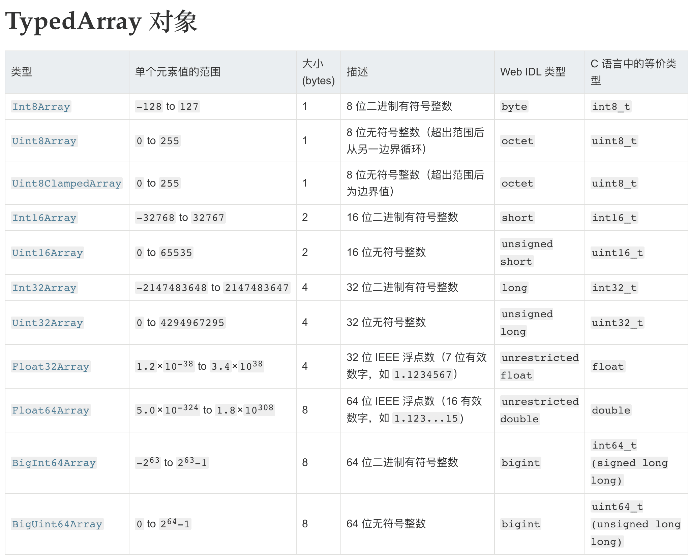

# ArrayBuffer&TypedArray&Buffer
众所周知计算机数据就是0和1组成的流，比如数字0-9，字母a-zA-Z还有unicode的字符，emoji表情等

## 计算机二进制表示
比如100
### 整数转x进制
```
(100).toString(2) // "1100100"
```
故100的二进制为`1100100`，同理整数转x进制则`toString(x)`

### x进制转整数
```
parseInt(1100100, 2) // 100
```
同理这里`parseInt(theNumber, x)`这里x可以为x进制

### 负数
负数在计算机内部采用“2的补码”表示，也就是说，将对应的正数值进行否运算，然后加1。比如，-1对应的正值是1，进行否运算以后，得到11111110，再加上1就是补码形式11111111。uint8按照无符号的8位整数解释11111111，返回结果就是255。

## [ArrayBuffer](https://developer.mozilla.org/zh-CN/docs/Web/JavaScript/Reference/Global_Objects/ArrayBuffer)
简单来说，ArrayBuffer存储数据，是数据最底层的形式。而视图是对ArrayBuffer的数据做读取展示。
ArrayBuffer对象代表储存二进制数据的一段内存，它不能直接读写。它是一个字节数组，通常在其他语言中称为“**byte array**”。

```bash
new ArrayBuffer(length)
```

其中length表示`ArrayBuffer` 的大小，单位为字节。
返回一个指定大小的`ArrayBuffer`对象，其内容被初始化为0

浏览器和Node都有这个API

```bash
// client
ArrayBuffer
ƒ ArrayBuffer() { [native code] }

// node
> ArrayBuffer
[Function: ArrayBuffer]
```

### ArrayBuffer.prototype.byteLength
查看ArrayBuffer对象长度
```
var buffer = new ArrayBuffer(32);
buffer.byteLength
// 32
```

### ArrayBuffer.prototype.slice
截取生成一个新的ArrayBuffer对象。slice方法其实包含两步，第一步是先分配一段新内存，第二步是将原来那个ArrayBuffer对象拷贝过去。

### ArrayBuffer.isView()
ArrayBuffer有一个静态方法isView，返回一个布尔值，表示参数是否为ArrayBuffer的视图实例。这个方法大致相当于判断参数，是否为TypedArray实例或DataView实例。

```js
var buffer = new ArrayBuffer(8);
ArrayBuffer.isView(buffer) // false

var v = new Int32Array(buffer);
ArrayBuffer.isView(v) // true
```

### ArrayBuffer与字符串的互相转换
ArrayBuffer转为字符串，或者字符串转为ArrayBuffer，有一个前提，即字符串的编码方法是确定的。假定字符串采用UTF-16编码（JavaScript的内部编码方式），可以自己编写转换函数。
```js
// ArrayBuffer转为字符串，参数为ArrayBuffer对象
function ab2str(buf) {
  return String.fromCharCode.apply(null, new Uint16Array(buf));
}

// 字符串转为ArrayBuffer对象，参数为字符串
function str2ab(str) {
  var buf = new ArrayBuffer(str.length * 2); // 每个字符占用2个字节
  var bufView = new Uint16Array(buf);
  for (var i = 0, strLen = str.length; i < strLen; i++) {
    bufView[i] = str.charCodeAt(i);
  }
  return buf;
}
```

## [DataView视图](https://developer.mozilla.org/zh-CN/docs/Web/JavaScript/Reference/Global_Objects/DataView)
DataView 视图是一个可以从 二进制ArrayBuffer 对象中读写多种数值类型的底层接口，使用它时，不用考虑不同平台的字节序问题。[moz](https://developer.mozilla.org/zh-CN/docs/Web/JavaScript/Reference/Global_Objects/DataView)

```bash
new DataView(buffer [, byteOffset [, byteLength]])
```
其中buffer参数可以为`new ArrayBuffer`对象返回的buffer

```js
var buf = new ArrayBuffer(32);
var dataView = new DataView(buf);
dataView.getUint8(0) // 0
```

## TypedArray视图
这是一种视图，根据里面类型的不一样而有不同的构造函数。但是除了内部数据结构不同其他API方法都一样。跟DataView的区别是，DataView数据是不规则的，可能混在一起，而TypedArray里面的数据类型是规整的。

TypedArray数组只是一层视图，本身不储存数据，它的数据都储存在底层的ArrayBuffer对象之中，要获取底层对象必须使用buffer属性。

- Int8Array：8位有符号整数，长度1个字节。
- Uint8Array：8位无符号整数，长度1个字节。
- Uint8ClampedArray：8位无符号整数，长度1个字节，溢出处理不同。
- Int16Array：16位有符号整数，长度2个字节。
- Uint16Array：16位无符号整数，长度2个字节。
- Int32Array：32位有符号整数，长度4个字节。
- Uint32Array：32位无符号整数，长度4个字节。
- Float32Array：32位浮点数，长度4个字节。
- Float64Array：64位浮点数，长度8个字节。



```bash
TypedArray(buffer, byteOffset=0, length?)
TypedArray(length)
TypedArray(typedArray)
```

```js
// 创建一个8字节的ArrayBuffer
var b = new ArrayBuffer(8);

// 创建一个指向b的Int32视图，开始于字节0，直到缓冲区的末尾
var v1 = new Int32Array(b);

// 创建一个指向b的Uint8视图，开始于字节2，直到缓冲区的末尾
var v2 = new Uint8Array(b, 2);

// 创建一个指向b的Int16视图，开始于字节2，长度为2
var v3 = new Int16Array(b, 2, 2);
```
上面代码在一段长度为8个字节的内存（b）之上，生成了三个视图：v1、v2和v3。只要任何一个视图对内存有所修改，就会在另外两个视图上反应出来。

第二个API`TypedArray(length)`，TypedArray可以同时分配内存生成

```js
var f64a = new Float64Array(8);
f64a[0] = 10;
f64a[1] = 20;
f64a[2] = f64a[0] + f64a[1];
console.log(f64a)
// VM963:4 Float64Array(8) [10, 20, 30, 0, 0, 0, 0, 0]
```

### BYTES_PER_ELEMENT属性
每一种视图的构造函数，都有一个BYTES_PER_ELEMENT属性，表示这种数据类型占据的字节数。

```js
Int8Array.BYTES_PER_ELEMENT // 1
Uint8Array.BYTES_PER_ELEMENT // 1
Int16Array.BYTES_PER_ELEMENT // 2
Uint16Array.BYTES_PER_ELEMENT // 2
Int32Array.BYTES_PER_ELEMENT // 4
Uint32Array.BYTES_PER_ELEMENT // 4
Float32Array.BYTES_PER_ELEMENT // 4
Float64Array.BYTES_PER_ELEMENT // 8
```

### TypedArray.prototype.buffer
TypedArray实例的buffer属性，返回整段内存区域对应的ArrayBuffer对象。该属性为只读属性。

## Node Buffer
在Node里，有一个内置对象[Buffer](http://nodejs.cn/api/buffer.html#buffer_buffers_and_character_encodings)，并且提供多个API可以调用。如
注意这里我们用`0-9a-f`共16个字母去描述这里的buffer。如a代表10，f代表15，一个数字可以代表4bit,两个数字则为8bit，即1Byte，1个字节

### String to Buffer
- Buffer.from，可以把string转换为buffer

```
const buf = Buffer.from('hello world', 'utf8');
console.log(buf) // <Buffer 68 65 6c 6c 6f 20 77 6f 72 6c 64>
```

### Buffer to String

```
const buf = Buffer.from('hello world', 'utf8');
console.log(buf.toString('hex'));
// 打印: 68656c6c6f20776f726c64
console.log(buf.toString('base64'));
// 打印: aGVsbG8gd29ybGQ=
```
### 一个根据Buffer手动转化为string的例子
node里控制台会输出Buffer的具体内容，但是不够直观，如下
```bash
<Buffer e7 a0 82 e9 94 85 e5 88 ab e4 b9 b1 e5 8a a8>
```

这个时候其实我们可以复制这些串，通过下面的转化简单看下内容
```js
const buf = `e7 a0 82 e9 94 85 e5 88 ab e4 b9 b1 e5 8a a8`
Buffer.from(buf.split(' ').map(i => `0x${i}`)).toString()
// '砂锅别乱动'
```

同时，如果后台返回的是buffer，但是我们没有通过`Buffer.toString()`方法的转化，而是在控制台通过`JSON.stringify`转化为JSON查看，会发现Buffer被base64转化
其一是调用`Buffer.toString()`，默认的toString()方法编码是utf8
而如果没有调用，则被处理为base64吐回给前端

## TextEncoder&TextDecoder
浏览器提供了`TextEncoder`和`TextDecoder`对象，**注意这里TextEncoder&TextDecoder只跟Uint8Array对象有关**

### TextEncoder
```js
const sourcePara = document.querySelector('.source');
const resultPara = document.querySelector('.result');
const string = sourcePara.textContent;

const textEncoder = new TextEncoder();

let encoded = textEncoder.encode(string);
resultPara.textContent += encoded;
```

如上TextEncoder有方法ecode，接受一个string作为参数，返回一个 Uint8Array 对象

```bash
b1 = encoder.encode(string);
```

### TextDecoder

```js
let uint8Array = new Uint8Array([72, 101, 108, 108, 111]);

alert( new TextDecoder().decode(uint8Array) ); // Hello
```


## protubuf里的bytes
联调的时候发现的一个字节流类型bytes，比如下面这样的
```protobuf
message Params
{
  optional bytes field = 1;
  optional bytes value = 2;
}
```

查阅[Protocal Buffers文档](https://developers.google.com/protocol-buffers/docs/proto3#scalar)发现并没有JS对应的类型

但是按照文档大致可以理解为字节流，其实就是JS里面的Uint8Array。上文我们可以知道，这是TypedArray视图的一种。
可以通过[ByteBuffer.js](https://github.com/protobufjs/bytebuffer.js)处理，向下兼容。但是这里比较通用的方便方法是用[TextEncoder&TextDecoder](#TextEncoder&TextDecoder)

[MDN TextEncoder](https://developer.mozilla.org/zh-CN/docs/Web/API/TextEncoder)

比如上面这里，格式可以用下面这样来格式化数据

```js
{
  field: new TextEncoder().encode(field)
  value: new TextEncoder().encode(value)
}
```

## protobuf里的Long
pb里的uint64，对应就是我们说的Long类型，这里对应到Java是属于long类型，范围是`-9223372036854775808 （-2的63次方）~9223372036854775807（2的63次方-1）`
```
基本类型：long 二进制位数：64
包装类：java.lang.Long
最小值：Long.MIN_VALUE=-9223372036854775808 （-2的63次方）
最大值：Long.MAX_VALUE=9223372036854775807 （2的63次方-1）
```

而JS这里数字的范围则是`-9007199254740991(-2的53次方)~9007199254740991(2的53次方)`，所以直接上[Long.js](https://github.com/dcodeIO/long.js)

```js
Math.pow(2, 53) - 1 === Number.MAX_SAFE_INTEGER
Math.pow(-2, 53) + 1 === Number.MIN_SAFE_INTEGER
```

# Q&A
- 什么叫视图？
ArrayBuffer对象作为内存区域，可以存放多种类型的数据。同一段内存，不同数据有不同的解读方式，这就叫做“视图”（view）。ArrayBuffer有两种视图，一种是TypedArray视图，另一种是DataView视图，两者的区别主要是字节序，前者的数组成员都是同一个数据类型，后者的数组成员可以是不同的数据类型。

# 参考
- [二进制数组](https://javascript.ruanyifeng.com/stdlib/arraybuffer.html)
- [TextDecoder 和 TextEncoder](https://zh.javascript.info/text-decoder)