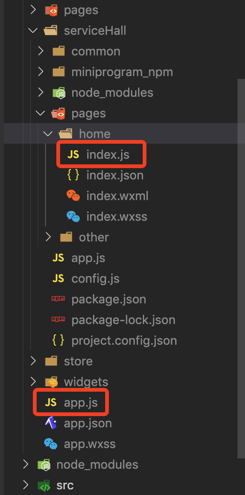
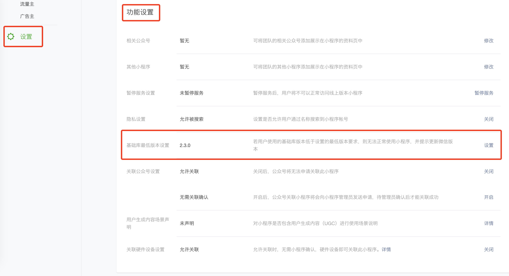
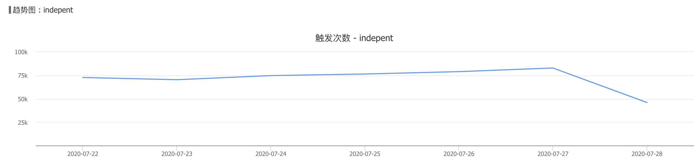
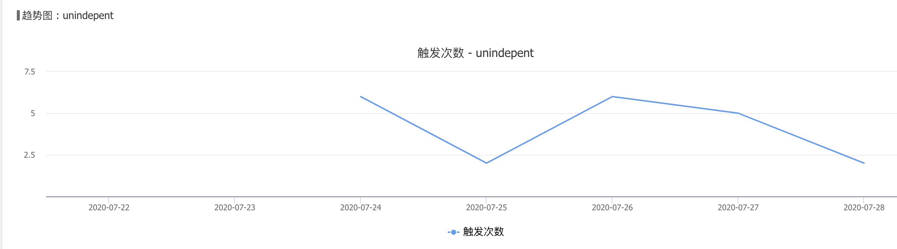
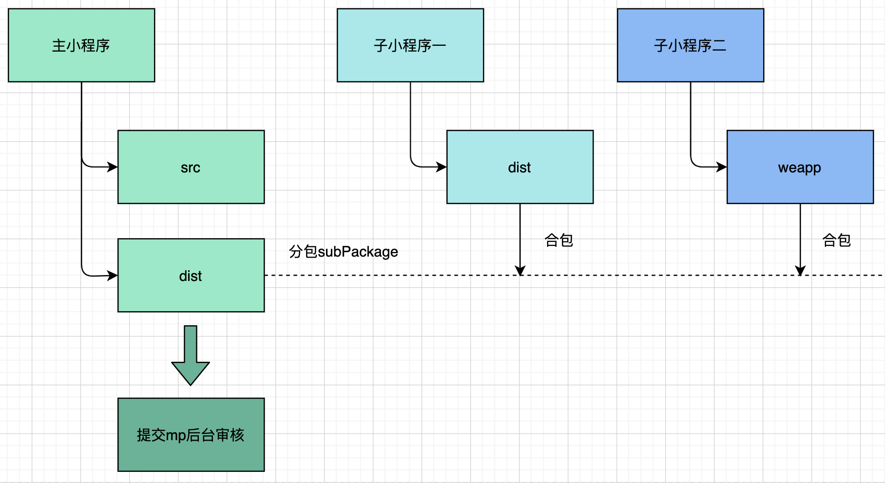
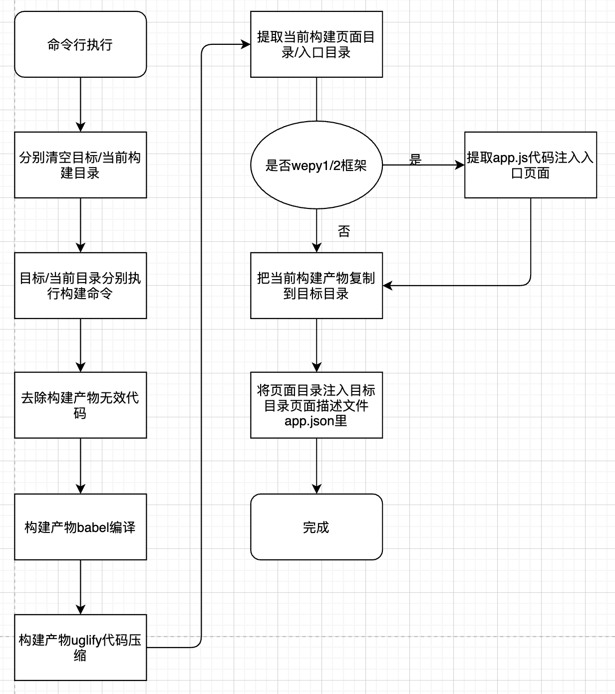

# 小程序的“微前端”方案

小程序业务从无到有，随着更多的业务越来越多转为小程序，新项目面临着选择开发一个全新小程序或是在旧的小程序迭代的难题。

新项目想要享受多端开发，一套代码适配网页和小程序，在原来的小程序迭代开发会受到各种限制。

我们基于小程序的独立分包特性，开发了[合包工具](https://github.com/ManfredHu/mp-merge-cli)。通过CI过程的小程序代码合包可以让多框架、不同工程的小程序项目合并到一个小程序里面，实现小程序的“微前端”解决方案。

## 微前端
什么是微前端？我理解是将大型应用“分治”，意味着应用可以独立开发、测试、部署。具体到小程序，可能大家都是一个小程序打遍天下无敌手。高级一点的可能利用小程序的分包加载、分包预加载等。所以微前端的概念对于初期中期的应用开发来说，不会遇到。只有经历长时间的迭代发展，代码积累足够多，产生的项目管理、人员管理足够复杂，才会需要微前端的解法，我理解微前端是一种架构解决方案。

查了一下某乎、微前端的定义如下
> 一种将独立的前端应用组成一个更大的整体的架构风格

那么问题来了，小程序的微前端要怎么做？如果有一个**巨型小程序应用**，要怎么开发迭代呢？答案会在下文慢慢揭晓。

## 小程序独立分包
[小程序独立分包特性官方文档](https://developers.weixin.qq.com/miniprogram/dev/framework/subpackages/independent.html
) 

总结一下独立分包的特点
1. 独立运行，不依赖主包和其他分包的代码
2. 独立拉取，访问到才会获取，类似按需加载
3. 生命周期可能发生变化，页面代码直接执行，而不会执行如app.onLaunch/app.onShow等app的钩子方法

### 独立分包的优势
我们发现独立分包在微信客户端 6.7.2，基础库 2.3.0 以上支持，新项目基于此特性开发不会对已有的项目产生任何“负担”。

这里负担指的是性能方面的问题，众所周知小程序代码体积的大小和运行效率决定了小程序的性能。而运行效率在日常应用来看，只要不是列表几十万那种量级，一般差别并不大。所以主要瓶颈应该是在代码包体积。随着迭代，代码体积增大，对应的“负担”增加。特别是一些运营活动的页面，在一段时期内有效，过后一般不会重复使用，如果不分包则代码体积只会一直增大。

### 独立分包各分包的关系
普通分包的代码会依赖主包，而独立分包不会。普通分包需要在主包代码执行后才执行，有主次之分。独立分包不依赖主包和其他分包代码，独立运行，独立获取。

根据生命周期来说，如下图。serviceHall为独立分包页面，访问相关页面则js文件直接执行，app.js的代码不会执行到。

### 设置独立分包完全支持
通过MP后台的设置->功能设置->基础库最低版本设置将小程序要求的基础库设置到2.3.0以上，低版本的基础库覆盖的用户非常少，因为小程序基础库更新的策略是尽量更新到新版本，这样特性支持会更加多。

MP后台将小程序对应的基础库版本要求调整到2.3.0以上意味着独立分包的完全支持，这个时候不支持独立分包的用户量很少了。作为验证，上报了不支持独立分包的用户数，验证结果。结果符合预期，**独立分包的支持度非常高**。如下图

## 多框架混合部署的想法
近几年小程序框架频出，从最开始的wepy、mpvue、taro、uni-app等到微信小程序推出的kbone。公司内来说就两个wepy和kbone，其中wepy2.x版本对比wepy1.x版本在运行效率、开发效率和习惯方面有了非常大的提高，多端开发则是kbone主推的特点。

站在开发人员的角度，社区提供的工具足够便利，可以让一个app从无到有开发迅速出来。但是站在一个维护旧有的小程序的开发者角度上，很多看着很好很美，但是不能用却是最大的遗憾。比如我们的项目是基于wepy1.x的版本，如果要升级到wepy2.x，对应的页面变更就很大，相当于项目重构，对应的风险和工作量都很大。

如kbone框架，可以一套代码适配多端环境，大大提高开发效率，也是很好很美。奈何框架锁死一切可能，基本想法出来后很快就会毙掉。

独立分包这个特性是让人眼前一量的，这不就是类似H5的按需加载吗？那么问题就来了，怎么应用独立分包这个特性去实现多项目、多框架的混合和部署？

## 小程序“微前端”方案
**我们希望开发一个合包工具，可以让不同工程、多种框架的小程序通过合并形成一个最终的小程序。基于此则不同框架、不同项目小程序均可实现类似“微前端”概念的小程序部署方案。**

从此框架再也不能限制开发人员，哪个框架香用哪个！
从此工程独立，相关的活动页面独立开发，发布混合在一起，活动过期了直接把整个工程代码去掉，干干净净！

不同的工程独立开发，测试，在最后发布的时候合并发布，还不能完全满足“微前端”的要求，因为我们没有做到项目的独立部署，但是其他优势已经利用起来了。不同工程的人员负责自己的项目开发，测试验证等，互不干扰。

### 方案遇到的难题和解决方法
1. wepy1/2会将公共代码库的代码放在app.js里面执行，独立分包会破坏wepy的代码执行顺序。通过将app.js的代码插入入口页面先执行，可以实现wepy框架的独立分包支持
2. kbone项目会依赖微信开发工具的babel编译压缩等，如果已经有CI流程需要自己实现babel转化、代码压缩等

以上两点合包工具通过提供可选项都已支持，具体可以参考合包工具代码。

## 合包工具

独立分包是把分包的代码，单独作为一个文件夹引入，此时小程序会将其作为分包。分包代码独立获取，独立运行。

通过两边项目的构建产物的处理和页面app.json的合并等等操作。将两个工程的代码做合并，最后形成一个项目。工具基于node开发，可以在各个系统环境运行，可以应用在CI流程。具体例子可以参考[这里](https://github.com/ManfredHu/mp-merge-cli/tree/master/example)。

## 简单例子
项目的example文件夹里有一个
https://github.com/ManfredHu/mp-merge-cli/tree/master/example

## Q&A
1. 有的项目需要编译压缩，有的不需要？
依赖具体的项目，因为这里很多项目有自己的CI流程，并不依赖小程序开发工具的Babel转化、代码压缩，混淆等功能。而Kbone项目一般是不提供Babel编译的，依赖开发工具，故加入可选择性开启的编译压缩功能满足脱离开发工具的需求。
2. WePY合包的注意事项？
WePY的公共代码会在app.js执行注入，在独立分包后并不会执行，这里找到分包的“首页”，将app.js的代码注入执行，则框架可正确运行。
3. 绝对路径跳转问题？
因为独立分包是属于子包，本来的子包项目的开发，开发阶段跳转主包会有问题，因为相关代码子工程并没有。
子包页面的跳转尽量用相对路径，子包页面跳转到主包/其他子包页面，可以使用绝对/相对路径