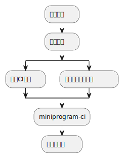
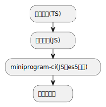

# 小程序原理简述

## 小程序诞生背景
原来微信公众号，演绎为微信小程序，公众号对内容管控不行，网页大家都懂的。小程序的双线程里，因为渲染线程其实是被动接收逻辑线程数据去做渲染的，所以数据在两个线程传输时候会有校验，可以做管控。故实现了监控，避免了公众号时代出事才去封的事后兜底，这下你知道为什么小程序每次发布前都需要审核了吧？

## 短语解释

- mp,微信公众平台 http://mp.weixin.qq.com/ 前缀，意思是 Media Platform
- wxa, weixin app，其实可以理解为小程序
- mp 可以表示为小程序吗？ 我看有的是这么写的，比如mpflow，意思是miniprogram-flow。随意了
- appid 表示应用id，比较长。微信内部有其他表示应用的uin表示，是一个hash关系，你会发现appid前缀有共性
- 用户的uin和openid的联系: 这是一套账号体系，从微信号到用户的uin到openid，甚至unionid。简单说是一一映射的，且openid是用户的uin的hash，所以需要解码内部才可以通用。unionid另一种hash

## 小程序版本管理

小程序运行包含Contact，Launch，代码包三类资源，都可以独立获取。所谓的版本管理就是逻辑上将这三种资源按照版本号索引，这样就实现了版本控制。

一般来说小程序版本可以分为

- 正式版
- 开发版
- 体验版

同一个appid不同版本之间代码包数据互相独立，Contact和Launch则共享同一份

Contact可以理解为最新版本号（现网用户获取的版本），客户端请求Contact时，后台返回appid唯一对应的Contact，本地获取到Contact后所有版本类型（正式/开发/体验）都共用。小程序还没上架时候Contact版本号为0。小程序灰度的时候短暂存在两个版本的Contact

Launch只有一个，可以理解存储小程序名和头像的地方，没有版本概念

- 正式版小程序后台会存储最近n个版本的代码包方便回退
- 开发版根据每个开发者不一样都会存储一个版本
- 体验版只有最近一个版本

此三者决策了小程序的版本路由，比如访问线上体验版本，启动时候获取Launch和Contact，Contact拿最新的体验版版本，再去下载代码包。也就是说本地其实有同个小程序的多个版本，小程序更新时候代码包不覆盖，清理的时候只剩本地最高的代码包便于后续增量更新

## 小程序编译

一般小程序编译会是这样的过程



其中,[miniprogram-ci](https://www.npmjs.com/package/miniprogram-ci)具有编译和上传的能力，如果用到其中的编译能力，则会全局引入`@babel/runtime/helpers/*`

### babel编译
babel对js代码的处理简单理解可以分为两块，一个是对类似`()=>{}`这样的语法的转化，另一个是对`Array.prototype.includes`等原生方法的扩展兼容，即让不支持类似方法的浏览器也可以运行这些方法
业内现在普遍是用的`babel-preset-env`，可以根据最低需支持的浏览器版本，对JS的新特性有选择性的打包兼容。

而`miniprogram-ci`就是全局兜底的兼容，因为与项目本身的编译无关，所以放在上传前做兜底兼容。这样做的好处是

1. 对项目忽略的node_modules等可以在微信开发工具做兜底，不会因为引入npm包而使项目构建失败
2. 项目本身不需要处理js的转化，可以更快构建，如项目本身就是js代码写的，那么直接跑就好了微信开发工具做兼容。但是如果是ts的，则也无需处理js的兼容，而只需要配置`tsconfig.json`到`esnext`即可。项目做ts到js的编译，而不用做js代码浏览器的兼容



### helper函数
如果项目本身用的是tsc编译，则默认会引入tslib做编译，[tslib](https://www.npmjs.com/package/tslib)作为一个npm包，不能按需编译而是根据tsconfig.json指定的es版本引入不同版本的tslib库。
此时如果没有配置helper公共，则helper会独立存在各个构建文件的开头部分。造成小程序体积的增加，这里可以提取公共helper或者放弃项目编译到es5的方式（上面直接用开发工具的babel编译，项目配置esnext），这里项目编译有ts的类型检查，但是代码因为只编译到esnext，所以不会有很多helper引入，当然ts的helper还是会有，但是不多。

下面两个`tsconfig.json`配置不会全要，一般是配置`importHelpers: true`就好，引用tslib
- `importHelpers` 使用tslib作为全局helper,因为是全局模块，可以多文件共享
- `noEmitHelpers` 不生成helper，自行实现全局helper函数

公共helper提取可以配置`tsconfig.json`的`importHelpers`，如果配置了那么就从tslib导入。如
```ts
import { __read, __spreadArray } from "tslib";
export function fn(arr) {
    var arr2 = __spreadArray([1], __read(arr), false);
}
```

这里后续还依赖微信开发者工具的编译或者自建CI，本质还是用的miniprogram-ci的编译模块，比如配置了`es6`，或者`es7`。推荐es7，新版本开发工具默认配置es7增强编译。


## 总结
项目如果是ts编译则`tsconfig.json`设置为`"target": "esnext"`，同时设置`importHelpers: true`提取ts的公共helper，以减小体积。
这里其实模块也推荐大家用`"module": "esnext"`，毕竟都2021年了


