# SublimeText3 常用快捷键和优秀插件（亲测）


> **这篇是自己在之前的[博客](http://www.cnblogs.com/manfredHu/p/4941307.html)写的，貌似[慕课](http://www.imooc.com/article/2070)拿了 5000+的 Page view，其他各种转载就不说了。**

> 2016/5/29 更新 MarkDown 插件

SublimeText 是前端的一个神器，以其精简和可 DIY 而让广大 fans 疯狂。好吧不吹了直入正题 -\_-!!

首先是安装，如果你有什么软件管家的话搜一下就好，一键安装。然后，有钱的土豪就自己买个吧，穷逼就搜下注册码看下有没有土豪共享咯。

既然是神器，肯定有你不知道的东西不是，下面这部分来讲操作。PS：大部分图片和文字来自网络，这里只是略微排版方便查阅。

测试操作系统：Win10
测试软件版本：SublimeText3 3059

---

## SublimeText3 操作部分

### 就近选择相同项: `ctrl+d`

把光标放在一个单词上，按下 ctrl+d，将选择这个单词。一直按住`ctrl`且按`D`多次，将选择当前选中项的下一个匹配项。通过按住 ctrl，再按 D 三次，将选择三个相同的文本。

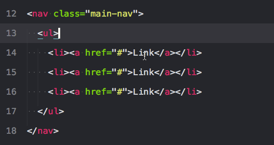

### 选择当前文件所有匹配项: `alt+f3`

选择文件中的所有匹配项。小心使用这个，因为它能选择一个文件中的所有匹配项. .

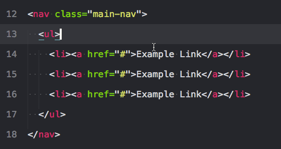

### 选择文本的包裹标签: `ctrl+shift+’` （ESC 键下面的那个）

这是一个法宝。也许你希望所有属性保持不变，但只是想选择标签。这个快捷键为你这样做，会注意到你可以在一次操作多个标签。ps：需要 Emmet 插件（可以直接到后面看插件的安装）
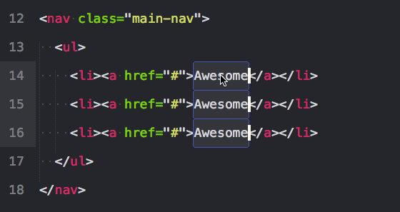

### 向上扩展一层: `ctrl+shift+a`

如果你把光标放在文本间再按下上面的键将选择文本，就像`ctrl+d`。但是再次按下它，将选择父容器，再按，将选择父容器的父容器。ps：需要 Emmet 插件（可以直接到后面看插件的安装）
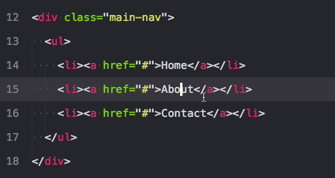

### 选择括号内的内容: `ctrl+shift+m`

这有助于选择括号之间的一切。同样适用于 CSS。
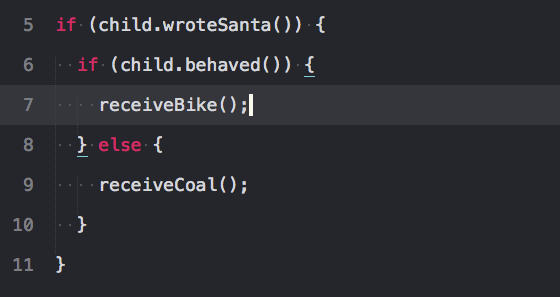

### 选择括号内的内容: `ctrl+shift+↑`或 `ctrl+shift+↓`

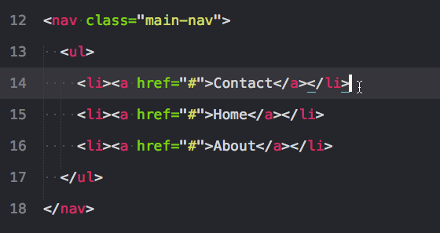

### 选择括号内的内容: `ctrl+shift+d`

如果你已经选中了文本，它会复制你的选中项。否则，把光标放在行上，会复制整行。
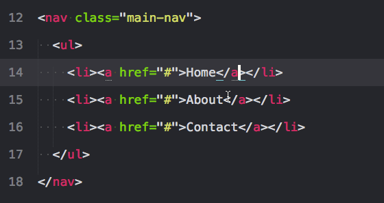

### 增加和减少缩进: `ctrl+[ 或 ]`

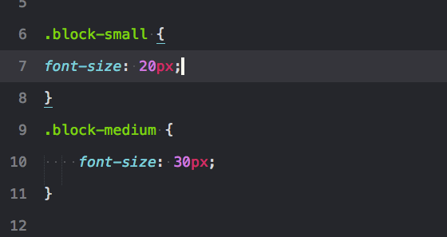

### 单行剪辑或选中项: `ctrl+x`

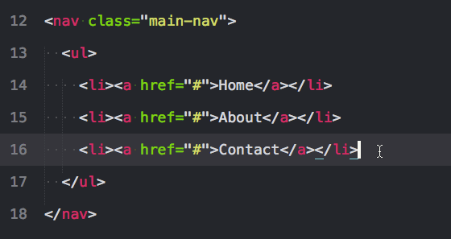

### 粘贴并复制格式: `ctrl+shift+v`

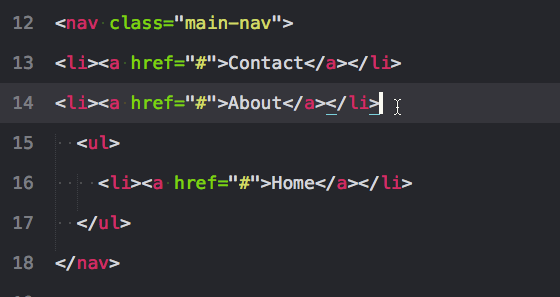

### 用标签包裹行或选中项: `alt+shift+w`

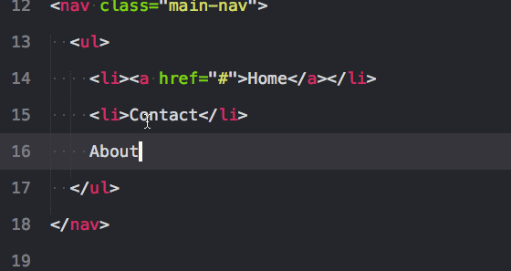

### 移除未闭合的容器元素: `ctrl+shift+;`

这会移除与你的光标相关的父标签。对清除标记很有帮助。
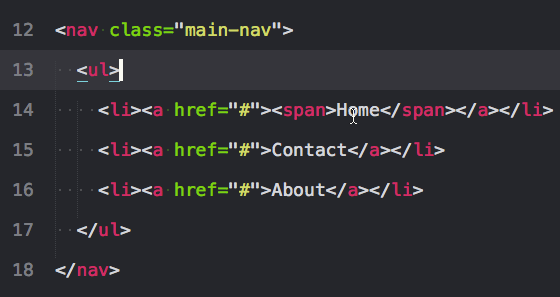

### 大写和小写: 大写`ctrl+k+u`、小写`ctrl+k+l`

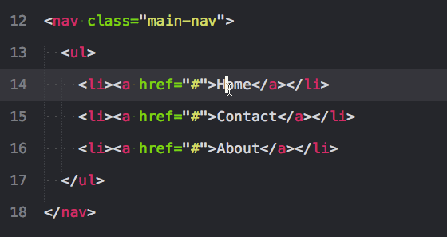

### 注释选中项/行: `ctrl+/`

这个在所有语言下都可用， 对行和选中项都可用。
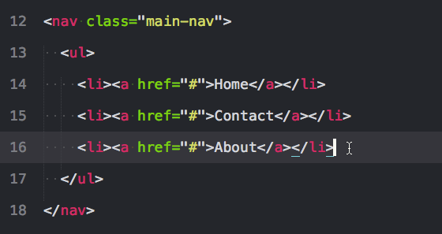

### 删除一行: `ctrl+shift+k`

---

## SublimeText3 插件部分

首先是安装包管理器 Package Control，SublimeText3 的指令已经更新了，SublimeText2 更新上来的童鞋注意下
Ctrl+`打开控制台或者 View->Show Console 菜单打开命令行

```
    import urllib.request,os; pf = 'Package Control.sublime-package'; ipp = sublime.installed_packages_path(); urllib.request.install_opener( urllib.request.build_opener( urllib.request.ProxyHandler()) ); open(os.path.join(ipp, pf), 'wb').write(urllib.request.urlopen( 'http://sublime.wbond.net/' + pf.replace(' ','%20')).read())
```

就是上面这串东西了，然后就可以接下来的安装插件了

> **Tips:** 插件名字链接到 github，网络不好的童鞋自行下载包扔到`Preferences->Browse Packages`打开的文件夹下面，然后解压，重启 Sublime 就行

### [emmet](https://github.com/sergeche/emmet-sublime)

这个没有什么好说的，类似 jQuery 的语法，编码蹭蹭往上提。不过要求 PyV8 环境（安装完后你会看到有一个文件夹），最好还是选择**在线装**吧。
`ctrl+shift+P` 输入 `install Package` 等待读取服务器列表，输入`emmet`第一个就是了
ps：最好看一下[github](https://github.com/sergeche/emmet-sublime)里面的简单教程

### [侧边栏增强插件 SideBarEnhancements](https://github.com/titoBouzout/SideBarEnhancements)

这个也没有什么好说的，谁用谁知道，大大增强右键列表的功能，装上就能用。

### [控制台呼出插件 Terminal](https://github.com/wbond/sublime_terminal)

用 node，Grunt 等等要调出控制台的娃知道的，简直神奇有木有，装上就能用。

> **Tips:**快捷键 `ctrl+shift+T`呼出**当前文件路径**的控制台
> 在 Mac 下时`command+shift+t`哈，也可以设置呼出的为 iTerm2

具体的看[这里](https://github.com/wbond/sublime_terminal#cmder-on-windows)
iTerm 的版本自己打开 iTerm 看看，2 的设置不一样的。
可以加打开文件的参数，这样打开就在你的文件对应的目录下了，简单有效。

### [代码提示插件 SublimeCodeIntel](https://github.com/SublimeCodeIntel/SublimeCodeIntel)

这个也没什么废话吧，支持多语言的高速编码的代码提示工具。
装上后还不能直接使用，查了一下原因要配置
你可以点击`Preferences->Browse Packages->SublimeCodeIntel`然后添加一个`.codeintel`文件夹再再在文件夹里面添加一个`config`文件（**Windows 创建`.codeintel`文件夹需要输入`.codeintel.`**）

config 文件配置：

```
{
    "PHP": {
        "php": '/usr/bin/php',
        "phpExtraPaths": [],
        "phpConfigFile": 'php.ini'
    },
    "JavaScript": {
        "javascriptExtraPaths": []
    },
    "Perl": {
        "perl": "/usr/bin/perl",
        "perlExtraPaths": []
    },
    "Ruby": {
        "ruby": "/usr/bin/ruby",
        "rubyExtraPaths": []
    },
    "Python": {
        "python": '/usr/bin/python',
        "pythonExtraPaths": []
    },
    "Python3": {
        "python": '/usr/bin/python3',
        "pythonExtraPaths": []
    }
}
```

其实只要有 JS 就够了，不过或许某天你要写 PHP 了呢是吧，留着吧。

然后打开 Sublime 创建个文件试一下，如果还不行就按下 `ctrl+shift+space` 开启提示功能

### [代码排版插件 Sublime-HTMLPrettify](https://github.com/victorporof/Sublime-HTMLPrettify)

以前用的是什么 TAG，CssComb 和 JSFormat，但是某一天发现这款集成 prettify 的插件后就一直没换过了,不要被插件的 HTML 迷惑，这是一款可以用于 HTML，CSS，Javascript 的集成排版插件

> **Tips:**安装完快捷键`ctrl+shift+h` 一键格式化代码

### [CSS3 前缀补充插件 Autoprefixer](https://github.com/postcss/autoprefixer)

ctrl+shift+P 输入 install Package 等待读取服务器列表，输入 autoprefixer 第一个就是了
要装 Node.js，没有的话去下载安装吧
插件使用 CanIUse 资料库，能精准判断哪些属性需要什么前缀

> **Tips:**使用方法：在输入 CSS3 属性后（冒号前）按 Tab 键

---

## SublimeText3 添加右键菜单和快捷开启浏览器

### 添加右键菜单

有时候要开个文件要开个 SublimeText3，又要拉文件，麻烦。这里介绍将 Sublime 添加到右键菜单。

> 1. 打开注册表，`开始→运行→regedit`
> 2. 在 `HKEY_CLASSSES_ROOT→ * → Shell` 下面新建项命名为`SublimeText`
> 3. 右键 SublimeText 项，新建字符串值，命名为`Icon`，值为 “sublime_text.exe 所在路径,0”，例如：`C:\Program Files\Sublime Text 3\sublime_text.exe,0`
> 4. 右键 SublimeText 项，新建项，命名为 command，默认值为 “sublime_text.exe 所在路径 %1”，例如：`C:\Program Files\Sublime Text 3\sublime_text.exe %1`

### 一键浏览文件

`Preferences->Key Bindings - User`打开用户快捷键设置，copy 下面的设置

```
[
    //firefox
    {
        "keys": ["f1"],
        "command": "side_bar_files_open_with",
        "args": {
            "paths": [],
            "application": "C:\\Program Files\\Mozilla Firefox\\firefox.exe",
            "extensions": ".*"
        }
    },
    //chorme
    {
        "keys": ["f2"],
        "command": "side_bar_files_open_with",
        "args": {
            "paths": [],
            "application": "C:\\Users\\manfr\\AppData\\Local\\Google\\Chrome\\Application\\chrome.exe",
            "extensions": ".*"
        }
    },
    //IE
    {
        "keys": ["f3"],
        "command": "side_bar_files_open_with",
        "args": {
            "paths": [],
            "application": "C:\\Program Files\\Internet Explorer\\iexplore.exe",
            "extensions": ".*"
        }
    },
    //safari
    {
        "keys": ["f4"],
        "command": "side_bar_files_open_with",
        "args": {
            "paths": [],
            "application": "C:\\Program Files (x86)\\Safari\\Safari.exe",
            "extensions": ".*"
        }
    }
]
```

稍微解释下，keys 是按键，application 是浏览器应用程序路径，注意反斜杠的要转义。extensions 是匹配所有的文件后缀格式。

> **Tips:**查了下默认的快捷键，SublimeText3 中 f1-f12 中只有 f11 被默认为全屏命令，其他的没设置。也就是说，你可以装十个八个浏览器一字排开按过去测试。

---

## SublimeText3 问题部分（自己遇到过的）

### 自动更新

有时候会弹出自动更新的框，解决方法：

> 1. 找到 Preferences -> Settings-User（设置用户）
> 2. 在最后一个花括号结尾（“｝”）前添加一句：`"update_check":false`
> 3. 然后请关闭 Submine Text 并重启，即不会再弹出更新提醒了

### 不能获取插件列表 Package Control：There are no packages available for installation

> 1. cmd 下输入`ping sublime.wbond.net`链接一下看下 sublime.wbond.net 这个域名的 ip
> 2. 打开`C:\Windows\system32\drivers\etc\hosts`文件。
>    在最后面加上例如 `50.116.34.243 sublime.wbond.net`这样的对应关系，IP 是上面测试的
> 3. 然后请关闭 Submine Text 并重启，即不会再弹出更新提醒了

## 参考

[Sublime Text 3 前端开发常用优秀插件介绍——黄映焜](http://www.cnblogs.com/hykun/p/sublimeText3.html)
[Gif 多图：我常用的 16 个 Sublime Text 快捷键 | 氪星人](http://defcon.cn/2416.html)

## 补充 Ubantu 配置部分（补）

最近在玩 Ubantu，所以将环境切了过去。这里补充一下吧。

### 装 SublimeText3

首先是安装，试了一下 SublimeText2 的（去官网默认就是下的 2 的-\_-!!）发现调不出安装包列表，后面也没去详细研究直接下了个 SublimeText3 的安装包装上。附上 Ubantu 下 SublimeText3-64bit 的链接：[http://www.sublimetext.com/3](http://www.sublimetext.com/3)

### 装 node

插件的安装跟上文差不多，唯一比较苦逼的就是装 node（插件依赖 node 环境）的时候了，不知道为什么安装好了输入`node -v`老是没有显示版本，搞了好久最后无奈去 Github 下了个 node 的安装包才搞定。

> **Tips:**一定要确认`node -v`和`npm -v`可以输出版本号才表示 node 安装完成

附上 ubantu 装 node 的 N 种方法的帖子：[http://www.linuxidc.com/Linux/2015-07/119588.htm](http://www.linuxidc.com/Linux/2015-07/119588.htm)

### 一键浏览文件

还有就是设置一键浏览文件的时候了，浏览器安装的目录跟 Windows 有点区别，看下面：

```
[
    //firefox
    {
        "keys": ["f1"],
        "command": "side_bar_files_open_with",
        "args": {
            "paths": [],
            "application": "/usr/lib/firefox/firefox",
            "extensions": ".*"
        }
    },
    //chorme
    {
        "keys": ["f2"],
        "command": "side_bar_files_open_with",
        "args": {
            "paths": [],
            "application": "/opt/google/chrome/google-chrome",
            "extensions": ".*"
        }
    }
]
```

火狐是 Ubantu 自带的，目录如上。然后 chrome 是我自己装的，基本上也应该是这个目录。装好之后找个文件按`F1`和`F2`检测下就好。
搞下来其实觉得没什么，主要是刚接触 Ubantu 系统对一些东西不太熟悉，后面加强。Thx ^\_^

---

## MarkDown 插件

### [MarkdownEditing](https://github.com/SublimeText-Markdown/MarkdownEditing)

这货很不错，快捷键什么都有了。具体的可以看 github 的介绍

### [markdown-preview](https://github.com/revolunet/sublimetext-markdown-preview)

这个插件是实时预览的插件，把下面这段加在`Preferences->Key Bindings-User`下就可以按`ctrl+m`预览了。

```
{
    "keys": ["alt+m"],
    "command": "markdown_preview_select",
    "args": {"target": "browser"}
}
```
