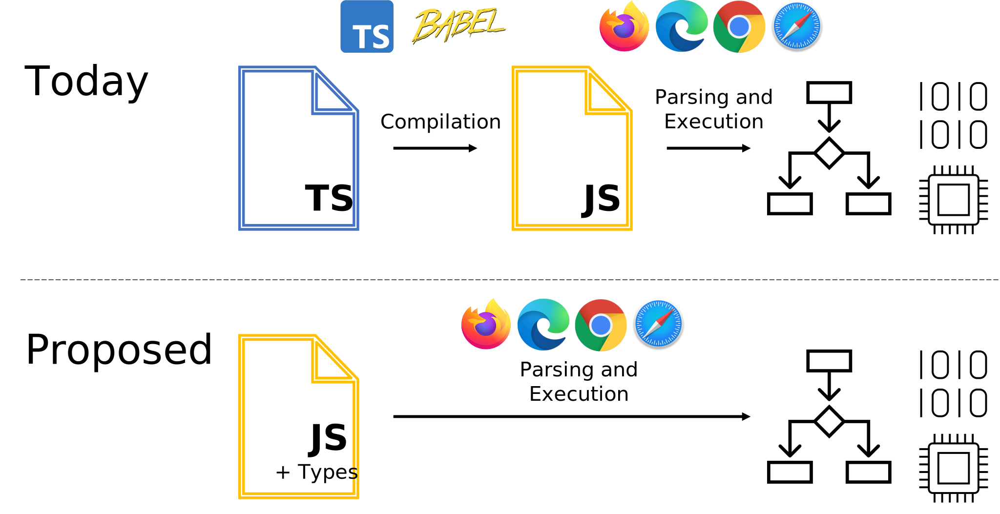
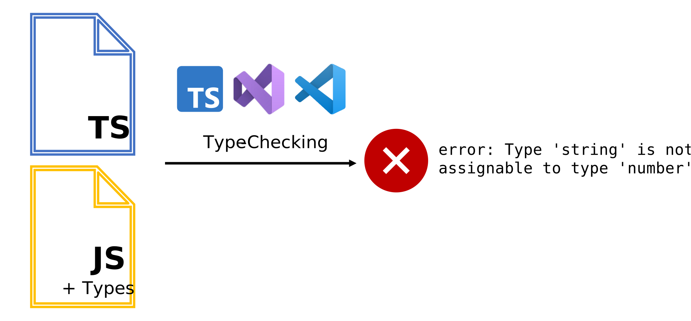

# TC39 类型注释提案

Created: March 22, 2022 2:45 PM
Last Edited Time: March 22, 2022 3:45 PM

原文链接: [https://devblogs.microsoft.com/typescript/a-proposal-for-type-syntax-in-javascript/](https://devblogs.microsoft.com/typescript/a-proposal-for-type-syntax-in-javascript/)

作者：**Daniel Rosenwasser，微软高级项目经理，主要是TypeScript方面**

# TC39是什么？

JS的语言规范ECMAScript制定的组织，当初各大浏览器打的不可开交之后，微软**[Internet Explorer](https://www.microsoft.com/en-us/download/internet-explorer.aspx)**占领了市场，但是Firefox，Safari等其他浏览器为了不跟在微软后面被掣肘，联合起来组成了TC39团体，主要是制定ECMAScritp，即标准JavaScript，而形如IE的兼容性Hack，也只是在IE才能跑，标准制定组织和其他浏览器开发者根本不鸟你。

```jsx
只在IE下生效
<!--[if IE]>
	这段文字只在IE浏览器显示
<![endif]-->
```

规范制定之后，各大浏览器会着手实现，而如果规范最后被拍死，那也就只有部分浏览器支持，比如Google很多特性只有Chrome能运行。

# Stage

刚在Stage0，所以还在讨论，但是收到普遍点赞👍

- Stage 0/Strawperson： 潜在的可能被纳入规范的一些想法。
- Stage 1/Proposal：为该想法设想一些适用场景，可能的 case。提出解决实现方案以及可能的变更。
- Stage 2/Draft：经过上一步验证讨论后，这一阶段开始起草语言层面的语义语法，准备正式的规范文档。
- Stage 3/Candidate：提案进入到了候选阶段。开始接收一些反馈对提案进行完善。
- Stage 4/Finished：可以被纳入到正式的 ECMAScript 语言规范中了。

# 背景和目的

随着前端的发展，原来不能不太被接受的TS慢慢被大家接受并在工作里运用，JS作为动态语言缺失的类型正在被TS慢慢补齐。而这个提案，简单理解就是将类型语法引入JS的注释，因为注释在运行时会直接去除，但是人对注释是可见的。

简单的，如同JSDoc注释被大家熟知，工具可以依据注释提炼出API文档，比如Swagger，甚至小程序文档的API接口都是根据注释生成的，Coding本质是一种与机器的沟通，开发者告诉机器如何运行逻辑，机器按照预期运行产生可控结果。代码语言是给机器运行的，而注释是给人看的。

如下的JSDoc注释，可以很清楚知道参数数量和类型，方法的含义等。非常清晰

```jsx
/**
 * Book类，代表一个书本.
 * @constructor
 * @param {string} title - 书本的标题.
 * @param {string} author - 书本的作者.
 */
function Book(title, author) {
    this.title=title;
    this.author=author;
}
Book.prototype={
    /**
     * 获取书本的标题
     * @returns {string|*}
     */
    getTitle:function(){
        return this.title;
    },
    /**
     * 设置书本的页数
     * @param pageNum {number} 页数
     */
    setPageNum:function(pageNum){
        this.pageNum=pageNum;
    }
};
```

基于此****Types as Comments****提案，则是为了实现**所有支持JS运行的地方，加入类型注释支持后都会支持TS的运行，则实现“TS无处不在”的目的，虽然带上了Flow但是本质还是TS。**甚至加入`// @ts-check` 可以实现JS的类型检查，这在TS是一个已实现的特性

[Documentation - JS Projects Utilizing TypeScript](https://www.typescriptlang.org/docs/handbook/intro-to-js-ts.html)

# JS社区现状的割裂

各花入各眼，当初ES4因为跨度太大而胎死腹中，TS也是最近几年才火起来，本质还是开发者对开发体验要求越来越高。

现在你抓一个前端问会不会TS，大概率会一些，但是几年前可能就不好说了。JS社区还是有部分人反感TS，原因在于环境搭建比较繁琐，你要先把tsc/tsconfig/ts-node几个搞懂才能上手写TS，如果是一堆any还不如不写。

TS对于JS一直以来的角度都是渐进式的（作为JS的超集），你写JS也可以直接在TS下跑，反之不行，而如果这个提案实现，则TS可以直接在JS上组织各种形式的注释实现类型系统

# 方案是如何运行的？



与原来TS需要编译为JS再运行不一样，加入Type Comment的JS文件可以直接解析运行，这会大大降低TS等具备类型的入门门槛

而对于编辑器来说，就是需要去检查这些JS注释，是否会产生类型错误



为了实现，JavaScript至少需要添加一些语法，比如变量和函数上的类型注释、可选性修饰符`？`对于参数和类成员、类型声明(接口和类型别名)和类型断言运算符(`as`和`！`)。可见性修饰符(例如，public、private和tected)也可能在范围内