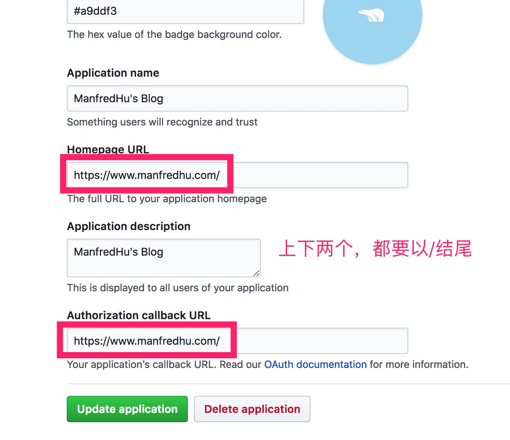

# hexo 添加 gitalk,gitment 社会化评论系统

社会化评论系统，类似留言板的功能，本来还想自己写一个的。Mongodb 都下好了，然后看到了一个项目——gitalk。

亲测 hexo 搭建的基于 github page 的页面可以使用。

用到了 github 授权第三方登陆的方式，做的，项目地址在这里：[https://github.com/gitalk/gitalk](https://github.com/gitalk/gitalk)

还有个叫 gitment 的，项目地址在这里：[https://github.com/imsun/gitment](https://github.com/imsun/gitment)

我是选了 gitalk，遇到了一些登陆的问题，类似

```
www.xxx.com/?error=redirect_uri_mismatch&
```

这样的跳转错误，然后排了好久没搞定，就去试了下 gitment，结果这个有点坑，用是可以用了，但是创建 issue 的时候会报错。。。
最后还是用回了 gitalk。

## 第一步:配置 github OAuth 授权

申请 Client ID 和 Client Secret

点击下面申请
[https://github.com/settings/applications/new](https://github.com/settings/applications/new)

OK 了记下两个 id，下面会用到。

## 第二步:引入样式和脚本

### cdn 脚本方式

```html
<link
  rel="stylesheet"
  href="https://cdn.jsdelivr.net/npm/gitalk@1/dist/gitalk.css"
/>
<script src="https://cdn.jsdelivr.net/npm/gitalk@1/dist/gitalk.min.js"></script>

<!-- or -->
<link rel="stylesheet" href="https://unpkg.com/gitalk/dist/gitalk.css" />
<script src="https://unpkg.com/gitalk/dist/gitalk.min.js"></script>
```

这里选 jsdelivr 的会比较好，因为在国内有 CDN 节点，unpkg 的国内没有 CDN 节点，都会自动同步 npm 的版本。

### npm

```bash
npm i --save gitalk
```

```js
import 'gitalk/dist/gitalk.css'
import Gitalk from 'gitalk'
```

hexo 版本比较低，一般都是引脚本方式。也可以像我一样写在主题里面，一般就是主题配置文件加个选项，然后 ejs 模版加上。

- 主题的\_config.yml 文件

```yml
gitalk: true
```

- ejs 模版，这里是 head.ejs

```html
<% if (theme.gitalk){ %>
<link
  rel="stylesheet"
  href="https://cdn.jsdelivr.net/npm/gitalk@1/dist/gitalk.css"
/>
<script src="https://cdn.jsdelivr.net/npm/gitalk@1/dist/gitalk.min.js"></script>
<% } %>
```

## 第三步：给个挂载点

```html
<div id="gitalk-container"></div>
```

```js
const gitalk = new Gitalk({
  clientID: 'GitHub Application Client ID',
  clientSecret: 'GitHub Application Client Secret',
  repo: 'GitHub repo',
  owner: 'GitHub repo owner',
  admin: [
    'GitHub repo owner and collaborators, only these guys can initialize github issues'
  ],
  id: location.pathname, // Ensure uniqueness and length less than 50
  distractionFreeMode: false // Facebook-like distraction free mode
})

gitalk.render('gitalk-container')
```

## 第四步：执行脚本

因为我是在主题加的，主题配置了多种评论系统，类似 disqus，youyan 等等，但是基本不是不维护了就是要翻墙。用 gitalk 这个也是因为 github 国内没被墙。具体写法类似这样

```html
<% } else if (theme.gitalk) {%>
<div id="gitalk-container"></div>
<script>
  var gitalk = new Gitalk({
    clientID: '5b9****************a359',
    clientSecret: 'c2f2d63e5**********************5d96b9a53a',
    repo: 'manfredHu.github.io',
    owner: 'ManfredHu',
    admin: ['ManfredHu'],
    id: location.pathname,
    distractionFreeMode: true // Facebook-like distraction free mode
  })
  gitalk.render('gitalk-container')
</script>
<% } %>
```

最后说下上面遇到的的 redirect_uri_mismatch 报的错误解决方法：
刚开始写的都是
Homepage URL 和 Authorization callback URL

```
https://www.manfredhu.com
```

然后就报错了。

最后解决了，如下图


最后成果如我的博客所示。[www.manfredhu.com](www.manfredhu.com)
