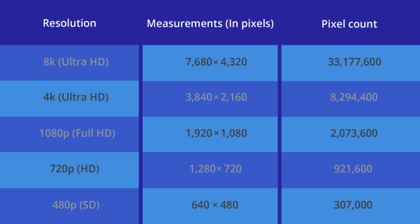

# 如何验证显示器频率
显示器作为现在常见的随处可见的成像设备, 作为PC数字的输出. 有很多的规格. 常见的分辨率(Resolution)有这么几种

比如常见的1080, 2k, 4k分辨率的显示器

480p即标清SD, 720p即高清HD. 4k以上就是超清了

## 如何测试显示器是否是1080分辨率

1080测试: 如果以下图片可以看到红黄蓝三种颜色则显示器为1080以上, 如果看到是混在一条线上则不支持

## 如何测试显示器是否是4K分辨率

4k测试: 如果以下图片可以看到红黄蓝三种颜色则显示器为4k以上, 如果看到是混在一条线上则不支持

