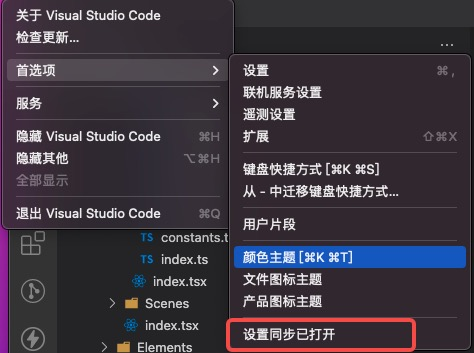

# VSCode在不同设备同步配置

> 2022.12.26更新：VSCode可以绑定Github账号了，以后可以统一配置不需要此插件了

最常遇到在不同设备需要同步VSCode的配置，这个时候可以使用[code-settings-sync](https://marketplace.visualstudio.com/items?itemName=Shan.code-settings-sync)插件，可以自动同步plugin/settings/theme等

>  2022/3/24更新，VSCode可以绑定Github账号了，以后可以统一配置不需要此插件了

## 创建access token
操作很简单，首先去github创建一个private token

在个人Setting下 -> Developer settings -> Personal access tokens 创建一个

gist Note随便输入，最后选择gist会生成一个hash串

假设哈希串是：hashhashhashhashhashhashhash

## VSCode插件配置

VSCode输入Sync选择高级配置，如下图。选择`Sync: 打开设置`

然后输入token到右侧里，gist可以置空，会默认生成

然后就可以到另一台机器Download配置了，自动上传/下载等选项可以按需打开，如上图我这里想要静默同步全部配置，按上图设置